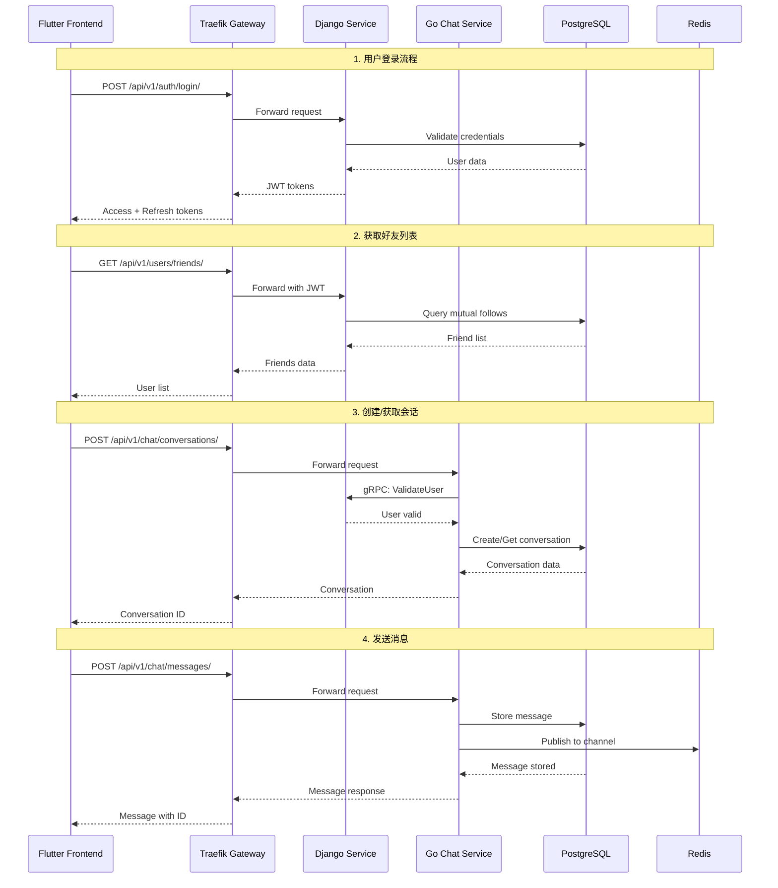

# Design Document: Chat Integration Demo

## Overview

本设计实现一个完整的 Django 与 Go 聊天服务 gRPC 通信演示模板。系统包括：
1. Django 管理用户和关注关系
2. Go Chat 服务处理实时消息
3. 两个服务通过 gRPC 通信
4. 简单的 Flutter Web 前端展示聊天功能

## Architecture

### 系统通信流程



### 目录结构变更

```
service/
├── core_django/
│   ├── apps/users/
│   │   ├── management/
│   │   │   └── commands/
│   │   │       └── setup_test_users.py    # 新增：创建测试用户命令
│   │   ├── views.py                        # 修改：添加好友列表 API
│   │   └── urls.py                         # 修改：添加好友路由
│   └── grpc_server/
│       └── server.py                       # 修改：完善 gRPC 服务
│
├── chat_gin/
│   ├── internal/
│   │   ├── handler/
│   │   │   └── http/
│   │   │       └── chat.go                 # 新增：HTTP API handlers
│   │   └── service/
│   │       └── chat_test.go                # 新增：集成测试
│   └── cmd/
│       └── test/
│           └── main.go                     # 新增：测试入口
│
client/
└── mobile_flutter/
    └── lib/
        └── features/
            └── chat/
                └── presentation/
                    └── pages/
                        └── chat_demo_page.dart  # 新增：聊天演示页面

scripts/
└── dev/
    └── setup_chat_demo.sh                  # 新增：演示环境设置脚本
```

## Components and Interfaces

### 1. Django 好友列表 API

```python
# service/core_django/apps/users/views.py

class FriendsListView(generics.ListAPIView):
    """获取互相关注的好友列表"""
    serializer_class = UserSerializer
    permission_classes = [IsAuthenticated]

    def get_queryset(self):
        user = self.request.user
        # 获取互相关注的用户（好友）
        following_ids = Follow.objects.filter(
            follower=user
        ).values_list('following_id', flat=True)
        
        followers_ids = Follow.objects.filter(
            following=user
        ).values_list('follower_id', flat=True)
        
        # 交集即为好友
        friend_ids = set(following_ids) & set(followers_ids)
        return User.objects.filter(id__in=friend_ids)
```

### 2. Django 测试用户管理命令

```python
# service/core_django/apps/users/management/commands/setup_test_users.py

from django.core.management.base import BaseCommand
from apps.users.models import User, Follow

class Command(BaseCommand):
    help = 'Setup test users for chat demo'

    def handle(self, *args, **options):
        # 创建 test1
        test1, created1 = User.objects.get_or_create(
            username='test1',
            defaults={
                'email': 'test1@example.com',
                'display_name': 'Test User 1',
            }
        )
        if created1:
            test1.set_password('testtesttest')
            test1.save()
            self.stdout.write(f'Created user: test1')
        
        # 创建 test2
        test2, created2 = User.objects.get_or_create(
            username='test2',
            defaults={
                'email': 'test2@example.com',
                'display_name': 'Test User 2',
            }
        )
        if created2:
            test2.set_password('testtesttest')
            test2.save()
            self.stdout.write(f'Created user: test2')
        
        # 建立互相关注关系
        Follow.objects.get_or_create(follower=test1, following=test2)
        Follow.objects.get_or_create(follower=test2, following=test1)
        
        self.stdout.write(self.style.SUCCESS('Test users setup complete!'))
```

### 3. Go Chat HTTP API

```go
// service/chat_gin/internal/handler/http/chat.go

package http

import (
    "net/http"
    "github.com/gin-gonic/gin"
    "github.com/google/uuid"
    "github.com/lesser/chat/internal/service"
    "github.com/lesser/chat/internal/model"
)

type ChatHTTPHandler struct {
    chatService *service.ChatService
}

func NewChatHTTPHandler(chatService *service.ChatService) *ChatHTTPHandler {
    return &ChatHTTPHandler{chatService: chatService}
}

// CreateConversation creates a new conversation
func (h *ChatHTTPHandler) CreateConversation(c *gin.Context) {
    var req struct {
        Type      string   `json:"type"`
        Name      string   `json:"name"`
        MemberIDs []string `json:"member_ids"`
    }
    
    if err := c.ShouldBindJSON(&req); err != nil {
        c.JSON(http.StatusBadRequest, gin.H{"error": err.Error()})
        return
    }
    
    // Get creator ID from auth context
    creatorID := c.GetString("user_id")
    
    memberUUIDs := make([]uuid.UUID, len(req.MemberIDs))
    for i, id := range req.MemberIDs {
        memberUUIDs[i], _ = uuid.Parse(id)
    }
    
    conv, err := h.chatService.CreateConversation(c.Request.Context(), service.CreateConversationRequest{
        Type:      model.ConversationType(req.Type),
        Name:      req.Name,
        MemberIDs: memberUUIDs,
        CreatorID: uuid.MustParse(creatorID),
    })
    
    if err != nil {
        c.JSON(http.StatusInternalServerError, gin.H{"error": err.Error()})
        return
    }
    
    c.JSON(http.StatusCreated, conv)
}

// SendMessage sends a message to a conversation
func (h *ChatHTTPHandler) SendMessage(c *gin.Context) {
    var req struct {
        ConversationID string `json:"conversation_id"`
        Content        string `json:"content"`
        MessageType    string `json:"message_type"`
    }
    
    if err := c.ShouldBindJSON(&req); err != nil {
        c.JSON(http.StatusBadRequest, gin.H{"error": err.Error()})
        return
    }
    
    senderID := c.GetString("user_id")
    
    msg, err := h.chatService.SendMessage(c.Request.Context(), service.SendMessageRequest{
        ConversationID: uuid.MustParse(req.ConversationID),
        SenderID:       uuid.MustParse(senderID),
        Content:        req.Content,
        MessageType:    model.MessageType(req.MessageType),
    })
    
    if err != nil {
        c.JSON(http.StatusInternalServerError, gin.H{"error": err.Error()})
        return
    }
    
    c.JSON(http.StatusCreated, msg)
}

// GetMessages retrieves messages for a conversation
func (h *ChatHTTPHandler) GetMessages(c *gin.Context) {
    convID := c.Param("conversation_id")
    userID := c.GetString("user_id")
    
    result, err := h.chatService.GetMessages(
        c.Request.Context(),
        uuid.MustParse(convID),
        uuid.MustParse(userID),
        1, 50,
    )
    
    if err != nil {
        c.JSON(http.StatusInternalServerError, gin.H{"error": err.Error()})
        return
    }
    
    c.JSON(http.StatusOK, result)
}
```

### 4. Go Chat 集成测试

```go
// service/chat_gin/internal/service/chat_integration_test.go

package service_test

import (
    "context"
    "testing"
    
    "github.com/google/uuid"
    "github.com/stretchr/testify/assert"
    "github.com/stretchr/testify/require"
    "github.com/lesser/chat/internal/model"
    "github.com/lesser/chat/internal/service"
)

func TestChatIntegration(t *testing.T) {
    // Setup test users (these should exist in DB)
    test1ID := uuid.MustParse("...") // Will be set from DB
    test2ID := uuid.MustParse("...")
    
    ctx := context.Background()
    chatService := setupTestService(t)
    
    // Test 1: Create private conversation
    conv, err := chatService.CreateConversation(ctx, service.CreateConversationRequest{
        Type:      model.ConversationTypePrivate,
        MemberIDs: []uuid.UUID{test1ID, test2ID},
        CreatorID: test1ID,
    })
    require.NoError(t, err)
    assert.NotNil(t, conv)
    assert.Equal(t, model.ConversationTypePrivate, conv.Type)
    
    // Test 2: Send message from test1
    msg1, err := chatService.SendMessage(ctx, service.SendMessageRequest{
        ConversationID: conv.ID,
        SenderID:       test1ID,
        Content:        "Hello from test1!",
        MessageType:    model.MessageTypeText,
    })
    require.NoError(t, err)
    assert.NotNil(t, msg1)
    assert.Equal(t, "Hello from test1!", msg1.Content)
    
    // Test 3: Send message from test2
    msg2, err := chatService.SendMessage(ctx, service.SendMessageRequest{
        ConversationID: conv.ID,
        SenderID:       test2ID,
        Content:        "Hello from test2!",
        MessageType:    model.MessageTypeText,
    })
    require.NoError(t, err)
    assert.NotNil(t, msg2)
    
    // Test 4: Retrieve messages
    result, err := chatService.GetMessages(ctx, conv.ID, test1ID, 1, 50)
    require.NoError(t, err)
    assert.Equal(t, int64(2), result.Total)
    
    // Verify message content integrity
    contents := make(map[string]bool)
    for _, m := range result.Messages {
        contents[m.Content] = true
    }
    assert.True(t, contents["Hello from test1!"])
    assert.True(t, contents["Hello from test2!"])
}
```

### 5. Flutter 聊天演示页面

```dart
// client/mobile_flutter/lib/features/chat/presentation/pages/chat_demo_page.dart

import 'package:flutter/material.dart';
import 'package:flutter_riverpod/flutter_riverpod.dart';

class ChatDemoPage extends ConsumerStatefulWidget {
  const ChatDemoPage({super.key});

  @override
  ConsumerState<ChatDemoPage> createState() => _ChatDemoPageState();
}

class _ChatDemoPageState extends ConsumerState<ChatDemoPage> {
  final TextEditingController _messageController = TextEditingController();
  List<Map<String, dynamic>> _friends = [];
  List<Map<String, dynamic>> _messages = [];
  String? _selectedFriendId;
  String? _conversationId;

  @override
  void initState() {
    super.initState();
    _loadFriends();
  }

  Future<void> _loadFriends() async {
    // Call API to get friends list
    // GET /api/v1/users/friends/
  }

  Future<void> _selectFriend(String friendId) async {
    setState(() => _selectedFriendId = friendId);
    // Create or get conversation
    // POST /api/v1/chat/conversations/
    // Then load messages
  }

  Future<void> _sendMessage() async {
    if (_messageController.text.isEmpty || _conversationId == null) return;
    // POST /api/v1/chat/messages/
  }

  @override
  Widget build(BuildContext context) {
    return Scaffold(
      appBar: AppBar(title: const Text('Chat Demo')),
      body: Row(
        children: [
          // Friends list
          SizedBox(
            width: 250,
            child: ListView.builder(
              itemCount: _friends.length,
              itemBuilder: (context, index) {
                final friend = _friends[index];
                return ListTile(
                  title: Text(friend['username']),
                  selected: friend['id'] == _selectedFriendId,
                  onTap: () => _selectFriend(friend['id']),
                );
              },
            ),
          ),
          const VerticalDivider(),
          // Chat area
          Expanded(
            child: Column(
              children: [
                Expanded(
                  child: ListView.builder(
                    itemCount: _messages.length,
                    itemBuilder: (context, index) {
                      final msg = _messages[index];
                      return MessageBubble(message: msg);
                    },
                  ),
                ),
                // Message input
                Padding(
                  padding: const EdgeInsets.all(8.0),
                  child: Row(
                    children: [
                      Expanded(
                        child: TextField(
                          controller: _messageController,
                          decoration: const InputDecoration(
                            hintText: 'Type a message...',
                          ),
                        ),
                      ),
                      IconButton(
                        icon: const Icon(Icons.send),
                        onPressed: _sendMessage,
                      ),
                    ],
                  ),
                ),
              ],
            ),
          ),
        ],
      ),
    );
  }
}

class MessageBubble extends StatelessWidget {
  final Map<String, dynamic> message;
  
  const MessageBubble({super.key, required this.message});

  @override
  Widget build(BuildContext context) {
    return Padding(
      padding: const EdgeInsets.all(8.0),
      child: Align(
        alignment: message['is_mine'] ? Alignment.centerRight : Alignment.centerLeft,
        child: Container(
          padding: const EdgeInsets.all(12),
          decoration: BoxDecoration(
            color: message['is_mine'] ? Colors.blue : Colors.grey[300],
            borderRadius: BorderRadius.circular(12),
          ),
          child: Text(
            message['content'],
            style: TextStyle(
              color: message['is_mine'] ? Colors.white : Colors.black,
            ),
          ),
        ),
      ),
    );
  }
}
```

## Data Models

### Django 模型（已存在）

```python
# User 和 Follow 模型已在 apps/users/models.py 中定义
# 好友关系 = 互相关注
```

### Go 模型（已存在）

```go
// Conversation 和 Message 模型已在 internal/model/ 中定义
```

## Correctness Properties

*A property is a characteristic or behavior that should hold true across all valid executions of a system-essentially, a formal statement about what the system should do. Properties serve as the bridge between human-readable specifications and machine-verifiable correctness guarantees.*

### Property 1: Message Round-Trip Integrity

*For any* valid message content sent to a conversation, retrieving messages from that conversation SHALL return the exact same content without modification.

**Validates: Requirements 4.2, 4.3, 4.4**

### Property 2: Conversation Membership Consistency

*For any* private conversation created between two users, both users SHALL be members of the conversation, and the conversation SHALL have exactly two members.

**Validates: Requirements 4.1**

### Property 3: Friend Relationship Symmetry

*For any* two users where user A follows user B AND user B follows user A, both users SHALL appear in each other's friends list.

**Validates: Requirements 3.1, 3.2, 3.3**

## Error Handling

### Django 错误处理

| 错误场景 | HTTP 状态码 | 错误消息 |
|---------|------------|---------|
| 用户不存在 | 404 | User not found |
| 未认证 | 401 | Authentication required |
| 无权限 | 403 | Permission denied |
| 已关注 | 400 | Already following this user |

### Go Chat 错误处理

| 错误场景 | gRPC 状态码 | 错误消息 |
|---------|------------|---------|
| 无效参数 | INVALID_ARGUMENT | Invalid request parameters |
| 会话不存在 | NOT_FOUND | Conversation not found |
| 非会话成员 | PERMISSION_DENIED | Not a member of this conversation |
| 内部错误 | INTERNAL | Internal server error |

## Testing Strategy

### 单元测试

- Django: 使用 pytest-django 测试用户创建和关注关系
- Go: 使用 testify 测试 service 层业务逻辑

### 集成测试

- 测试 Django 与 Go 服务间的 gRPC 通信
- 测试完整的消息发送和接收流程

### 属性测试

- 使用 Go 的 testing/quick 或 gopter 进行属性测试
- 验证消息内容完整性
- 验证会话成员一致性

### 测试配置

- 每个属性测试运行至少 100 次迭代
- 测试标签格式: **Feature: chat-integration-demo, Property N: property_text**
