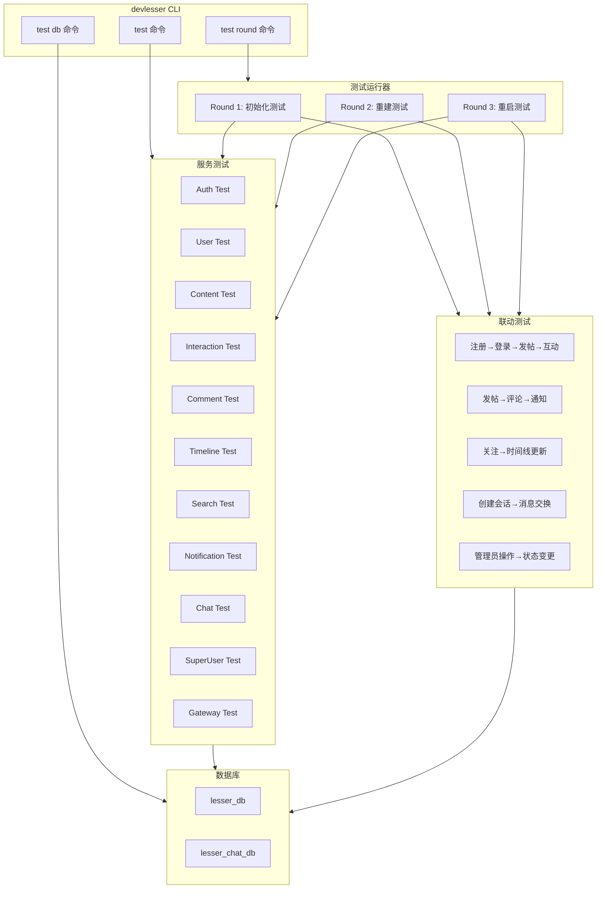

# Design Document: CLI Service Testing

## Overview

本设计文档描述了 CLI 服务测试流程的技术实现方案。通过扩展现有的 `devlesser` CLI 工具，实现数据库分表验证、三轮测试流程、以及服务联动测试功能。

## Architecture



## Components and Interfaces

### 1. CLI 命令扩展

扩展 `cli.rs` 中的 `TestTarget` 枚举和命令结构：

```rust
/// 测试目标
#[derive(ValueEnum, Clone, Debug, PartialEq)]
pub enum TestTarget {
    // ... 现有选项 ...
    
    /// 数据库分表验证
    Db,
    /// 服务联动测试
    Integration,
    /// 第一轮测试（初始化）
    Round1,
    /// 第二轮测试（重建）
    Round2,
    /// 第三轮测试（重启）
    Round3,
    /// 完整三轮测试
    Full,
}
```

### 2. 数据库验证模块

新增 `infra/cli/src/commands/test/database.rs`：

```rust
/// 数据库表定义
pub struct DatabaseSchema {
    pub lesser_db_tables: Vec<&'static str>,
    pub lesser_chat_db_tables: Vec<&'static str>,
}

impl Default for DatabaseSchema {
    fn default() -> Self {
        Self {
            lesser_db_tables: vec![
                // 用户相关
                "users", "follows", "blocks", 
                "user_privacy_settings", "user_notification_settings",
                "follow_requests",
                // SuperUser 相关
                "superusers", "superuser_audit_logs", "superuser_sessions",
                // 内容相关
                "contents", "likes", "bookmarks", "reposts",
                // 评论相关
                "comments", "comment_likes",
                // 通知相关
                "notifications",
                // 封禁相关
                "user_bans",
                // 搜索相关
                "content_embeddings", "comment_embeddings", "user_embeddings",
            ],
            lesser_chat_db_tables: vec![
                "conversations", "conversation_members", 
                "messages", "message_reads",
            ],
        }
    }
}

/// 验证数据库表结构
pub async fn verify_database_schema() -> Result<TestStats>;

/// 检查单个表是否存在
async fn check_table_exists(db: &str, table: &str) -> bool;
```

### 3. 测试轮次运行器

新增 `infra/cli/src/commands/test/rounds.rs`：

```rust
/// 测试轮次
pub enum TestRound {
    Round1,  // 初始化测试
    Round2,  // 删除重建测试
    Round3,  // 重启测试
}

/// 执行测试轮次
pub async fn execute_round(round: TestRound) -> Result<RoundStats>;

/// 执行完整三轮测试
pub async fn execute_full_test() -> Result<FullTestStats>;

/// 轮次统计
pub struct RoundStats {
    pub round: TestRound,
    pub service_stats: HashMap<String, TestStats>,
    pub integration_stats: TestStats,
    pub duration: Duration,
}
```

### 4. 联动测试模块

新增 `infra/cli/src/commands/test/integration.rs`：

```rust
/// 联动测试场景
pub enum IntegrationScenario {
    /// 用户注册 → 登录 → 创建内容 → 互动
    UserContentFlow,
    /// 内容创建 → 评论 → 通知
    ContentCommentFlow,
    /// 用户关注 → 时间线更新
    FollowTimelineFlow,
    /// 聊天会话创建 → 消息交换
    ChatMessageFlow,
    /// 管理员操作 → 状态变更
    AdminModerationFlow,
}

/// 运行联动测试
pub async fn run_integration_tests() -> Result<TestStats>;

/// 运行单个场景
async fn run_scenario(scenario: IntegrationScenario) -> Result<bool>;
```

## Data Models

### 测试结果数据结构

```rust
/// 完整测试结果
pub struct FullTestStats {
    pub rounds: Vec<RoundStats>,
    pub total_duration: Duration,
    pub bugs_found: Vec<BugReport>,
}

/// Bug 报告
pub struct BugReport {
    pub round: TestRound,
    pub service: String,
    pub test_name: String,
    pub error_message: String,
    pub timestamp: DateTime<Utc>,
    pub fixed: bool,
}

/// 测试进度
pub struct TestProgress {
    pub current_round: u8,
    pub current_service: String,
    pub current_test: String,
    pub completed: u32,
    pub total: u32,
}
```

## Correctness Properties

*A property is a characteristic or behavior that should hold true across all valid executions of a system—essentially, a formal statement about what the system should do. Properties serve as the bridge between human-readable specifications and machine-verifiable correctness guarantees.*

### Property 1: Database Schema Completeness

*For any* database (lesser_db or lesser_chat_db), the CLI verification SHALL correctly identify all expected tables as present when they exist, and report missing tables when they don't exist.

**Validates: Requirements 1.1, 1.2, 1.3, 1.4**

### Property 2: Test Round Execution Order

*For any* test round (1, 2, or 3), the CLI SHALL execute setup steps (init/clean/restart) before running service tests, and service tests before integration tests.

**Validates: Requirements 3.1-3.6, 4.1-4.7, 5.1-5.5**

### Property 3: Service Test Coverage

*For any* service test execution, the CLI SHALL test all defined API endpoints for that service and record pass/fail status for each.

**Validates: Requirements 6.1-6.11**

### Property 4: Integration Flow Verification

*For any* integration test scenario, the CLI SHALL verify that state changes propagate correctly across all involved services.

**Validates: Requirements 7.1-7.6**

### Property 5: Test Continuation on Failure

*For any* test failure during execution, the CLI SHALL continue executing remaining tests and include the failure in the final report.

**Validates: Requirements 2.6, 8.4**

### Property 6: Test Result Consistency

*For any* test execution, the final summary SHALL accurately reflect the total count, passed count, and failed count of all executed tests.

**Validates: Requirements 8.1-8.5**

## Error Handling

### 数据库连接错误

```rust
pub enum DatabaseError {
    ConnectionFailed(String),
    TableNotFound { database: String, table: String },
    QueryFailed(String),
}
```

### 服务测试错误

```rust
pub enum TestError {
    ServiceUnavailable(String),
    GrpcCallFailed { method: String, error: String },
    AssertionFailed { expected: String, actual: String },
    Timeout(Duration),
}
```

### 错误恢复策略

1. **服务不可用**: 等待 30 秒后重试，最多 3 次
2. **gRPC 调用失败**: 记录错误，继续下一个测试
3. **断言失败**: 记录详细信息，继续执行
4. **超时**: 标记为失败，继续下一个测试

## Testing Strategy

### 单元测试

- 测试 JSON 字段提取函数
- 测试测试结果统计逻辑
- 测试命令行参数解析

### 属性测试

使用 `proptest` 库进行属性测试：

1. **数据库验证属性测试**: 生成随机表名列表，验证检测逻辑
2. **测试统计属性测试**: 生成随机测试结果，验证统计准确性
3. **错误处理属性测试**: 生成随机错误场景，验证恢复逻辑

### 集成测试

- 端到端测试完整的三轮测试流程
- 验证服务联动测试的正确性
- 验证测试报告的完整性

### 测试配置

```rust
// 属性测试配置
proptest! {
    #![proptest_config(ProptestConfig::with_cases(100))]
    
    // Property 1: 数据库验证
    #[test]
    fn test_database_schema_verification(tables in prop::collection::vec(any::<String>(), 0..20)) {
        // 验证逻辑
    }
    
    // Property 6: 测试结果一致性
    #[test]
    fn test_stats_consistency(results in prop::collection::vec(any::<bool>(), 0..100)) {
        // 验证统计逻辑
    }
}
```

## Implementation Notes

### 文件结构

```
infra/cli/src/commands/test/
├── mod.rs              # 模块入口（更新）
├── runner.rs           # 测试运行器（更新）
├── grpc.rs             # gRPC 工具（现有）
├── database.rs         # 数据库验证（新增）
├── rounds.rs           # 测试轮次（新增）
├── integration.rs      # 联动测试（新增）
├── auth.rs             # Auth 测试（现有）
├── user.rs             # User 测试（现有）
├── content.rs          # Content 测试（现有）
├── comment.rs          # Comment 测试（现有）
├── interaction.rs      # Interaction 测试（现有）
├── timeline.rs         # Timeline 测试（现有）
├── search.rs           # Search 测试（现有）
├── notification.rs     # Notification 测试（现有）
├── chat.rs             # Chat 测试（现有）
├── superuser.rs        # SuperUser 测试（现有）
└── gateway.rs          # Gateway 测试（现有）
```

### 依赖

```toml
# Cargo.toml 新增依赖
[dependencies]
tokio-postgres = "0.7"  # PostgreSQL 客户端
chrono = "0.4"          # 时间处理

[dev-dependencies]
proptest = "1.4"        # 属性测试
```

