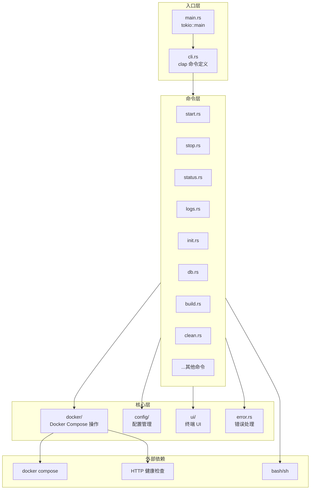

# Design Document

## Overview

本设计文档描述 `dev` CLI 工具的架构设计，该工具使用 Rust 实现，替代现有的 `dev.sh` bash 脚本。

### 设计目标

1. **可维护性**: 模块化设计，每个命令独立实现
2. **用户体验**: 丰富的终端 UI，清晰的错误提示
3. **性能**: 异步执行，实时输出流
4. **可扩展性**: 易于添加新命令

### 技术栈

| 组件 | 库 | 版本 | 用途 |
|------|-----|------|------|
| 命令解析 | clap | 4.x | 命令行参数解析，derive 宏 |
| 命令补全 | clap_complete | 4.x | Shell 补全脚本生成 |
| 终端样式 | console | 0.15.x | 彩色输出，终端检测 |
| 进度条 | indicatif | 0.17.x | Spinner，进度条 |
| 交互提示 | dialoguer | 0.11.x | 确认，选择，输入 |
| 错误处理 | anyhow | 1.x | 应用级错误处理 |
| 错误定义 | thiserror | 1.x | 自定义错误类型 |
| 异步运行时 | tokio | 1.x | 异步命令执行 |
| 序列化 | serde | 1.x | 配置文件解析 |
| 环境变量 | dotenvy | 0.15.x | .env 文件加载 |
| HTTP 客户端 | reqwest | 0.12.x | 健康检查请求 |

## Architecture

### 项目结构

```
infra/cli/
├── Cargo.toml              # 项目配置
├── README.md               # 使用说明
└── src/
    ├── main.rs             # 入口点
    ├── cli.rs              # 命令定义 (clap)
    ├── commands/           # 命令实现
    │   ├── mod.rs
    │   ├── start.rs        # start 命令
    │   ├── stop.rs         # stop 命令
    │   ├── restart.rs      # restart 命令
    │   ├── logs.rs         # logs 命令
    │   ├── status.rs       # status/ps 命令
    │   ├── test.rs         # test 命令
    │   ├── init.rs         # init 命令
    │   ├── check.rs        # check 命令
    │   ├── update.rs       # update 命令
    │   ├── migrate.rs      # migrate 命令
    │   ├── db.rs           # db 子命令
    │   ├── build.rs        # build 命令
    │   ├── rebuild.rs      # rebuild 命令
    │   ├── proto.rs        # proto 命令
    │   ├── clean.rs        # clean 命令
    │   ├── enter.rs        # enter 命令
    │   ├── shell.rs        # shell 命令
    │   ├── env.rs          # env 命令
    │   ├── urls.rs         # urls 命令
    │   └── completion.rs   # completion 命令
    ├── config/             # 配置管理
    │   ├── mod.rs
    │   ├── env.rs          # 环境变量
    │   └── paths.rs        # 路径常量
    ├── docker/             # Docker 操作
    │   ├── mod.rs
    │   ├── compose.rs      # docker compose 封装
    │   └── health.rs       # 健康检查
    ├── ui/                 # 终端 UI
    │   ├── mod.rs
    │   ├── output.rs       # 输出格式化
    │   ├── spinner.rs      # Spinner 封装
    │   ├── progress.rs     # 进度条封装
    │   └── prompt.rs       # 交互提示
    └── error.rs            # 错误定义
```

### 架构图



## Components and Interfaces

### 1. CLI 命令定义 (cli.rs)

使用 clap derive 宏定义命令结构：

```rust
use clap::{Parser, Subcommand, ValueEnum};

#[derive(Parser)]
#[command(name = "dev")]
#[command(author, version, about = "开发环境管理工具")]
#[command(propagate_version = true)]
pub struct Cli {
    /// 启用调试输出
    #[arg(short, long, global = true)]
    pub debug: bool,

    #[command(subcommand)]
    pub command: Commands,
}

#[derive(Subcommand)]
pub enum Commands {
    /// 启动服务
    Start {
        /// 目标服务: all, service, infra, django, chat, client, flutter, react
        #[arg(default_value = "all")]
        target: StartTarget,
    },
    
    /// 停止服务
    Stop {
        /// 目标服务
        target: Option<String>,
    },
    
    /// 重启服务
    Restart {
        /// 服务名称
        service: Option<String>,
    },
    
    /// 查看日志
    Logs {
        /// 服务名称
        service: Option<String>,
        /// 显示行数
        #[arg(short = 'n', long, default_value = "100")]
        lines: u32,
        /// 实时跟踪
        #[arg(short, long)]
        follow: bool,
    },
    
    /// 查看服务状态
    #[command(alias = "ps")]
    Status,
    
    /// 测试服务连通性
    Test,
    
    /// 初始化开发环境
    Init,
    
    /// 检查依赖
    Check,
    
    /// 更新环境
    Update,
    
    /// 执行数据库迁移
    Migrate,
    
    /// 生成迁移文件
    Makemigrations {
        /// Django app 名称
        app: Option<String>,
    },
    
    /// 创建超级用户
    Createsuperuser,
    
    /// 数据库操作
    Db {
        #[command(subcommand)]
        command: DbCommands,
    },
    
    /// 构建镜像
    Build {
        /// 服务名称
        service: Option<String>,
    },
    
    /// 重新构建并启动
    Rebuild {
        /// 服务名称
        service: Option<String>,
    },
    
    /// 生成 Proto 代码
    Proto {
        /// 目标: all, python, go, dart, typescript
        #[arg(default_value = "all")]
        target: String,
    },
    
    /// 清理环境
    Clean {
        #[command(subcommand)]
        command: Option<CleanCommands>,
        /// 跳过确认
        #[arg(short, long)]
        force: bool,
    },
    
    /// 进入容器
    Enter {
        /// 服务名称: django, chat, postgres, redis, traefik
        service: String,
    },
    
    /// Django Python shell
    Shell,
    
    /// 进入容器 sh
    Bash {
        /// 服务名称
        #[arg(default_value = "django")]
        service: String,
    },
    
    /// 显示环境变量
    Env,
    
    /// 显示访问地址
    Urls,
    
    /// 生成 shell 补全脚本
    Completion {
        /// Shell 类型: bash, zsh, fish
        shell: clap_complete::Shell,
    },
}

#[derive(ValueEnum, Clone)]
pub enum StartTarget {
    All,
    Service,
    Infra,
    Django,
    Chat,
    Client,
    Flutter,
    React,
}

#[derive(Subcommand)]
pub enum DbCommands {
    /// 进入数据库 shell
    Shell,
    /// 重置数据库
    Reset,
}

#[derive(Subcommand)]
pub enum CleanCommands {
    /// 清理容器
    Containers,
    /// 清理数据卷
    Volumes,
}
```

### 2. Docker Compose 封装 (docker/compose.rs)

```rust
use std::process::Stdio;
use tokio::process::Command;
use anyhow::{Result, Context};

pub struct DockerCompose {
    compose_file: String,
    env_file: String,
}

impl DockerCompose {
    pub fn new(compose_file: &str, env_file: &str) -> Self {
        Self {
            compose_file: compose_file.to_string(),
            env_file: env_file.to_string(),
        }
    }

    /// 启动服务
    pub async fn up(&self, services: &[&str], detach: bool) -> Result<()> {
        let mut cmd = self.base_command();
        cmd.arg("up");
        if detach {
            cmd.arg("-d");
        }
        cmd.args(services);
        self.run_command(cmd).await
    }

    /// 停止服务
    pub async fn down(&self, volumes: bool, orphans: bool) -> Result<()> {
        let mut cmd = self.base_command();
        cmd.arg("down");
        if volumes {
            cmd.arg("-v");
        }
        if orphans {
            cmd.arg("--remove-orphans");
        }
        self.run_command(cmd).await
    }

    /// 获取服务状态 (JSON 格式)
    pub async fn ps_json(&self) -> Result<Vec<ServiceStatus>> {
        let mut cmd = self.base_command();
        cmd.args(["ps", "--format", "json"]);
        let output = cmd.output().await?;
        // 解析 JSON 输出
        parse_service_status(&output.stdout)
    }

    /// 查看日志
    pub async fn logs(&self, service: Option<&str>, lines: u32, follow: bool) -> Result<()> {
        let mut cmd = self.base_command();
        cmd.arg("logs");
        cmd.arg(format!("--tail={}", lines));
        if follow {
            cmd.arg("-f");
        }
        if let Some(svc) = service {
            cmd.arg(svc);
        }
        // 流式输出
        self.run_command_stream(cmd).await
    }

    /// 执行容器命令
    pub async fn exec(&self, service: &str, command: &[&str], interactive: bool) -> Result<()> {
        let mut cmd = self.base_command();
        cmd.arg("exec");
        if interactive {
            cmd.arg("-it");
        }
        cmd.arg(service);
        cmd.args(command);
        self.run_command_interactive(cmd).await
    }

    /// 构建镜像
    pub async fn build(&self, service: Option<&str>, no_cache: bool) -> Result<()> {
        let mut cmd = self.base_command();
        cmd.arg("build");
        if no_cache {
            cmd.arg("--no-cache");
        }
        if let Some(svc) = service {
            cmd.arg(svc);
        }
        self.run_command_stream(cmd).await
    }

    fn base_command(&self) -> Command {
        let mut cmd = Command::new("docker");
        cmd.args(["compose", "-f", &self.compose_file, "--env-file", &self.env_file]);
        cmd
    }

    async fn run_command(&self, mut cmd: Command) -> Result<()> {
        let status = cmd.status().await?;
        if !status.success() {
            anyhow::bail!("命令执行失败");
        }
        Ok(())
    }

    async fn run_command_stream(&self, mut cmd: Command) -> Result<()> {
        cmd.stdout(Stdio::inherit());
        cmd.stderr(Stdio::inherit());
        let status = cmd.status().await?;
        if !status.success() {
            anyhow::bail!("命令执行失败");
        }
        Ok(())
    }

    async fn run_command_interactive(&self, mut cmd: Command) -> Result<()> {
        cmd.stdin(Stdio::inherit());
        cmd.stdout(Stdio::inherit());
        cmd.stderr(Stdio::inherit());
        let status = cmd.status().await?;
        if !status.success() {
            anyhow::bail!("命令执行失败");
        }
        Ok(())
    }
}
```

### 3. 终端 UI 封装 (ui/output.rs)

```rust
use console::{style, Emoji};

// Emoji 图标
pub static ROCKET: Emoji = Emoji("🚀", "");
pub static DOCKER: Emoji = Emoji("🐳", "");
pub static DATABASE: Emoji = Emoji("🗄", "");
pub static API: Emoji = Emoji("🔌", "");
pub static WEB: Emoji = Emoji("🌐", "");
pub static MOBILE: Emoji = Emoji("📱", "");
pub static GEAR: Emoji = Emoji("⚙", "");
pub static CHECK: Emoji = Emoji("✅", "[OK]");
pub static CROSS: Emoji = Emoji("❌", "[FAIL]");

/// 打印成功消息
pub fn success(msg: &str) {
    println!("{} {}", style("✓").green(), msg);
}

/// 打印警告消息
pub fn warn(msg: &str) {
    println!("{} {}", style("⚠").yellow(), msg);
}

/// 打印错误消息
pub fn error(msg: &str) {
    eprintln!("{} {}", style("✗").red(), msg);
}

/// 打印信息消息
pub fn info(msg: &str) {
    println!("{} {}", style("ℹ").cyan(), msg);
}

/// 打印步骤消息
pub fn step(msg: &str) {
    println!("{} {}", style("▶").blue().bold(), msg);
}

/// 打印分隔线
pub fn separator() {
    println!("{}", style("────────────────────────────────────────────────────────────").dim());
}

/// 打印标题
pub fn header(title: &str) {
    println!();
    println!("{}", style("╔════════════════════════════════════════════════════════════╗").cyan().bold());
    println!("{}  {} {}", style("║").cyan().bold(), ROCKET, style(title).bold());
    println!("{}", style("╚════════════════════════════════════════════════════════════╝").cyan().bold());
    println!();
}

/// 打印 URL
pub fn url(name: &str, url: &str) {
    println!("  {}  →  {}", style(name).cyan(), url);
}
```

### 4. Spinner 封装 (ui/spinner.rs)

```rust
use indicatif::{ProgressBar, ProgressStyle};
use std::time::Duration;

pub struct Spinner {
    pb: ProgressBar,
}

impl Spinner {
    pub fn new(message: &str) -> Self {
        let pb = ProgressBar::new_spinner();
        pb.set_style(
            ProgressStyle::default_spinner()
                .tick_chars("⠋⠙⠹⠸⠼⠴⠦⠧⠇⠏")
                .template("{spinner:.cyan} {msg}")
                .unwrap()
        );
        pb.set_message(message.to_string());
        pb.enable_steady_tick(Duration::from_millis(100));
        Self { pb }
    }

    pub fn set_message(&self, msg: &str) {
        self.pb.set_message(msg.to_string());
    }

    pub fn finish_with_message(&self, msg: &str) {
        self.pb.finish_with_message(msg.to_string());
    }

    pub fn finish_and_clear(&self) {
        self.pb.finish_and_clear();
    }
}
```

### 5. 交互提示封装 (ui/prompt.rs)

```rust
use dialoguer::{Confirm, Select, Input, theme::ColorfulTheme};
use anyhow::Result;

/// 确认提示
pub fn confirm(message: &str, default: bool) -> Result<bool> {
    let result = Confirm::with_theme(&ColorfulTheme::default())
        .with_prompt(message)
        .default(default)
        .interact()?;
    Ok(result)
}

/// 选择提示
pub fn select<T: ToString>(message: &str, items: &[T]) -> Result<usize> {
    let result = Select::with_theme(&ColorfulTheme::default())
        .with_prompt(message)
        .items(items)
        .default(0)
        .interact()?;
    Ok(result)
}

/// 输入提示
pub fn input(message: &str, default: Option<&str>) -> Result<String> {
    let mut input = Input::with_theme(&ColorfulTheme::default())
        .with_prompt(message);
    if let Some(d) = default {
        input = input.default(d.to_string());
    }
    let result = input.interact_text()?;
    Ok(result)
}
```

### 6. 错误定义 (error.rs)

```rust
use thiserror::Error;

#[derive(Error, Debug)]
pub enum DevError {
    #[error("Docker 未安装或未运行")]
    DockerNotAvailable,

    #[error("Docker Compose 未安装")]
    DockerComposeNotAvailable,

    #[error("环境变量文件不存在: {0}")]
    EnvFileNotFound(String),

    #[error("缺少必要的环境变量: {0:?}")]
    MissingEnvVars(Vec<String>),

    #[error("服务 {0} 未运行")]
    ServiceNotRunning(String),

    #[error("健康检查失败: {0}")]
    HealthCheckFailed(String),

    #[error("命令执行失败: {0}")]
    CommandFailed(String),

    #[error("用户取消操作")]
    UserCancelled,
}
```

### 7. 配置管理 (config/mod.rs)

```rust
use std::path::PathBuf;
use anyhow::{Result, Context};
use dotenvy::from_path;

pub struct Config {
    pub project_root: PathBuf,
    pub compose_file: PathBuf,
    pub env_file: PathBuf,
    pub flutter_dir: PathBuf,
    pub react_dir: PathBuf,
    pub proto_script: PathBuf,
    pub flutter_port: u16,
    pub react_port: u16,
}

impl Config {
    pub fn load() -> Result<Self> {
        let project_root = find_project_root()?;
        
        // 环境变量文件路径 (优先新位置)
        let env_file = if project_root.join("infra/env/dev.env").exists() {
            project_root.join("infra/env/dev.env")
        } else {
            project_root.join("infra/.env.dev")
        };

        // 加载环境变量
        if env_file.exists() {
            from_path(&env_file).ok();
        }

        Ok(Self {
            compose_file: project_root.join("infra/docker-compose.yml"),
            env_file,
            flutter_dir: project_root.join("client/mobile_flutter"),
            react_dir: project_root.join("client/web_react"),
            proto_script: project_root.join("scripts/proto/generate.sh"),
            flutter_port: std::env::var("FLUTTER_WEB_PORT")
                .unwrap_or_else(|_| "3000".to_string())
                .parse()
                .unwrap_or(3000),
            react_port: std::env::var("REACT_PORT")
                .unwrap_or_else(|_| "3001".to_string())
                .parse()
                .unwrap_or(3001),
            project_root,
        })
    }

    pub fn validate_env(&self) -> Result<()> {
        let required = [
            "POSTGRES_USER",
            "POSTGRES_PASSWORD", 
            "POSTGRES_DB",
            "REDIS_URL",
            "DJANGO_SECRET_KEY",
        ];
        
        let missing: Vec<_> = required
            .iter()
            .filter(|var| std::env::var(var).is_err())
            .map(|s| s.to_string())
            .collect();

        if !missing.is_empty() {
            anyhow::bail!("缺少必要的环境变量: {:?}", missing);
        }
        Ok(())
    }
}

fn find_project_root() -> Result<PathBuf> {
    let current = std::env::current_dir()?;
    let mut path = current.as_path();
    
    loop {
        if path.join("dev.sh").exists() || path.join("infra/docker-compose.yml").exists() {
            return Ok(path.to_path_buf());
        }
        path = path.parent().context("无法找到项目根目录")?;
    }
}
```

## Data Models

### ServiceStatus

```rust
#[derive(Debug, serde::Deserialize)]
pub struct ServiceStatus {
    #[serde(rename = "Name")]
    pub name: String,
    #[serde(rename = "State")]
    pub state: String,
    #[serde(rename = "Health")]
    pub health: Option<String>,
    #[serde(rename = "Publishers")]
    pub publishers: Option<Vec<Publisher>>,
}

#[derive(Debug, serde::Deserialize)]
pub struct Publisher {
    #[serde(rename = "PublishedPort")]
    pub published_port: Option<u16>,
}

impl ServiceStatus {
    pub fn ports(&self) -> Vec<u16> {
        self.publishers
            .as_ref()
            .map(|pubs| {
                pubs.iter()
                    .filter_map(|p| p.published_port)
                    .collect()
            })
            .unwrap_or_default()
    }

    pub fn is_running(&self) -> bool {
        self.state == "running"
    }

    pub fn is_healthy(&self) -> bool {
        self.health.as_deref() == Some("healthy")
    }
}
```

### HealthCheckResult

```rust
#[derive(Debug)]
pub struct HealthCheckResult {
    pub service: String,
    pub url: String,
    pub status: HealthStatus,
    pub response_time_ms: Option<u64>,
}

#[derive(Debug)]
pub enum HealthStatus {
    Healthy,
    Unhealthy(String),
    Unreachable,
}
```


## Correctness Properties

*A property is a characteristic or behavior that should hold true across all valid executions of a system-essentially, a formal statement about what the system should do. Properties serve as the bridge between human-readable specifications and machine-verifiable correctness guarantees.*


Based on the prework analysis, the following properties are testable:

### Property 1: Shell completion output validity

*For any* supported shell type (bash, zsh, fish), running `dev completion <shell>` SHALL produce non-empty output containing shell-specific completion syntax.

**Validates: Requirements 1.3, 1.4, 1.5**

### Property 2: Help flag availability

*For any* command and subcommand defined in the CLI, running with `--help` or `-h` flag SHALL produce help text containing the command description.

**Validates: Requirements 1.6**

### Property 3: NO_COLOR environment variable respect

*For any* CLI output, WHEN the NO_COLOR environment variable is set, the output SHALL NOT contain ANSI escape sequences (color codes).

**Validates: Requirements 2.8**

### Property 4: Sensitive value masking

*For any* environment variable whose name contains "PASSWORD" or "SECRET", WHEN displayed via `dev env` command, the value SHALL be masked (not shown in plain text).

**Validates: Requirements 10.3**

### Property 5: Missing environment variable reporting

*For any* set of missing required environment variables, WHEN a command requiring those variables is executed, the error message SHALL list all missing variable names.

**Validates: Requirements 10.6**

### Property 6: Exit code consistency

*For any* CLI command execution, the exit code SHALL be 0 on success and non-zero on failure.

**Validates: Requirements 11.7**

## Error Handling

### Error Categories

| 类别 | 错误类型 | 处理方式 |
|------|----------|----------|
| 依赖缺失 | DockerNotAvailable, DockerComposeNotAvailable | 显示安装说明 URL |
| 配置错误 | EnvFileNotFound, MissingEnvVars | 显示缺失项列表 |
| 运行时错误 | ServiceNotRunning, HealthCheckFailed | 建议查看日志 |
| 用户操作 | UserCancelled | 静默退出 |

### 错误消息格式

```
✗ 错误: Docker 未安装或未运行
  
  请安装 Docker Desktop: https://docs.docker.com/get-docker/
  或启动 Docker 服务: sudo systemctl start docker
```

### 退出码

| 退出码 | 含义 |
|--------|------|
| 0 | 成功 |
| 1 | 一般错误 |
| 2 | 配置错误 |
| 3 | 依赖缺失 |
| 130 | 用户中断 (Ctrl+C) |

## Testing Strategy

### 单元测试

- 配置解析测试 (config/mod.rs)
- 环境变量验证测试 (config/env.rs)
- 服务状态解析测试 (docker/compose.rs)
- 输出格式化测试 (ui/output.rs)

### 属性测试

使用 `proptest` crate 进行属性测试：

```rust
use proptest::prelude::*;

proptest! {
    #[test]
    fn test_sensitive_value_masking(key in ".*PASSWORD.*|.*SECRET.*", value in ".*") {
        let masked = mask_sensitive_value(&key, &value);
        assert_eq!(masked, "********");
    }

    #[test]
    fn test_no_color_output(output in ".*") {
        std::env::set_var("NO_COLOR", "1");
        let stripped = strip_ansi_codes(&output);
        assert!(!contains_ansi_codes(&stripped));
    }
}
```

### 集成测试

- 命令行解析测试 (使用 `assert_cmd` crate)
- Shell 补全生成测试
- Docker Compose 命令执行测试 (需要 Docker 环境)

### 测试配置

- 属性测试最少运行 100 次迭代
- 使用 `#[ignore]` 标记需要 Docker 的集成测试
- CI 中分离单元测试和集成测试

## Cargo.toml

```toml
[package]
name = "dev"
version = "0.1.0"
edition = "2021"
authors = ["Lesser Team"]
description = "开发环境管理 CLI 工具"
readme = "README.md"

[[bin]]
name = "dev"
path = "src/main.rs"

[dependencies]
# CLI 框架
clap = { version = "4", features = ["derive", "env"] }
clap_complete = "4"

# 终端 UI
console = "0.15"
indicatif = "0.17"
dialoguer = "0.11"

# 错误处理
anyhow = "1"
thiserror = "1"

# 异步运行时
tokio = { version = "1", features = ["full"] }

# HTTP 客户端 (健康检查)
reqwest = { version = "0.12", features = ["json"] }

# 序列化
serde = { version = "1", features = ["derive"] }
serde_json = "1"

# 环境变量
dotenvy = "0.15"

# 进程管理
ctrlc = "3"

[dev-dependencies]
# 属性测试
proptest = "1"

# 命令行测试
assert_cmd = "2"
predicates = "3"

# 临时文件
tempfile = "3"
```
