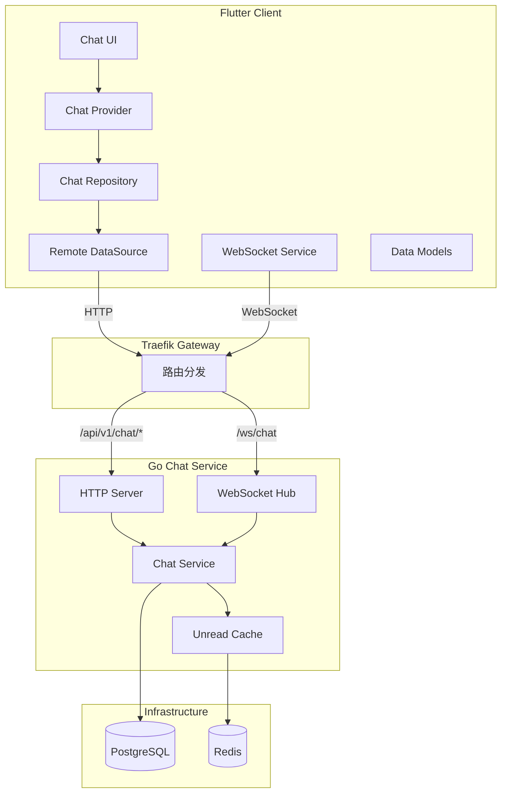

# Design Document: Flutter Chat Sync

## Overview

本设计文档定义 Flutter 客户端与 Go Chat 服务之间的功能对齐方案，确保两端实现一致，避免过度设计。核心目标：

1. **API 契约对齐**：确保 Flutter 调用的 API 端点与 Go 服务完全匹配
2. **数据模型一致**：Message 和 Conversation 的字段映射正确
3. **类型映射正确**：消息类型和会话类型的枚举值对应
4. **WebSocket 协议一致**：实时消息格式两端统一

## Architecture



## Components and Interfaces

### 1. API 端点映射

| Flutter Endpoint | Go Route | Method | Description |
|-----------------|----------|--------|-------------|
| `ApiEndpoints.conversations` | `/api/v1/chat/conversations` | GET | 获取会话列表 |
| `ApiEndpoints.conversations` | `/api/v1/chat/conversations` | POST | 创建会话 |
| `ApiEndpoints.conversationById(id)` | `/api/v1/chat/conversations/:id` | GET | 获取会话详情 |
| `ApiEndpoints.messages(convId)` | `/api/v1/chat/conversations/:id/messages` | GET | 获取消息列表 |
| `ApiEndpoints.messages(convId)` | `/api/v1/chat/conversations/:id/messages` | POST | 发送消息 |
| `ApiEndpoints.markAsRead(convId)` | `/api/v1/chat/conversations/:id/read` | POST | 标记已读 |
| `ApiEndpoints.unreadCounts` | `/api/v1/chat/unread-counts` | GET | 批量获取未读数 |

### 2. 数据模型映射

#### Message 模型

| Flutter Field | Go Field | JSON Key | Type | Notes |
|--------------|----------|----------|------|-------|
| `id` | `ID` | `id` | String/int64 | Flutter 期望 String，Go 返回 int64 |
| `conversationId` | `DialogID` | `dialog_id` | String/UUID | 字段名不一致 ⚠️ |
| `senderId` | `SenderID` | `sender_id` | String/UUID | 一致 |
| `content` | `Content` | `content` | String | 一致 |
| `messageType` | `MsgType` | `msg_type` | String/int | 类型不一致 ⚠️ |
| `createdAt` | `Date` | `date` | DateTime | 字段名不一致 ⚠️ |
| `readAt` | - | - | DateTime? | Go 使用 IsUnread 布尔值 ⚠️ |

#### Conversation 模型

| Flutter Field | Go Field | JSON Key | Type | Notes |
|--------------|----------|----------|------|-------|
| `id` | `ID` | `id` | String/UUID | 一致 |
| `type` | `Type` | `type` | String | 一致 |
| `members` | `Members` | `members` | List<User> | 一致 |
| `createdAt` | `CreatedAt` | `created_at` | DateTime | 一致 |
| `name` | `Name` | `name` | String? | 一致 |
| `creatorId` | `CreatorID` | `creator_id` | String/UUID | 一致 |
| `lastMessage` | `LastMessage` | `last_message` | Message? | 一致 |
| `unreadCount` | `UnreadCount` | `unread_count` | int | 一致 |

### 3. 类型映射

#### 消息类型映射

| Flutter MessageType | Go MessageType | Integer Value |
|--------------------|----------------|---------------|
| `text` | `MessageTypeText` | 0 |
| `image` | `MessageTypeImage` | 1 |
| `file` | `MessageTypeFile` | 4 |
| `system` | `MessageTypeSystem` | 9 |
| - | `MessageTypeVideo` | 2 |
| - | `MessageTypeLink` | 3 |

**注意**：Flutter 缺少 `video` 和 `link` 类型支持。

#### 会话类型映射

| Flutter ConversationType | Go ConversationType | String Value |
|-------------------------|---------------------|--------------|
| `private` | `ConversationTypePrivate` | "private" |
| `group` | `ConversationTypeGroup` | "group" |
| `channel` | `ConversationTypeChannel` | "channel" |

### 4. WebSocket 消息格式

#### 服务端 → 客户端

```typescript
// 消息格式
interface WSMessage {
  type: string;      // 消息类型
  payload: any;      // 消息载荷
}

// 消息类型
type WSMessageType = 
  | "message"              // 新消息（订阅会话后）
  | "conversation_update"  // 会话更新（未读数/最后消息）
  | "read_receipt"         // 单条已读回执
  | "read_receipt_batch"   // 批量已读回执
  | "subscribed"           // 订阅成功
  | "unsubscribed"         // 取消订阅成功
  | "error";               // 错误
```

#### 客户端 → 服务端

```typescript
interface WSCommand {
  action: "subscribe" | "unsubscribe" | "ping";
  conversation_id?: string;
}
```

### 5. 发现的不一致问题

| 问题 | Flutter | Go | 影响 | 建议修复 |
|-----|---------|-----|------|---------|
| Message ID 类型 | String | int64 | 解析错误 | Flutter 需要处理 int64 |
| 会话ID字段名 | `conversation_id` | `dialog_id` | 解析错误 | Go 统一使用 `conversation_id` |
| 消息时间字段 | `created_at` | `date` | 解析错误 | Go 统一使用 `created_at` |
| 消息类型格式 | String | int | 解析错误 | Go 返回 String 或 Flutter 处理 int |
| 已读状态 | `readAt` | `IsUnread` | 语义不同 | 统一使用 cursor 模式 |
| WebSocket 已读类型 | `messages_read` | `read_receipt_batch` | 事件不匹配 | 统一命名 |

## Data Models

### 统一的 Message JSON 格式

```json
{
  "id": "12345",
  "conversation_id": "550e8400-e29b-41d4-a716-446655440000",
  "sender_id": "660e8400-e29b-41d4-a716-446655440001",
  "content": "Hello!",
  "message_type": "text",
  "created_at": "2025-12-30T10:00:00Z",
  "is_unread": true
}
```

### 统一的 Conversation JSON 格式

```json
{
  "id": "550e8400-e29b-41d4-a716-446655440000",
  "type": "private",
  "name": null,
  "creator_id": "660e8400-e29b-41d4-a716-446655440001",
  "created_at": "2025-12-30T09:00:00Z",
  "updated_at": "2025-12-30T10:00:00Z",
  "members": [
    {
      "id": "660e8400-e29b-41d4-a716-446655440001",
      "username": "user1",
      "display_name": "User One"
    }
  ],
  "last_message": { ... },
  "unread_count": 5
}
```

## Correctness Properties

*A property is a characteristic or behavior that should hold true across all valid executions of a system—essentially, a formal statement about what the system should do. Properties serve as the bridge between human-readable specifications and machine-verifiable correctness guarantees.*

### Property 1: API Response Structure Consistency

*For any* API endpoint called by Flutter, the response JSON structure SHALL contain all fields expected by the corresponding Flutter model, with correct types and naming.

**Validates: Requirements 1.1, 1.2, 1.3, 1.4, 1.5, 1.6, 2.3, 2.4**

### Property 2: Message Parsing Round-Trip

*For any* message created via POST and then retrieved via GET, the Flutter client SHALL parse all fields correctly, and the parsed values SHALL match the original sent values (content, messageType).

**Validates: Requirements 2.5, 3.3, 3.4**

### Property 3: Conversation Type Validation

*For any* conversation creation request, if type is "private" then exactly 2 member IDs must be provided, and if type is "group" then a non-empty name must be provided.

**Validates: Requirements 4.3, 4.4**

### Property 4: Unread Count Consistency

*For any* conversation, after marking as read, the unread_count returned by subsequent GET requests SHALL be 0 for that user. After a new message is sent by another user, the unread_count SHALL increment by 1.

**Validates: Requirements 5.1, 5.2, 5.3**

### Property 5: WebSocket Event Format Consistency

*For any* WebSocket event sent by Chat_Service, the event type and payload structure SHALL match what Flutter_Client expects, enabling correct parsing and state updates.

**Validates: Requirements 6.1, 6.2, 6.3, 6.4**

## Error Handling

### HTTP 错误响应格式

```json
{
  "error": "错误描述信息"
}
```

### 错误码映射

| HTTP Status | Flutter Exception | Go Error |
|-------------|------------------|----------|
| 400 | `ServerException` | 参数验证失败 |
| 401 | `UnauthorizedException` | 未认证 |
| 403 | `ForbiddenException` | 非会话成员 |
| 404 | `NotFoundException` | 会话/消息不存在 |
| 500 | `ServerException` | 内部错误 |

## Testing Strategy

### 单元测试

- Flutter: 测试 Model.fromJson() 解析各种 JSON 格式
- Go: 测试 HTTP handler 返回正确的 JSON 结构

### 集成测试

使用 Go 的 `testing` 包和 `httptest` 进行端到端测试：

1. 创建会话 → 验证响应格式
2. 发送消息 → 验证响应格式
3. 获取消息 → 验证分页和字段
4. 标记已读 → 验证未读数变化
5. WebSocket 连接 → 验证事件格式

### 属性测试

使用 Go 的 `testing/quick` 或 `gopter` 库：

- 每个属性测试运行至少 100 次迭代
- 测试标签格式: **Feature: flutter-chat-sync, Property N: property_text**

### 联合调试脚本

```bash
#!/bin/bash
# scripts/dev/flutter_chat_sync_test.sh

# 1. 启动服务
dev start

# 2. 创建测试用户
dev bash core_django "python manage.py setup_test_users"

# 3. 运行 Go 集成测试
dev bash chat_gin "go test -v ./internal/service/... -run TestFlutterSync"

# 4. 输出结果
echo "联合调试测试完成"
```

