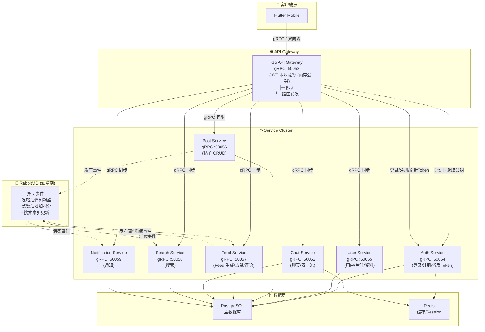
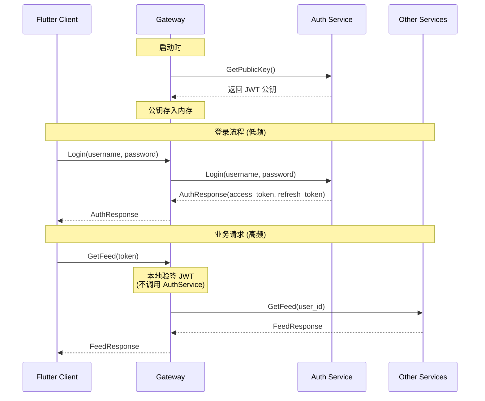

# Design Document: gRPC 全面迁移

## Overview

本设计文档描述将 Lesser 社交平台从混合通信协议完全迁移到纯 gRPC + gRPC 双向流架构的技术方案。

核心架构调整：
1. **移除 React Web** - 仅保留 Flutter 客户端
2. **Gateway 职责分离** - Gateway 只做鉴权/限流/路由，不做业务
3. **Service Cluster 替代 Worker Cluster** - 业务服务提供同步 gRPC 接口
4. **RabbitMQ 作为润滑剂** - 仅处理次要、非阻塞的异步逻辑
5. **强一致 vs 最终一致** - 区分同步 gRPC 和异步 MQ 处理

## Architecture

### 迁移后整体架构



### Gateway 鉴权流程详解




### 架构核心原则

#### 1. Gateway 职责（只做基础设施）

| 职责 | 说明 | 实现方式 |
|------|------|---------|
| **JWT 验签** | 数学验证 Token 签名和过期时间 | 内存中持有公钥，本地验签 |
| **限流** | 请求频率限制，防止滥用 | 内存计数器 / Redis |
| **路由** | 根据请求路径转发到对应 Service | 配置映射 |
| **协议转换** | gRPC-Web → gRPC（如需要） | 中间件 |

**Gateway 永远不写业务规则！**

**关键设计：JWT 验签 ≠ 调用 AuthService**

```
┌─────────────────────────────────────────────────────────────────┐
│                    鉴权流程优化                                  │
├─────────────────────────────────────────────────────────────────┤
│                                                                 │
│  ❌ 错误做法（每次请求都调用 AuthService）                        │
│  ┌────────┐    ┌─────────┐    ┌─────────────┐                  │
│  │ Client │───>│ Gateway │───>│ AuthService │  性能瓶颈！       │
│  └────────┘    └─────────┘    └─────────────┘                  │
│                                                                 │
│  ✅ 正确做法（Gateway 本地验签）                                  │
│  ┌────────┐    ┌─────────────────────────┐                     │
│  │ Client │───>│ Gateway                 │                     │
│  └────────┘    │ ├─ 内存持有 JWT 公钥     │                     │
│                │ ├─ 本地验证签名          │                     │
│                │ └─ 本地检查过期时间      │                     │
│                └─────────────────────────┘                     │
│                                                                 │
└─────────────────────────────────────────────────────────────────┘
```

| 组件 | 职责 | 是否涉及业务逻辑？ | 依赖资源 |
|------|------|------------------|---------|
| **Gateway** | JWT 验签 (数学验证)、限流、路由 | ❌ (安全基建) | 仅需公钥 (内存) |
| **AuthService** | 登录、注册、颁发 Token、封禁查询 | ✅ (核心用户业务) | Postgres, Redis |
| **其他 Service** | 发帖、聊天、点赞 | ✅ (各自的业务) | Postgres, Redis |

**JWT 验签 vs TLS/SSL**：
- SSL 是在 Nginx/Gateway 层解密的
- JWT 也应该在 Gateway 层校验
- 两者都是传输层安全协议，不是业务逻辑

#### 2. 强一致 vs 最终一致

| 操作类型 | 一致性 | 处理方式 | 示例 |
|---------|--------|---------|------|
| 登录/注册 | 强一致 | 同步 gRPC → Auth Service | 必须立即返回结果 |
| 权限验证 | 强一致 | 同步 gRPC → Auth Service | 必须立即知道是否有权限 |
| 发帖/删帖 | 强一致 | 同步 gRPC → Post Service | 用户需要立即看到结果 |
| 获取 Feed | 强一致 | 同步 gRPC → Feed Service | 用户需要立即看到内容 |
| 发送消息 | 强一致 | 同步 gRPC → Chat Service | 消息必须立即送达 |
| 通知粉丝 | 最终一致 | MQ → Notification Service | 可以延迟几秒 |
| 更新搜索索引 | 最终一致 | MQ → Search Service | 可以延迟几秒 |
| 增加积分 | 最终一致 | MQ → User Service | 可以延迟处理 |

#### 3. RabbitMQ 作为润滑剂

RabbitMQ 仅用于处理次要、非阻塞的异步逻辑：

```
发帖成功 (同步返回)
    │
    └──> 发布事件到 MQ
              │
              ├──> Notification Service: 通知粉丝
              ├──> Search Service: 更新搜索索引
              └──> Feed Service: 更新粉丝 Feed 缓存
```

### 通信协议对比

| 功能 | 迁移前 | 迁移后 |
|------|--------|--------|
| 认证 | gRPC (Gateway 处理) | gRPC (Gateway → Auth Service) |
| 业务 API | gRPC (Gateway → MQ → Worker) | gRPC (Gateway → Service 同步) |
| 聊天 API | REST + WebSocket | gRPC + 双向流 |
| 异步事件 | 所有写操作都进 MQ | 仅次要逻辑进 MQ |

## Components and Interfaces

### 1. API Gateway 接口

```protobuf
// protos/gateway/gateway.proto

syntax = "proto3";
package gateway;

// Gateway 只做路由转发和健康检查
// JWT 验签在 Gateway 内部完成，不需要 RPC

service GatewayService {
  // 健康检查
  rpc Health(HealthRequest) returns (HealthResponse);
}

message HealthRequest {}
message HealthResponse {
  bool healthy = 1;
  map<string, bool> services = 2;
}
```

**Gateway 内部实现**：

```go
// service/gateway/internal/server/gateway.go

type GatewayServer struct {
    jwtValidator  *auth.JWTValidator    // JWT 本地验签
    rateLimiter   *ratelimit.Limiter    // 限流器
    router        *router.Router         // 路由器
    
    // Service 客户端连接池
    authClient    pb.AuthServiceClient
    userClient    pb.UserServiceClient
    postClient    pb.PostServiceClient
    feedClient    pb.FeedServiceClient
    chatClient    pb.ChatServiceClient
    searchClient  pb.SearchServiceClient
    notifClient   pb.NotificationServiceClient
}

// 请求处理流程
func (s *GatewayServer) handleRequest(ctx context.Context, req interface{}) (interface{}, error) {
    // 1. 限流检查
    if !s.rateLimiter.Allow() {
        return nil, status.Error(codes.ResourceExhausted, "请求过于频繁")
    }
    
    // 2. JWT 本地验签（不调用 AuthService）
    token := extractToken(ctx)
    claims, err := s.jwtValidator.ValidateToken(token)
    if err != nil {
        return nil, status.Error(codes.Unauthenticated, "无效的 Token")
    }
    
    // 3. 将用户信息注入 context
    ctx = context.WithValue(ctx, "user_id", claims.UserID)
    
    // 4. 路由到对应 Service
    return s.router.Route(ctx, req)
}
```

**gRPC 双向流代理实现**：

```go
// service/gateway/internal/proxy/stream_proxy.go

// StreamProxy 处理 gRPC 双向流的代理转发
// 关键：确保支持 HTTP/2 Streaming Flush
type StreamProxy struct {
    chatClient pb.ChatServiceClient
}

// ProxyStreamEvents 代理 Chat 双向流
// 注意：不能使用 HTTP/1.1 中间件，会截断长连接
func (p *StreamProxy) ProxyStreamEvents(
    clientStream pb.ChatService_StreamEventsServer,
) error {
    ctx := clientStream.Context()
    
    // 验证 Token
    token := extractTokenFromContext(ctx)
    claims, err := p.jwtValidator.ValidateToken(token)
    if err != nil {
        return status.Error(codes.Unauthenticated, "无效的 Token")
    }
    
    // 创建到 ChatService 的双向流
    md := metadata.Pairs("user_id", claims.UserID)
    ctx = metadata.NewOutgoingContext(ctx, md)
    
    serverStream, err := p.chatClient.StreamEvents(ctx)
    if err != nil {
        return err
    }
    
    // 双向转发
    errChan := make(chan error, 2)
    
    // Client -> Server
    go func() {
        for {
            msg, err := clientStream.Recv()
            if err != nil {
                errChan <- err
                return
            }
            if err := serverStream.Send(msg); err != nil {
                errChan <- err
                return
            }
        }
    }()
    
    // Server -> Client
    go func() {
        for {
            msg, err := serverStream.Recv()
            if err != nil {
                errChan <- err
                return
            }
            if err := clientStream.Send(msg); err != nil {
                errChan <- err
                return
            }
        }
    }()
    
    // 等待任一方向结束
    return <-errChan
}
```

**gRPC 双向流注意事项**：

```
┌─────────────────────────────────────────────────────────────────┐
│              gRPC 双向流 Gateway 代理要点                        │
├─────────────────────────────────────────────────────────────────┤
│                                                                 │
│  1. HTTP/2 Streaming Flush                                      │
│     - 必须使用 HTTP/2 协议                                       │
│     - 不能使用 HTTP/1.1 中间件（会截断长连接）                    │
│     - 确保 Traefik 配置 h2c (HTTP/2 Cleartext)                  │
│                                                                 │
│  2. 连接管理                                                    │
│     - 双向流是长连接，需要正确处理断开和重连                      │
│     - 使用 context 传递取消信号                                  │
│     - 优雅关闭：先关闭发送端，等待接收端结束                      │
│                                                                 │
│  3. 错误处理                                                    │
│     - 任一方向出错都应该关闭整个流                               │
│     - 区分正常关闭 (io.EOF) 和异常错误                           │
│     - 记录详细日志便于排查                                       │
│                                                                 │
│  4. 认证传递                                                    │
│     - 在建立流时验证 Token                                       │
│     - 将 user_id 通过 metadata 传递给 ChatService               │
│                                                                 │
└─────────────────────────────────────────────────────────────────┘
```

**Traefik gRPC 双向流配置**：

```yaml
# infra/gateway/dynamic/routes.yml

http:
  routers:
    # Chat gRPC 路由（支持双向流）
    grpc-chat:
      rule: "PathPrefix(`/chat.`)"
      service: chat-grpc
      entryPoints:
        - grpc

  services:
    # Chat gRPC 服务（h2c 支持 HTTP/2 Cleartext）
    chat-grpc:
      loadBalancer:
        servers:
          - url: "h2c://chat:50052"
        # 双向流需要禁用响应超时
        serversTransport: grpc-streaming-transport

  serversTransports:
    # gRPC 双向流专用传输配置
    grpc-streaming-transport:
      forwardingTimeouts:
        dialTimeout: "30s"
        responseHeaderTimeout: "0s"    # 禁用响应头超时（双向流需要）
        idleConnTimeout: "0s"          # 禁用空闲超时（长连接需要）
```

### 2. Auth Service 接口

```protobuf
// protos/auth/auth.proto

syntax = "proto3";
package auth;

service AuthService {
  // 用户登录（低频，强一致）
  rpc Login(LoginRequest) returns (AuthResponse);
  // 用户注册（低频，强一致）
  rpc Register(RegisterRequest) returns (AuthResponse);
  // 刷新 Token（低频，强一致）
  rpc RefreshToken(RefreshTokenRequest) returns (AuthResponse);
  // 登出（低频）
  rpc Logout(LogoutRequest) returns (LogoutResponse);
  // 获取公钥（Gateway 启动时调用一次，用于本地验签）
  rpc GetPublicKey(GetPublicKeyRequest) returns (GetPublicKeyResponse);
  // 封禁用户（管理接口）
  rpc BanUser(BanUserRequest) returns (BanUserResponse);
  // 检查用户是否被封禁（可选，Gateway 可缓存封禁列表）
  rpc CheckBanned(CheckBannedRequest) returns (CheckBannedResponse);
}

message LoginRequest {
  string username = 1;
  string password = 2;
}

message RegisterRequest {
  string username = 1;
  string email = 2;
  string password = 3;
}

message RefreshTokenRequest {
  string refresh_token = 1;
}

message AuthResponse {
  bool success = 1;
  string access_token = 2;
  string refresh_token = 3;
  string user_id = 4;
  string error_code = 5;
  string error_message = 6;
}

message LogoutRequest {
  string access_token = 1;
}

message LogoutResponse {
  bool success = 1;
}

message GetPublicKeyRequest {}

message GetPublicKeyResponse {
  string public_key = 1;      // PEM 格式的公钥
  string key_id = 2;          // Key ID，用于密钥轮换
  string algorithm = 3;       // 如 "RS256"
  int64 expires_at = 4;       // 公钥过期时间（用于密钥轮换）
}

message BanUserRequest {
  string user_id = 1;
  string reason = 2;
  int64 duration_seconds = 3;  // 0 表示永久封禁
}

message BanUserResponse {
  bool success = 1;
}

message CheckBannedRequest {
  string user_id = 1;
}

message CheckBannedResponse {
  bool banned = 1;
  string reason = 2;
  int64 expires_at = 3;
}
```

**Gateway JWT 验签流程**：

```go
// service/gateway/internal/auth/jwt.go

type JWTValidator struct {
    publicKey     *rsa.PublicKey
    publicKeyID   string           // Key ID，用于密钥轮换
    algorithm     string
    expiresAt     time.Time        // 公钥过期时间
    mu            sync.RWMutex
    authClient    pb.AuthServiceClient
    refreshTicker *time.Ticker
}

// 启动时从 AuthService 获取公钥，并启动定时刷新
func (v *JWTValidator) Start(ctx context.Context, authClient pb.AuthServiceClient) error {
    v.authClient = authClient
    
    // 首次加载公钥
    if err := v.refreshPublicKey(ctx); err != nil {
        return err
    }
    
    // 启动定时刷新（每小时）
    v.refreshTicker = time.NewTicker(1 * time.Hour)
    go v.backgroundRefresh(ctx)
    
    return nil
}

// 定时刷新公钥
func (v *JWTValidator) backgroundRefresh(ctx context.Context) {
    for {
        select {
        case <-ctx.Done():
            return
        case <-v.refreshTicker.C:
            if err := v.refreshPublicKey(ctx); err != nil {
                log.Printf("[JWT] 定时刷新公钥失败: %v", err)
            } else {
                log.Printf("[JWT] 公钥已刷新，KeyID: %s", v.publicKeyID)
            }
        }
    }
}

// 从 AuthService 获取公钥
func (v *JWTValidator) refreshPublicKey(ctx context.Context) error {
    resp, err := v.authClient.GetPublicKey(ctx, &pb.GetPublicKeyRequest{})
    if err != nil {
        return err
    }
    
    block, _ := pem.Decode([]byte(resp.PublicKey))
    pub, err := x509.ParsePKIXPublicKey(block.Bytes)
    if err != nil {
        return err
    }
    
    v.mu.Lock()
    v.publicKey = pub.(*rsa.PublicKey)
    v.publicKeyID = resp.KeyId
    v.algorithm = resp.Algorithm
    v.expiresAt = time.Unix(resp.ExpiresAt, 0)
    v.mu.Unlock()
    
    return nil
}

// 本地验签（不调用 AuthService）
func (v *JWTValidator) ValidateToken(tokenString string) (*Claims, error) {
    v.mu.RLock()
    publicKey := v.publicKey
    keyID := v.publicKeyID
    v.mu.RUnlock()
    
    token, err := jwt.ParseWithClaims(tokenString, &Claims{}, func(token *jwt.Token) (interface{}, error) {
        // 检查 Key ID 是否匹配
        if kid, ok := token.Header["kid"].(string); ok && kid != keyID {
            // Key ID 不匹配，尝试刷新公钥
            if refreshErr := v.refreshPublicKey(context.Background()); refreshErr != nil {
                return nil, fmt.Errorf("key ID mismatch and refresh failed: %w", refreshErr)
            }
            v.mu.RLock()
            publicKey = v.publicKey
            v.mu.RUnlock()
        }
        return publicKey, nil
    })
    
    if err != nil {
        return nil, err
    }
    
    if claims, ok := token.Claims.(*Claims); ok && token.Valid {
        return claims, nil
    }
    
    return nil, errors.New("invalid token")
}

func (v *JWTValidator) Stop() {
    if v.refreshTicker != nil {
        v.refreshTicker.Stop()
    }
}
```

**密钥轮换策略**：

```
┌─────────────────────────────────────────────────────────────────┐
│                    JWT 公钥刷新机制                              │
├─────────────────────────────────────────────────────────────────┤
│                                                                 │
│  1. 定时刷新（每小时）                                           │
│     Gateway 每小时自动从 AuthService 拉取最新公钥                │
│                                                                 │
│  2. 惰性刷新（Key ID 不匹配时）                                  │
│     当 JWT 的 kid 与当前公钥不匹配时，立即尝试刷新               │
│     适用于紧急密钥轮换场景                                       │
│                                                                 │
│  3. 优雅降级                                                    │
│     刷新失败时继续使用旧公钥，记录错误日志                       │
│     避免因 AuthService 短暂不可用导致全站中断                    │
│                                                                 │
└─────────────────────────────────────────────────────────────────┘
```

### 3. User Service 接口

```protobuf
// protos/user/user.proto

syntax = "proto3";
package user;

import "common/common.proto";

service UserService {
  // 获取用户资料（强一致）
  rpc GetProfile(GetProfileRequest) returns (UserProfile);
  // 更新用户资料（强一致）
  rpc UpdateProfile(UpdateProfileRequest) returns (UserProfile);
  // 关注用户（强一致）
  rpc Follow(FollowRequest) returns (FollowResponse);
  // 取消关注（强一致）
  rpc Unfollow(UnfollowRequest) returns (UnfollowResponse);
  // 获取粉丝列表（强一致）
  rpc GetFollowers(GetFollowersRequest) returns (UsersResponse);
  // 获取关注列表（强一致）
  rpc GetFollowing(GetFollowingRequest) returns (UsersResponse);
}

message UserProfile {
  string id = 1;
  string username = 2;
  string display_name = 3;
  string avatar_url = 4;
  string bio = 5;
  int64 followers_count = 6;
  int64 following_count = 7;
  int64 posts_count = 8;
  common.Timestamp created_at = 9;
}

message GetProfileRequest {
  string user_id = 1;
}

message UpdateProfileRequest {
  string user_id = 1;
  string display_name = 2;
  string avatar_url = 3;
  string bio = 4;
}

message FollowRequest {
  string follower_id = 1;
  string following_id = 2;
}

message FollowResponse {
  bool success = 1;
}

message UnfollowRequest {
  string follower_id = 1;
  string following_id = 2;
}

message UnfollowResponse {
  bool success = 1;
}

message GetFollowersRequest {
  string user_id = 1;
  common.Pagination pagination = 2;
}

message GetFollowingRequest {
  string user_id = 1;
  common.Pagination pagination = 2;
}

message UsersResponse {
  repeated UserProfile users = 1;
  common.Pagination pagination = 2;
}
```


### 4. Post Service 接口

```protobuf
// protos/post/post.proto

syntax = "proto3";
package post;

import "common/common.proto";

service PostService {
  // 创建帖子（强一致，同步返回后发布事件到 MQ）
  rpc CreatePost(CreatePostRequest) returns (Post);
  // 获取帖子（强一致）
  rpc GetPost(GetPostRequest) returns (Post);
  // 获取帖子列表（强一致）
  rpc ListPosts(ListPostsRequest) returns (PostsResponse);
  // 更新帖子（强一致）
  rpc UpdatePost(UpdatePostRequest) returns (Post);
  // 删除帖子（强一致）
  rpc DeletePost(DeletePostRequest) returns (DeletePostResponse);
  // 获取用户帖子（强一致）
  rpc GetUserPosts(GetUserPostsRequest) returns (PostsResponse);
}

message Post {
  string id = 1;
  string author_id = 2;
  string content = 3;
  repeated string media_urls = 4;
  int64 likes_count = 5;
  int64 comments_count = 6;
  int64 reposts_count = 7;
  common.Timestamp created_at = 8;
  common.Timestamp updated_at = 9;
}

message CreatePostRequest {
  string author_id = 1;
  string content = 2;
  repeated string media_urls = 3;
}

message GetPostRequest {
  string post_id = 1;
}

message ListPostsRequest {
  common.Pagination pagination = 1;
}

message GetUserPostsRequest {
  string user_id = 1;
  common.Pagination pagination = 2;
}

message UpdatePostRequest {
  string post_id = 1;
  string content = 2;
  repeated string media_urls = 3;
}

message DeletePostRequest {
  string post_id = 1;
}

message DeletePostResponse {
  bool success = 1;
}

message PostsResponse {
  repeated Post posts = 1;
  common.Pagination pagination = 2;
}
```

### 5. Feed Service 接口

```protobuf
// protos/feed/feed.proto

syntax = "proto3";
package feed;

import "common/common.proto";
import "post/post.proto";

service FeedService {
  // 获取用户 Feed（强一致）
  rpc GetFeed(GetFeedRequest) returns (FeedResponse);
  // 点赞（强一致，同步返回后发布事件到 MQ）
  rpc Like(LikeRequest) returns (LikeResponse);
  // 取消点赞（强一致）
  rpc Unlike(UnlikeRequest) returns (UnlikeResponse);
  // 评论（强一致，同步返回后发布事件到 MQ）
  rpc Comment(CommentRequest) returns (Comment);
  // 删除评论（强一致）
  rpc DeleteComment(DeleteCommentRequest) returns (DeleteCommentResponse);
  // 获取评论列表（强一致）
  rpc GetComments(GetCommentsRequest) returns (CommentsResponse);
  // 转发（强一致）
  rpc Repost(RepostRequest) returns (RepostResponse);
  // 收藏（强一致）
  rpc Bookmark(BookmarkRequest) returns (BookmarkResponse);
  // 取消收藏（强一致）
  rpc Unbookmark(UnbookmarkRequest) returns (UnbookmarkResponse);
}

message FeedItem {
  post.Post post = 1;
  UserSummary author = 2;
  bool liked = 3;
  bool bookmarked = 4;
  bool reposted = 5;
}

message UserSummary {
  string id = 1;
  string username = 2;
  string display_name = 3;
  string avatar_url = 4;
}

message GetFeedRequest {
  string user_id = 1;
  common.Pagination pagination = 2;
}

message FeedResponse {
  repeated FeedItem items = 1;
  common.Pagination pagination = 2;
}

message LikeRequest {
  string user_id = 1;
  string post_id = 2;
}

message LikeResponse {
  bool success = 1;
  int64 likes_count = 2;
}

message UnlikeRequest {
  string user_id = 1;
  string post_id = 2;
}

message UnlikeResponse {
  bool success = 1;
  int64 likes_count = 2;
}

message Comment {
  string id = 1;
  string post_id = 2;
  string author_id = 3;
  string content = 4;
  common.Timestamp created_at = 5;
}

message CommentRequest {
  string user_id = 1;
  string post_id = 2;
  string content = 3;
}

message DeleteCommentRequest {
  string comment_id = 1;
}

message DeleteCommentResponse {
  bool success = 1;
}

message GetCommentsRequest {
  string post_id = 1;
  common.Pagination pagination = 2;
}

message CommentsResponse {
  repeated Comment comments = 1;
  common.Pagination pagination = 2;
}

message RepostRequest {
  string user_id = 1;
  string post_id = 2;
}

message RepostResponse {
  bool success = 1;
}

message BookmarkRequest {
  string user_id = 1;
  string post_id = 2;
}

message BookmarkResponse {
  bool success = 1;
}

message UnbookmarkRequest {
  string user_id = 1;
  string post_id = 2;
}

message UnbookmarkResponse {
  bool success = 1;
}
```

### 6. Chat Service 接口（双向流）

```protobuf
// protos/chat/chat.proto

syntax = "proto3";
package chat;

import "common/common.proto";

service ChatService {
  // 获取会话列表（强一致）
  rpc GetConversations(GetConversationsRequest) returns (ConversationsResponse);
  // 获取单个会话（强一致）
  rpc GetConversation(GetConversationRequest) returns (Conversation);
  // 创建会话（强一致）
  rpc CreateConversation(CreateConversationRequest) returns (Conversation);
  // 获取消息列表（强一致）
  rpc GetMessages(GetMessagesRequest) returns (MessagesResponse);
  // 发送消息（强一致）
  rpc SendMessage(SendMessageRequest) returns (Message);
  // 标记已读（强一致）
  rpc MarkAsRead(MarkAsReadRequest) returns (ReadReceipt);
  // 标记会话已读（强一致）
  rpc MarkConversationAsRead(MarkConversationAsReadRequest) returns (BatchReadReceipt);
  // 获取未读数（强一致）
  rpc GetUnreadCounts(GetUnreadCountsRequest) returns (GetUnreadCountsResponse);
  
  // 双向流：实时事件（替代 WebSocket）
  rpc StreamEvents(stream ClientEvent) returns (stream ServerEvent);
}

// 客户端事件
message ClientEvent {
  oneof event {
    SubscribeRequest subscribe = 1;
    UnsubscribeRequest unsubscribe = 2;
    SendMessageEvent send_message = 3;
    PingEvent ping = 4;
    TypingEvent typing = 5;
  }
}

message SubscribeRequest {
  string conversation_id = 1;
}

message UnsubscribeRequest {
  string conversation_id = 1;
}

message SendMessageEvent {
  string conversation_id = 1;
  string content = 2;
  string message_type = 3;
  string client_message_id = 4;
}

message PingEvent {}

message TypingEvent {
  string conversation_id = 1;
  bool is_typing = 2;
}

// 服务端事件
message ServerEvent {
  oneof event {
    NewMessageEvent new_message = 1;
    MessageReadEvent message_read = 2;
    ConversationUpdateEvent conversation_update = 3;
    UnreadCountUpdateEvent unread_update = 4;
    UserStatusEvent user_status = 5;
    TypingIndicatorEvent typing_indicator = 6;
    SubscribedEvent subscribed = 7;
    UnsubscribedEvent unsubscribed = 8;
    PongEvent pong = 9;
    ErrorEvent error = 10;
    MessageSentEvent message_sent = 11;
  }
}

message NewMessageEvent {
  Message message = 1;
}

message MessageReadEvent {
  string message_id = 1;
  string conversation_id = 2;
  string reader_id = 3;
  common.Timestamp read_at = 4;
  repeated string message_ids = 5;
}

message ConversationUpdateEvent {
  string conversation_id = 1;
  Message last_message = 2;
  int64 unread_count = 3;
}

message UnreadCountUpdateEvent {
  string conversation_id = 1;
  int64 count = 2;
}

message UserStatusEvent {
  string user_id = 1;
  bool is_online = 2;
  common.Timestamp last_seen = 3;
}

message TypingIndicatorEvent {
  string conversation_id = 1;
  string user_id = 2;
  bool is_typing = 3;
}

message SubscribedEvent {
  string conversation_id = 1;
}

message UnsubscribedEvent {
  string conversation_id = 1;
}

message PongEvent {}

message ErrorEvent {
  string code = 1;
  string message = 2;
  string action = 3;
}

message MessageSentEvent {
  string client_message_id = 1;
  Message message = 2;
}

// 现有消息定义保持不变...
enum ConversationType {
  PRIVATE = 0;
  GROUP = 1;
  CHANNEL = 2;
}

message Conversation {
  string id = 1;
  ConversationType type = 2;
  string name = 3;
  repeated string member_ids = 4;
  string creator_id = 5;
  common.Timestamp created_at = 6;
  Message last_message = 7;
}

message Message {
  string id = 1;
  string conversation_id = 2;
  string sender_id = 3;
  string content = 4;
  string message_type = 5;
  common.Timestamp created_at = 6;
  common.Timestamp read_at = 7;
}

message ReadReceipt {
  string message_id = 1;
  string conversation_id = 2;
  string reader_id = 3;
  common.Timestamp read_at = 4;
}

message BatchReadReceipt {
  string conversation_id = 1;
  string reader_id = 2;
  repeated string message_ids = 3;
  common.Timestamp read_at = 4;
}

// 请求/响应消息...
message GetConversationsRequest {
  string user_id = 1;
  common.Pagination pagination = 2;
}

message ConversationsResponse {
  repeated Conversation conversations = 1;
  common.Pagination pagination = 2;
}

message GetConversationRequest {
  string conversation_id = 1;
}

message CreateConversationRequest {
  ConversationType type = 1;
  string name = 2;
  repeated string member_ids = 3;
  string creator_id = 4;
}

message GetMessagesRequest {
  string conversation_id = 1;
  common.Pagination pagination = 2;
}

message MessagesResponse {
  repeated Message messages = 1;
  common.Pagination pagination = 2;
}

message SendMessageRequest {
  string conversation_id = 1;
  string sender_id = 2;
  string content = 3;
  string message_type = 4;
}

message MarkAsReadRequest {
  string message_id = 1;
  string user_id = 2;
}

message MarkConversationAsReadRequest {
  string conversation_id = 1;
  string user_id = 2;
}

message GetUnreadCountsRequest {
  string user_id = 1;
  repeated string conversation_ids = 2;
}

message UnreadCount {
  string conversation_id = 1;
  int64 count = 2;
}

message GetUnreadCountsResponse {
  repeated UnreadCount unread_counts = 1;
}
```


### 7. Search Service 接口

```protobuf
// protos/search/search.proto

syntax = "proto3";
package search;

import "common/common.proto";
import "post/post.proto";
import "user/user.proto";

service SearchService {
  // 搜索帖子（强一致）
  rpc SearchPosts(SearchPostsRequest) returns (SearchPostsResponse);
  // 搜索用户（强一致）
  rpc SearchUsers(SearchUsersRequest) returns (SearchUsersResponse);
  // 更新搜索索引（内部调用，由 MQ 触发）
  rpc UpdateIndex(UpdateIndexRequest) returns (UpdateIndexResponse);
}

message SearchPostsRequest {
  string query = 1;
  common.Pagination pagination = 2;
}

message SearchPostsResponse {
  repeated post.Post posts = 1;
  common.Pagination pagination = 2;
}

message SearchUsersRequest {
  string query = 1;
  common.Pagination pagination = 2;
}

message SearchUsersResponse {
  repeated user.UserProfile users = 1;
  common.Pagination pagination = 2;
}

message UpdateIndexRequest {
  string entity_type = 1;  // "post" or "user"
  string entity_id = 2;
  string action = 3;       // "create", "update", "delete"
}

message UpdateIndexResponse {
  bool success = 1;
}
```

### 8. Notification Service 接口

```protobuf
// protos/notification/notification.proto

syntax = "proto3";
package notification;

import "common/common.proto";

service NotificationService {
  // 获取通知列表（强一致）
  rpc GetNotifications(GetNotificationsRequest) returns (NotificationsResponse);
  // 标记已读（强一致）
  rpc MarkAsRead(MarkNotificationAsReadRequest) returns (MarkAsReadResponse);
  // 标记全部已读（强一致）
  rpc MarkAllAsRead(MarkAllAsReadRequest) returns (MarkAsReadResponse);
  // 获取未读数（强一致）
  rpc GetUnreadCount(GetUnreadCountRequest) returns (UnreadCountResponse);
  // 创建通知（内部调用，由 MQ 触发）
  rpc CreateNotification(CreateNotificationRequest) returns (Notification);
}

enum NotificationType {
  NOTIFICATION_TYPE_UNSPECIFIED = 0;
  LIKE = 1;
  COMMENT = 2;
  FOLLOW = 3;
  MENTION = 4;
  REPOST = 5;
}

message Notification {
  string id = 1;
  string user_id = 2;
  NotificationType type = 3;
  string actor_id = 4;
  string target_id = 5;
  string content = 6;
  bool read = 7;
  common.Timestamp created_at = 8;
}

message GetNotificationsRequest {
  string user_id = 1;
  common.Pagination pagination = 2;
}

message NotificationsResponse {
  repeated Notification notifications = 1;
  common.Pagination pagination = 2;
}

message MarkNotificationAsReadRequest {
  string notification_id = 1;
}

message MarkAllAsReadRequest {
  string user_id = 1;
}

message MarkAsReadResponse {
  bool success = 1;
  int64 marked_count = 2;
}

message GetUnreadCountRequest {
  string user_id = 1;
}

message UnreadCountResponse {
  int64 count = 1;
}

message CreateNotificationRequest {
  string user_id = 1;
  NotificationType type = 2;
  string actor_id = 3;
  string target_id = 4;
  string content = 5;
}
```

## Data Models

### Service 目录结构（迁移后）

```
service/
├── gateway/                    # API Gateway（只做基础设施）
│   ├── cmd/server/
│   ├── internal/
│   │   ├── auth/              # JWT 验证
│   │   ├── ratelimit/         # 限流
│   │   ├── router/            # 路由转发
│   │   └── server/            # gRPC 服务器
│   └── proto/
│
├── auth/                       # Auth Service
│   ├── cmd/server/
│   ├── internal/
│   │   ├── handler/           # gRPC 处理器
│   │   ├── service/           # 业务逻辑
│   │   └── repository/        # 数据访问
│   └── proto/
│
├── user/                       # User Service
│   ├── cmd/server/
│   ├── internal/
│   │   ├── handler/
│   │   ├── service/
│   │   ├── repository/
│   │   └── event/             # MQ 事件发布
│   └── proto/
│
├── post/                       # Post Service
│   ├── cmd/server/
│   ├── internal/
│   │   ├── handler/
│   │   ├── service/
│   │   ├── repository/
│   │   └── event/             # MQ 事件发布
│   └── proto/
│
├── feed/                       # Feed Service
│   ├── cmd/server/
│   ├── internal/
│   │   ├── handler/
│   │   ├── service/
│   │   ├── repository/
│   │   ├── event/             # MQ 事件发布
│   │   └── consumer/          # MQ 事件消费
│   └── proto/
│
├── chat/                       # Chat Service
│   ├── cmd/server/
│   ├── internal/
│   │   ├── handler/
│   │   │   └── grpc/          # gRPC + 双向流处理器
│   │   ├── service/
│   │   ├── repository/
│   │   └── stream/            # 双向流管理
│   └── proto/
│
├── search/                     # Search Service
│   ├── cmd/server/
│   ├── internal/
│   │   ├── handler/
│   │   ├── service/
│   │   ├── repository/
│   │   └── consumer/          # MQ 事件消费（索引更新）
│   └── proto/
│
├── notification/               # Notification Service
│   ├── cmd/server/
│   ├── internal/
│   │   ├── handler/
│   │   ├── service/
│   │   ├── repository/
│   │   └── consumer/          # MQ 事件消费
│   └── proto/
│
└── pkg/                        # 共享公共库
    ├── app/
    ├── broker/                 # RabbitMQ 客户端
    ├── cache/
    ├── config/
    ├── database/
    ├── grpcclient/
    └── logger/
```

### 需要删除的目录/文件

```
# React Web 客户端（完全删除）
client/web_react/

# Worker 服务（重构为 Service）
service/auth_worker/      → 重构为 service/auth/
service/user_worker/      → 重构为 service/user/
service/post_worker/      → 重构为 service/post/
service/feed_worker/      → 重构为 service/feed/
service/notification_worker/ → 重构为 service/notification/
service/search_worker/    → 重构为 service/search/

# Chat 服务中的 WebSocket 相关
service/chat/internal/handler/ws/     # 删除
service/chat/internal/server/ws.go    # 删除

# Flutter 中的 REST/HTTP 相关
client/mobile_flutter/lib/core/api/   # 删除
```


## Correctness Properties

*A property is a characteristic or behavior that should hold true across all valid executions of a system-essentially, a formal statement about what the system should do. Properties serve as the bridge between human-readable specifications and machine-verifiable correctness guarantees.*

由于本迁移规范要求零测试，此处仅记录设计层面的正确性属性，不生成测试代码。

### 设计正确性属性

**Property 1: Gateway 无业务逻辑**
*For any* 请求经过 Gateway，Gateway 只做鉴权/限流/路由，不执行任何业务逻辑
**Validates: Requirements 1.1**

**Property 2: 强一致操作同步返回**
*For any* 强一致操作（登录/发帖/获取 Feed），Service 必须同步返回结果
**Validates: Requirements 1.2, 1.3**

**Property 3: 双向流连接稳定性**
*For any* 客户端连接，当网络断开后重连，客户端应能恢复之前的订阅状态
**Validates: Requirements 2.5**

**Property 4: 消息顺序一致性**
*For any* 会话中的消息序列，通过双向流接收的消息顺序应与发送顺序一致
**Validates: Requirements 2.2, 2.3**

## Error Handling

### gRPC 错误码映射

| gRPC 状态码 | 用户提示 | 处理策略 |
|------------|---------|---------|
| `UNAUTHENTICATED` | 请先登录 | 触发重新登录流程 |
| `PERMISSION_DENIED` | 权限不足 | 显示错误，不重试 |
| `NOT_FOUND` | 资源不存在 | 显示错误，不重试 |
| `INVALID_ARGUMENT` | 参数无效 | 显示详细错误信息 |
| `UNAVAILABLE` | 服务暂时不可用 | 指数退避重试 |
| `DEADLINE_EXCEEDED` | 请求超时 | 指数退避重试 |
| `INTERNAL` | 服务器错误 | 显示错误，可选重试 |

### 双向流错误处理

```dart
class StreamErrorHandler {
  static const maxReconnectAttempts = 5;
  static const baseReconnectDelay = Duration(seconds: 1);
  
  int _reconnectAttempts = 0;
  
  Duration getReconnectDelay() {
    final delay = baseReconnectDelay * (1 << _reconnectAttempts);
    _reconnectAttempts = (_reconnectAttempts + 1).clamp(0, maxReconnectAttempts);
    return delay;
  }
  
  void resetReconnectAttempts() {
    _reconnectAttempts = 0;
  }
  
  bool shouldReconnect(GrpcError error) {
    switch (error.code) {
      case StatusCode.unavailable:
      case StatusCode.deadlineExceeded:
      case StatusCode.aborted:
        return _reconnectAttempts < maxReconnectAttempts;
      case StatusCode.unauthenticated:
        return false;
      default:
        return false;
    }
  }
}
```

## Testing Strategy

**本迁移规范要求零测试**，因此不编写任何测试代码。

迁移验证将通过以下方式进行：
1. 手动功能测试
2. 日志监控
3. 生产环境灰度发布

## Migration Steps Summary

### 第一阶段：清理和准备

1. **删除 React Web 客户端**
   - 删除 `client/web_react/` 目录
   - 更新文档移除 React 相关内容

2. **重构 Worker 为 Service**
   - `auth_worker` → `auth` Service
   - `user_worker` → `user` Service
   - `post_worker` → `post` Service
   - `feed_worker` → `feed` Service
   - `notification_worker` → `notification` Service
   - `search_worker` → `search` Service

### 第二阶段：后端迁移

1. **Gateway 重构**
   - 移除业务逻辑
   - 实现纯路由转发
   - 添加限流中间件

2. **Service 实现**
   - 每个 Service 提供同步 gRPC 接口
   - 添加 MQ 事件发布（次要逻辑）
   - 添加 MQ 事件消费（需要的 Service）

3. **Chat Service 重构**
   - 移除 WebSocket Hub
   - 实现 gRPC 双向流
   - 移除 HTTP Server

### 第三阶段：前端迁移

1. **移除 REST/HTTP 代码**
   - 删除 `lib/core/api/` 目录
   - 移除 Dio 依赖

2. **统一 gRPC 客户端**
   - 完善双向流管理
   - 实现自动重连

3. **数据源重构**
   - 所有数据源使用 gRPC

### 第四阶段：配置和文档

1. **Traefik 配置更新**
   - 移除 REST/WebSocket 路由
   - 仅保留 gRPC 路由

2. **Docker Compose 更新**
   - 更新服务定义
   - 更新端口映射

3. **文档更新**
   - 更新架构图
   - 更新开发准则
   - 更新 README
