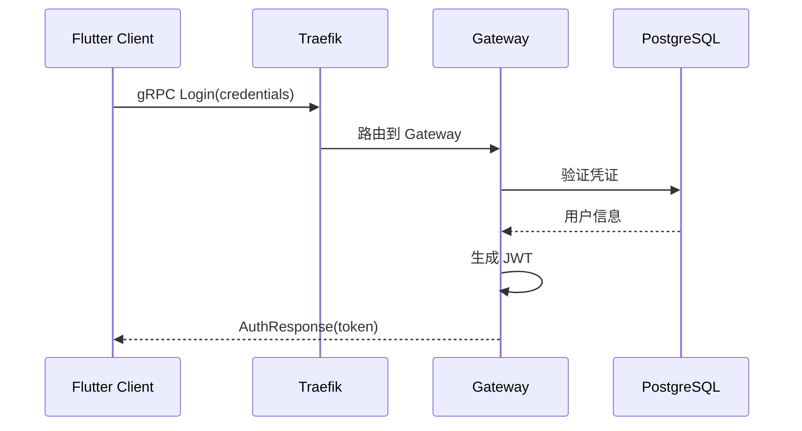
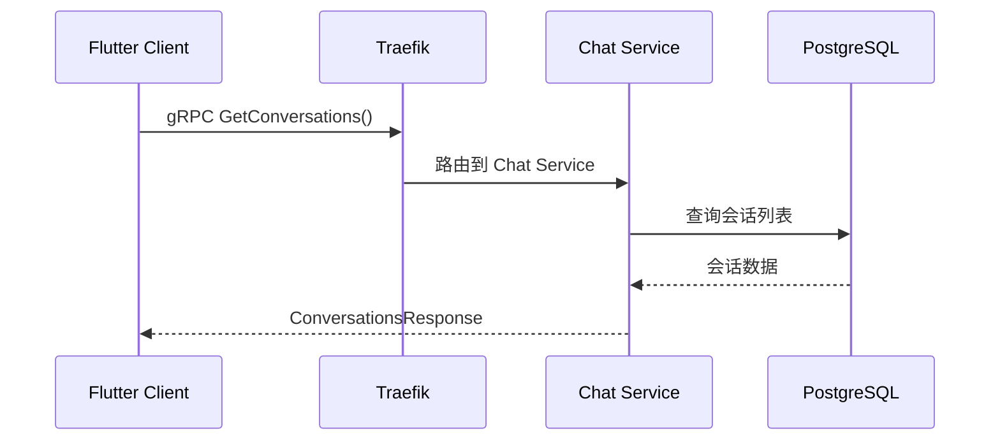
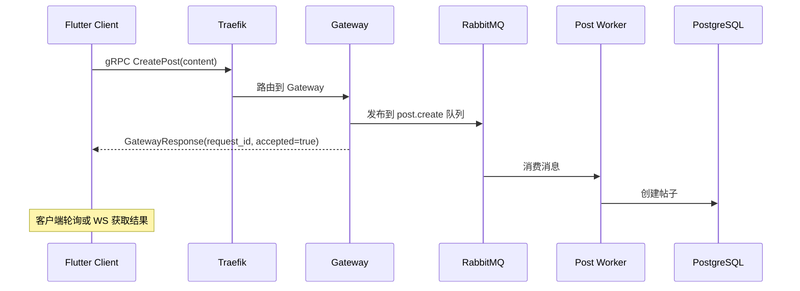

# Design Document: gRPC + WebSocket 统一架构

## Overview

本设计实现通信协议统一化重构，将 Chat Service 的 REST API 全部迁移到 gRPC，同时保留 WebSocket 用于实时消息推送。核心变更包括：

1. **Chat Service 改造**: 移除 Gin REST API，保留 gRPC Server 和 WebSocket Hub
2. **Auth 流程同步化**: 将登录/注册从 MQ 异步改为 Gateway 同步处理
3. **Gateway 智能分发**: 区分 Command（写操作→MQ）和 Query（读操作→直接返回）
4. **Flutter 网络层统一**: 移除 Dio，统一使用 gRPC + WebSocket

```
┌─────────────────────────────────────────────────────────────────────────────┐
│                              架构变更对比                                    │
├─────────────────────────────────────────────────────────────────────────────┤
│  Before (混合协议)                    After (统一协议)                       │
│  ┌─────────┐                         ┌─────────┐                            │
│  │ Flutter │                         │ Flutter │                            │
│  └────┬────┘                         └────┬────┘                            │
│       │                                   │                                  │
│  ┌────┴────┐                         ┌────┴────┐                            │
│  │ Traefik │                         │ Traefik │                            │
│  └────┬────┘                         └────┬────┘                            │
│       │                                   │                                  │
│  ┌────┼────────────┐              ┌──────┼──────────┐                       │
│  │    │            │              │      │          │                       │
│  ▼    ▼            ▼              ▼      ▼          ▼                       │
│ gRPC REST/WS    gRPC           gRPC    gRPC       WS                       │
│  │    │            │              │      │          │                       │
│  ▼    ▼            ▼              ▼      ▼          ▼                       │
│ Gateway Chat    Gateway        Gateway Chat      Chat                      │
│  │    │            │              │      │          │                       │
│  ▼    ▼            ▼              ▼      ▼          ▼                       │
│  MQ  DB/Redis    MQ            MQ/DB  DB/Redis  Redis                      │
└─────────────────────────────────────────────────────────────────────────────┘
```

## Architecture

### 整体架构图

```mermaid
graph TB
    subgraph 客户端层["📱 客户端层"]
        Flutter["Flutter App<br/>(gRPC Client + WebSocket)"]
    end

    subgraph 网关层["🌐 网关层"]
        Traefik["Traefik :80<br/>路由分发"]
    end

    subgraph 服务层["⚙️ 服务层"]
        Gateway["Go Gateway :50053<br/>(gRPC Server)<br/>Command/Query 分发"]
        Chat["Go Chat Service<br/>gRPC :50052 + WS :8080"]
        
        subgraph Workers["Worker 集群 (MQ Consumers)"]
            PostWorker["Post Worker"]
            FeedWorker["Feed Worker"]
            OtherWorkers["..."]
        end
    end

    subgraph 消息层["📨 消息层"]
        RabbitMQ["RabbitMQ"]
    end

    subgraph 数据层["🗄️ 数据层"]
        Postgres["PostgreSQL"]
        Redis["Redis"]
    end

    %% 路由逻辑
    Flutter -->|gRPC-Web /grpc/*| Traefik
    Flutter -->|WebSocket /ws/chat| Traefik

    %% Traefik 分发
    Traefik -->|gRPC| Gateway
    Traefik -->|gRPC| Chat
    Traefik -->|WS| Chat

    %% Gateway 逻辑
    Gateway -->|Command (写操作)| RabbitMQ
    Gateway -->|Query (读操作)| Postgres
    Gateway -->|Auth (同步)| Postgres

    %% Chat 逻辑
    Chat -->|gRPC (会话/消息)| Postgres
    Chat -->|WS (实时推送)| Redis

    RabbitMQ --> Workers
    Workers --> Postgres
```

### 请求流程

#### 1. Auth 流程（同步）



#### 2. Chat Query 流程（同步）



#### 3. Post Command 流程（异步）



## Components and Interfaces

### 1. Chat Service gRPC 接口

```protobuf
// protos/chat/chat.proto (已存在，无需修改)
service ChatService {
  rpc GetConversations(GetConversationsRequest) returns (ConversationsResponse);
  rpc GetConversation(GetConversationRequest) returns (Conversation);
  rpc CreateConversation(CreateConversationRequest) returns (Conversation);
  rpc GetMessages(GetMessagesRequest) returns (MessagesResponse);
  rpc SendMessage(SendMessageRequest) returns (Message);
  rpc StreamMessages(StreamRequest) returns (stream Message);
  rpc MarkAsRead(MarkAsReadRequest) returns (ReadReceipt);
  rpc MarkConversationAsRead(MarkConversationAsReadRequest) returns (BatchReadReceipt);
  rpc GetUnreadCounts(GetUnreadCountsRequest) returns (GetUnreadCountsResponse);
}
```

### 2. Gateway Auth 接口（新增同步方法）

```protobuf
// protos/gateway/gateway.proto (扩展)
service GatewayService {
  // 现有异步接口
  rpc Process(GatewayRequest) returns (GatewayResponse);
  rpc GetResult(GetResultRequest) returns (TaskResult);
  
  // 新增同步 Auth 接口
  rpc Login(LoginRequest) returns (AuthResponse);
  rpc Register(RegisterRequest) returns (AuthResponse);
  rpc RefreshToken(RefreshTokenRequest) returns (AuthResponse);
}

message LoginRequest {
  string username = 1;
  string password = 2;
}

message RegisterRequest {
  string username = 1;
  string email = 2;
  string password = 3;
}

message RefreshTokenRequest {
  string refresh_token = 1;
}

message AuthResponse {
  bool success = 1;
  string access_token = 2;
  string refresh_token = 3;
  string user_id = 4;
  string error_code = 5;
  string error_message = 6;
}
```

### 3. Chat Service 改造

```go
// service/chat_gin/internal/server/http.go
// 移除所有 REST API 路由，仅保留：
// - GET /health (健康检查)
// - GET /ws/chat (WebSocket)

func (s *HTTPServer) setupRoutes() {
    // 健康检查（保留）
    s.router.GET("/health", s.healthCheck)
    
    // WebSocket 端点（保留）
    s.router.GET("/ws/chat", s.handleWebSocket)
    
    // 移除所有 /api/v1/chat/* 路由
}
```

### 4. Flutter 网络层重构

```dart
// lib/core/network/grpc_client.dart (统一入口)
class UnifiedGrpcClient {
  final GrpcClientManager _manager;
  
  // 各服务客户端
  late final GatewayServiceClient _gatewayStub;
  late final ChatServiceClient _chatStub;
  
  // Auth 方法（同步）
  Future<AuthResponse> login(String username, String password);
  Future<AuthResponse> register(String username, String email, String password);
  
  // Chat 方法（通过 ChatGrpcClient 代理）
  ChatGrpcClient get chat => _chatClient;
}

// lib/core/network/ws_client.dart (WebSocket 管理)
class WebSocketClient {
  // 连接管理
  Future<void> connect(String userId);
  Future<void> disconnect();
  
  // 心跳和重连
  void _startHeartbeat();
  void _scheduleReconnect();
  
  // 消息流
  Stream<WsMessage> get messageStream;
}
```

## Data Models

### Proto 消息定义

现有 `protos/chat/chat.proto` 已定义完整的消息类型，无需修改。

### WebSocket 消息格式

```typescript
// 客户端 → 服务端
interface WsClientMessage {
  action: 'subscribe' | 'unsubscribe' | 'ping';
  conversation_id?: string;
}

// 服务端 → 客户端
interface WsServerMessage {
  type: 'message' | 'conversation_update' | 'read_receipt' | 'pong';
  payload: any;
}
```

## Correctness Properties

*A property is a characteristic or behavior that should hold true across all valid executions of a system—essentially, a formal statement about what the system should do. Properties serve as the bridge between human-readable specifications and machine-verifiable correctness guarantees.*

### Property 1: gRPC Chat 操作一致性

*For any* 有效的 Chat gRPC 请求（GetConversations, GetMessages, SendMessage 等），Chat Service 应返回与请求语义一致的响应数据，且数据应与数据库状态保持一致。

**Validates: Requirements 1.2, 1.3, 1.4, 1.5, 1.6**

### Property 2: Auth 同步响应

*For any* 登录或注册请求，Gateway 应同步返回认证结果：
- 有效凭证 → 返回 JWT Token
- 无效凭证 → 返回 UNAUTHENTICATED 错误

**Validates: Requirements 3.1, 3.2, 3.4**

### Property 3: Command/Query 分离

*For any* Gateway 请求：
- Command 类型（CreatePost, Like 等）→ 返回 accepted=true 和 request_id
- Query 类型（GetProfile, GetFeed 等）→ 直接返回数据

**Validates: Requirements 4.1, 4.2**

### Property 4: gRPC 认证拦截

*For any* 需要认证的 gRPC 请求，如果 metadata 中缺少有效的 authorization header，服务应返回 UNAUTHENTICATED 状态码。

**Validates: Requirements 5.3, 8.2**

### Property 5: 错误码一致性

*For any* 错误情况，gRPC 服务应返回标准状态码：
- 未认证 → UNAUTHENTICATED
- 参数无效 → INVALID_ARGUMENT
- 资源不存在 → NOT_FOUND

**Validates: Requirements 8.2, 8.3, 8.4**

### Property 6: 错误消息转换

*For any* gRPC 错误码，GrpcErrorConverter 应能将其转换为非空的用户友好错误信息。

**Validates: Requirements 8.5**

## Error Handling

### gRPC 错误码映射

| 场景 | gRPC Status Code | 错误消息 |
|------|------------------|----------|
| 未提供 Token | UNAUTHENTICATED | 认证失败，请重新登录 |
| Token 过期 | UNAUTHENTICATED | 登录已过期，请重新登录 |
| 无权访问 | PERMISSION_DENIED | 权限不足 |
| 会话不存在 | NOT_FOUND | 会话不存在 |
| 消息不存在 | NOT_FOUND | 消息不存在 |
| 参数格式错误 | INVALID_ARGUMENT | 参数无效: {details} |
| 服务不可用 | UNAVAILABLE | 服务暂时不可用，请稍后重试 |
| 请求超时 | DEADLINE_EXCEEDED | 请求超时，请检查网络连接 |
| 内部错误 | INTERNAL | 服务器内部错误 |

### Flutter 错误处理

```dart
class GrpcErrorConverter {
  static String toUserMessage(GrpcError error) {
    switch (error.code) {
      case StatusCode.unauthenticated:
        return '认证失败，请重新登录';
      case StatusCode.permissionDenied:
        return '权限不足';
      case StatusCode.notFound:
        return '资源不存在';
      case StatusCode.invalidArgument:
        return '参数无效: ${error.message}';
      case StatusCode.unavailable:
        return '服务暂时不可用，请稍后重试';
      case StatusCode.deadlineExceeded:
        return '请求超时，请检查网络连接';
      default:
        return error.message ?? '未知错误';
    }
  }
}
```

## Testing Strategy

### 测试方法

本设计采用双重测试策略：

1. **单元测试**: 验证具体示例和边界情况
2. **属性测试**: 验证通用属性在所有输入下成立

### 属性测试配置

- 测试框架: Go 使用 `testing/quick`，Dart 使用 `glados`
- 每个属性测试最少运行 100 次迭代
- 每个测试需标注对应的设计属性

### 测试覆盖

| 组件 | 单元测试 | 属性测试 |
|------|----------|----------|
| Chat gRPC Handler | 各 RPC 方法的正常/异常路径 | Property 1: 操作一致性 |
| Gateway Auth | 登录/注册的正常/异常路径 | Property 2: 同步响应 |
| Gateway Router | Command/Query 路由逻辑 | Property 3: 分离正确性 |
| Auth Interceptor | Token 验证逻辑 | Property 4: 认证拦截 |
| Error Handler | 各错误码处理 | Property 5, 6: 错误处理 |

### 集成测试

- WebSocket 连接/断开/重连
- Traefik gRPC/WS 路由
- 端到端消息流程
