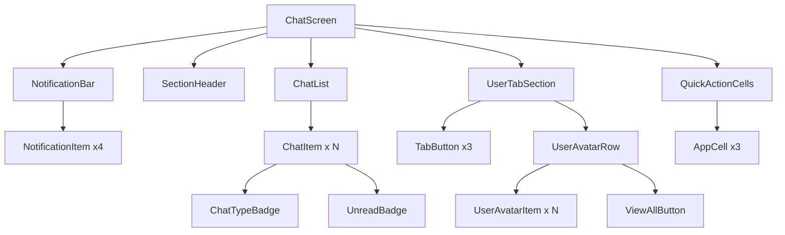

# Design Document: Message Page UI Refactor

## Overview

本设计文档描述 Message 页面的 UI 重构方案，基于最新设计稿实现全新的消息页面布局。页面采用垂直滚动布局，从上到下依次包含：通知分类栏、最近聊天列表、用户切换区域（好友/粉丝/关注）、快捷操作入口。

设计遵循项目 Flutter 组件开发准则，所有组件使用 `AppColors`、`AppSpacing`、`AppRadius` 主题系统，确保视觉一致性和可维护性。

## Architecture

### 页面结构

```
MessagePage (ChatScreen)
├── Scaffold
│   ├── AppBar (无标题，简洁设计)
│   └── Body
│       └── SingleChildScrollView / CustomScrollView
│           ├── NotificationBar (通知分类栏)
│           ├── SectionHeader ("最近聊天")
│           ├── ChatList (聊天列表)
│           ├── UserTabSection (好友/粉丝/关注切换)
│           │   ├── TabBar
│           │   └── UserAvatarRow (横向头像列表)
│           └── QuickActionCells (快捷操作)
```

### 组件层级



## Components and Interfaces

### 1. NotificationBar 组件

通知分类栏，显示四个通知入口。

```dart
/// 通知分类栏 - 显示四个通知类型入口
class NotificationBar extends StatelessWidget {
  /// 点击回调，参数为通知类型
  final void Function(NotificationType type)? onTap;
  
  const NotificationBar({super.key, this.onTap});
}

/// 通知类型枚举
enum NotificationType {
  likes,     // 喜欢
  replies,   // 回复
  bookmarks, // 收藏
  follows,   // 关注
}
```

**视觉规格：**
- 容器：水平排列，等间距分布
- 图标容器：56x56px，圆角 `AppRadius.xl` (16px)，背景 `AppColors.secondary`
- 图标：28px，颜色 `AppColors.foreground`
- 标签：12px，颜色 `AppColors.foreground`，间距 `AppSpacing.sm` (8px)

### 2. ChatItem 组件

单个聊天会话项，重构现有组件。

```dart
/// 聊天类型枚举
enum ChatType {
  private,  // 私聊
  group,    // 群聊
  channel,  // 频道
}

/// 聊天会话项组件
class ChatItem extends StatelessWidget {
  /// 头像 URL
  final String? avatarUrl;
  
  /// 聊天标题（用户名/群名/频道名）
  final String title;
  
  /// 副标题（最后一条消息）
  final String subtitle;
  
  /// 时间显示
  final String time;
  
  /// 未读消息数
  final int unreadCount;
  
  /// 聊天类型
  final ChatType chatType;
  
  /// 是否静音
  final bool isMuted;
  
  /// 点击回调
  final VoidCallback? onTap;
}
```

**视觉规格：**
- 内边距：水平 `AppSpacing.lg` (16px)，垂直 `AppSpacing.md` (12px)
- 头像：48px 圆形
- 标题：14px，`AppColors.foreground`，`FontWeight.w500`
- 副标题：13px，`AppColors.mutedForeground`，单行省略
- 时间：12px，`AppColors.mutedForeground`
- 未读徽章：`AppColors.info` 背景，白色文字

### 3. ChatTypeBadge 组件

聊天类型标识，显示在头像右下角。

```dart
/// 聊天类型标识组件
class ChatTypeBadge extends StatelessWidget {
  /// 聊天类型
  final ChatType chatType;
  
  const ChatTypeBadge({super.key, required this.chatType});
}
```

**视觉规格：**
- 尺寸：16x16px
- 背景：`AppColors.background`（带边框效果）
- 图标：10px，`AppColors.mutedForeground`
- 群聊图标：`Icons.people_outline` 或双人图标
- 频道图标：`#` 符号或 `Icons.tag`
- 私聊：不显示徽章

### 4. UserTabSection 组件

用户切换区域，包含三个标签页。

```dart
/// 用户标签类型
enum UserTabType {
  friends,   // 好友
  followers, // 粉丝
  following, // 关注
}

/// 用户切换区域组件
class UserTabSection extends StatefulWidget {
  /// 好友列表
  final List<UserItem> friends;
  
  /// 粉丝列表
  final List<UserItem> followers;
  
  /// 关注列表
  final List<UserItem> following;
  
  /// 用户点击回调
  final void Function(UserItem user)? onUserTap;
  
  /// 查看全部回调
  final void Function(UserTabType type)? onViewAll;
}
```

**视觉规格：**
- Tab 间距：`AppSpacing.xl` (24px)
- 选中态：`AppColors.foreground`，`FontWeight.bold`，下划线 20x3px
- 未选中态：`AppColors.mutedForeground`，`FontWeight.normal`
- 下划线颜色：`AppColors.foreground`

### 5. UserAvatarRow 组件

横向滚动的用户头像列表。

```dart
/// 用户头像行组件
class UserAvatarRow extends StatelessWidget {
  /// 用户列表
  final List<UserItem> users;
  
  /// 用户点击回调
  final void Function(UserItem user)? onUserTap;
  
  /// 查看全部回调
  final VoidCallback? onViewAll;
}

/// 用户数据模型
class UserItem {
  final String id;
  final String name;
  final String avatarUrl;
  final bool isOnline;
}
```

**视觉规格：**
- 头像：48px 圆形
- 用户名：12px，`AppColors.foreground`，居中
- 间距：`AppSpacing.md` (12px)
- 查看全部按钮：灰色圆形背景 + chevron_right 图标

### 6. QuickActionCell 组件

复用现有 `AppCell` 组件，配置如下：

| 操作 | 图标 | 标题 | 描述 |
|------|------|------|------|
| 创建群聊 | `Icons.people_outline` | 创建群聊 | 创建新的群组聊天 |
| 创建频道 | `Icons.tag` | 创建频道 | 创建新的频道 |
| 添加好友 | `Icons.person_add_alt_outlined` | 添加好友 | 通过ID或二维码添加 |

## Data Models

### 现有模型复用

```dart
// 复用 conversation.dart
@freezed
sealed class Conversation with _$Conversation {
  const factory Conversation({
    required String id,
    required List<ChatUser> participants,
    @JsonKey(name: 'last_message') String? lastMessage,
    @JsonKey(name: 'last_message_time') DateTime? lastMessageTime,
    @JsonKey(name: 'unread_count') @Default(0) int unreadCount,
    @JsonKey(name: 'created_at') required DateTime createdAt,
    @JsonKey(name: 'updated_at') DateTime? updatedAt,
  }) = _Conversation;
}
```

### 新增字段

需要在 `Conversation` 模型中添加聊天类型字段：

```dart
/// 聊天类型
@JsonKey(name: 'chat_type') @Default('private') String chatType,
```

## Correctness Properties

*A property is a characteristic or behavior that should hold true across all valid executions of a system—essentially, a formal statement about what the system should do. Properties serve as the bridge between human-readable specifications and machine-verifiable correctness guarantees.*

### Property 1: Chat List Sorting

*For any* list of conversations displayed in the Chat_List, they SHALL be sorted by `lastMessageTime` in descending order (newest first).

**Validates: Requirements 2.2**

### Property 2: Chat Type Badge Consistency

*For any* ChatItem with a given `chatType`, the ChatTypeBadge SHALL display the correct icon:
- `ChatType.group` → group icon (双人图标)
- `ChatType.channel` → hashtag icon (#)
- `ChatType.private` → no badge displayed

**Validates: Requirements 2.5, 2.6, 6.5, 6.6, 6.7, 6.8**

### Property 3: Unread Badge Display Logic

*For any* ChatItem:
- IF `unreadCount > 0`, THEN UnreadBadge SHALL be visible
- IF `unreadCount > 99`, THEN UnreadBadge text SHALL be "99+"
- IF `unreadCount <= 0`, THEN UnreadBadge SHALL NOT be visible

**Validates: Requirements 2.8, 2.9**

### Property 4: Tab Selection State

*For any* selected tab in UserTabSection:
- The selected tab SHALL have `AppColors.foreground` color and bold font weight
- The selected tab SHALL have an underline indicator
- All unselected tabs SHALL have `AppColors.mutedForeground` color and normal font weight
- All unselected tabs SHALL NOT have an underline indicator

**Validates: Requirements 3.2, 3.3, 3.4**

### Property 5: Tab Content Switching

*For any* tab selection in UserTabSection:
- WHEN "好友" is selected, UserAvatarRow SHALL display `friends` list
- WHEN "粉丝" is selected, UserAvatarRow SHALL display `followers` list
- WHEN "关注" is selected, UserAvatarRow SHALL display `following` list

**Validates: Requirements 3.5, 3.6, 3.7**

## Error Handling

### 空状态处理

1. **聊天列表为空**：显示空状态插图和提示文字 "暂无聊天"
2. **用户列表为空**：显示空状态提示 "暂无好友/粉丝/关注"
3. **头像加载失败**：显示默认头像占位符

### 加载状态处理

1. **聊天列表加载中**：显示骨架屏或 CircularProgressIndicator
2. **用户列表加载中**：显示头像占位符动画

### 错误状态处理

1. **网络错误**：显示错误提示和重试按钮
2. **数据解析错误**：静默处理，显示默认值

## Testing Strategy

### 单元测试

1. **ChatTypeBadge 组件测试**
   - 测试不同 ChatType 显示正确图标
   - 测试 private 类型不显示徽章

2. **UnreadBadge 组件测试**
   - 测试 unreadCount = 0 时不显示
   - 测试 unreadCount = 50 时显示 "50"
   - 测试 unreadCount = 100 时显示 "99+"

3. **UserTabSection 状态测试**
   - 测试初始选中状态
   - 测试切换 tab 后状态变化

### 属性测试

使用 `flutter_test` 配合 `property_based_testing` 或手动生成测试数据：

1. **Property 1 测试**：生成随机 Conversation 列表，验证排序正确性
2. **Property 2 测试**：生成所有 ChatType 枚举值，验证徽章显示逻辑
3. **Property 3 测试**：生成随机 unreadCount (0-200)，验证徽章显示和文本
4. **Property 4 测试**：生成所有 tab 选中状态，验证样式正确性
5. **Property 5 测试**：生成所有 tab 选中状态，验证内容切换正确性

### Widget 测试

1. **NotificationBar 测试**：验证四个入口正确渲染和点击响应
2. **ChatItem 测试**：验证所有元素正确渲染
3. **UserAvatarRow 测试**：验证横向滚动和查看全部按钮

### 集成测试

1. **页面滚动测试**：验证整体页面滚动流畅
2. **Tab 切换测试**：验证切换 tab 后内容正确更新
3. **导航测试**：验证点击各入口正确跳转
