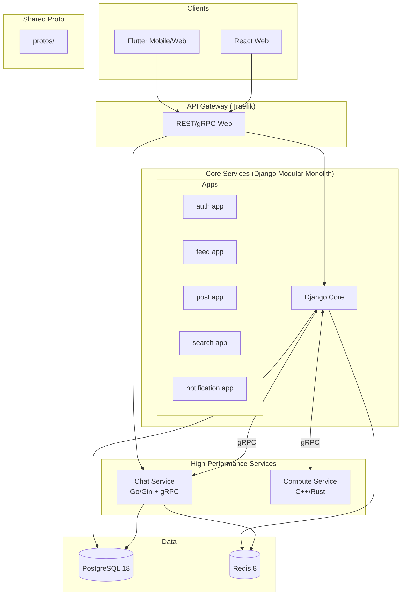

# Design Document: Platform Scaffold

## Overview

本设计采用**混合架构模式**：Django 模块化单体 + 高性能语言微服务。Django 作为核心业务服务（认证、帖子、通知、搜索），Go 处理高并发实时通信（聊天、WebSocket），C++/Rust 处理计算密集型任务。服务间通过 gRPC 通信，客户端通过 gRPC-Web/REST 访问。

## Architecture

### 系统架构图



### 目录结构 (完整版)

```
.
├── dev.sh                          # 开发环境入口脚本
├── prod.sh                         # 生产环境入口脚本
├── README.md
├── .gitignore
│
├── protos/                         # 共享 Protocol Buffers 定义
│   ├── common/
│   │   └── common.proto            # 通用消息类型
│   ├── auth/
│   │   └── auth.proto              # 认证服务 proto
│   ├── feed/
│   │   └── feed.proto              # Feed 服务 proto
│   ├── post/
│   │   └── post.proto              # 帖子服务 proto
│   ├── chat/
│   │   └── chat.proto              # 聊天服务 proto
│   ├── notification/
│   │   └── notification.proto      # 通知服务 proto
│   └── compute/
│       └── compute.proto           # 计算服务 proto
│
├── infra/                          # 基础设施配置
│   ├── docker-compose.yml          # 开发环境
│   ├── docker-compose.prod.yml     # 生产环境
│   ├── .env.dev                    # 开发环境变量
│   ├── .env.prod                   # 生产环境变量模板
│   ├── gateway/
│   │   ├── traefik.yml             # Traefik 静态配置
│   │   └── dynamic/
│   │       └── routes.yml          # 动态路由配置
│   ├── database/
│   │   └── init.sql                # 数据库初始化
│   └── cache/
│       └── redis.conf              # Redis 配置
│
├── service/                        # 后端服务
│   │
│   ├── core_django/                # Django 模块化单体
│   │   ├── Dockerfile
│   │   ├── requirements.txt
│   │   ├── pyproject.toml
│   │   ├── manage.py
│   │   ├── config/                 # 项目配置
│   │   │   ├── __init__.py
│   │   │   ├── settings/
│   │   │   │   ├── __init__.py
│   │   │   │   ├── base.py         # 基础配置
│   │   │   │   ├── dev.py          # 开发配置
│   │   │   │   └── prod.py         # 生产配置
│   │   │   ├── urls.py             # 根 URL 配置
│   │   │   ├── asgi.py
│   │   │   └── wsgi.py
│   │   │
│   │   ├── apps/                   # Django Apps (模块化)
│   │   │   ├── __init__.py
│   │   │   │
│   │   │   ├── users/              # 用户认证模块
│   │   │   │   ├── __init__.py
│   │   │   │   ├── apps.py
│   │   │   │   ├── models.py
│   │   │   │   ├── serializers.py
│   │   │   │   ├── views.py
│   │   │   │   ├── urls.py
│   │   │   │   ├── services.py     # 业务逻辑层
│   │   │   │   ├── grpc_services.py # gRPC 服务实现
│   │   │   │   ├── admin.py
│   │   │   │   ├── tests/
│   │   │   │   │   ├── __init__.py
│   │   │   │   │   ├── test_models.py
│   │   │   │   │   └── test_views.py
│   │   │   │   └── migrations/
│   │   │   │
│   │   │   ├── posts/              # 帖子模块
│   │   │   │   ├── __init__.py
│   │   │   │   ├── apps.py
│   │   │   │   ├── models.py       # Post, Story, Column 模型
│   │   │   │   ├── serializers.py
│   │   │   │   ├── views.py
│   │   │   │   ├── urls.py
│   │   │   │   ├── services.py
│   │   │   │   ├── grpc_services.py
│   │   │   │   ├── tasks.py        # Celery 任务 (Story 过期删除)
│   │   │   │   ├── admin.py
│   │   │   │   ├── tests/
│   │   │   │   └── migrations/
│   │   │   │
│   │   │   ├── feeds/              # Feeds 流模块
│   │   │   │   ├── __init__.py
│   │   │   │   ├── apps.py
│   │   │   │   ├── models.py       # Like, Repost, Comment, Bookmark
│   │   │   │   ├── serializers.py
│   │   │   │   ├── views.py
│   │   │   │   ├── urls.py
│   │   │   │   ├── services.py
│   │   │   │   ├── grpc_services.py
│   │   │   │   ├── admin.py
│   │   │   │   ├── tests/
│   │   │   │   └── migrations/
│   │   │   │
│   │   │   ├── search/             # 搜索模块
│   │   │   │   ├── __init__.py
│   │   │   │   ├── apps.py
│   │   │   │   ├── views.py
│   │   │   │   ├── urls.py
│   │   │   │   ├── services.py
│   │   │   │   ├── indexes.py      # 搜索索引定义
│   │   │   │   └── tests/
│   │   │   │
│   │   │   └── notifications/      # 通知模块
│   │   │       ├── __init__.py
│   │   │       ├── apps.py
│   │   │       ├── models.py
│   │   │       ├── serializers.py
│   │   │       ├── views.py
│   │   │       ├── urls.py
│   │   │       ├── services.py
│   │   │       ├── grpc_services.py
│   │   │       ├── consumers.py    # WebSocket consumers
│   │   │       ├── admin.py
│   │   │       ├── tests/
│   │   │       └── migrations/
│   │   │
│   │   ├── core/                   # 共享核心模块
│   │   │   ├── __init__.py
│   │   │   ├── models.py           # 基础模型类
│   │   │   ├── permissions.py      # 权限类
│   │   │   ├── pagination.py       # 分页类
│   │   │   ├── exceptions.py       # 自定义异常
│   │   │   ├── middleware.py       # 中间件
│   │   │   └── utils.py            # 工具函数
│   │   │
│   │   ├── grpc_server/            # gRPC 服务器配置
│   │   │   ├── __init__.py
│   │   │   ├── server.py           # gRPC 服务器启动
│   │   │   └── interceptors.py     # gRPC 拦截器
│   │   │
│   │   └── generated/              # 生成的 proto 代码
│   │       └── protos/
│   │
│   ├── chat_go/                    # Go 聊天服务
│   │   ├── Dockerfile
│   │   ├── go.mod
│   │   ├── go.sum
│   │   ├── Makefile
│   │   ├── cmd/
│   │   │   └── server/
│   │   │       └── main.go         # 入口
│   │   ├── internal/
│   │   │   ├── config/
│   │   │   │   └── config.go
│   │   │   ├── server/
│   │   │   │   ├── grpc.go         # gRPC 服务器
│   │   │   │   ├── http.go         # HTTP/WebSocket 服务器
│   │   │   │   └── router.go
│   │   │   ├── service/
│   │   │   │   ├── chat.go         # 聊天业务逻辑
│   │   │   │   ├── conversation.go
│   │   │   │   └── message.go
│   │   │   ├── repository/
│   │   │   │   ├── conversation.go
│   │   │   │   └── message.go
│   │   │   ├── model/
│   │   │   │   ├── conversation.go
│   │   │   │   └── message.go
│   │   │   ├── handler/
│   │   │   │   ├── grpc/           # gRPC handlers
│   │   │   │   │   └── chat.go
│   │   │   │   └── ws/             # WebSocket handlers
│   │   │   │       └── hub.go
│   │   │   └── middleware/
│   │   │       └── auth.go
│   │   ├── pkg/
│   │   │   ├── database/
│   │   │   │   └── postgres.go
│   │   │   └── cache/
│   │   │       └── redis.go
│   │   └── generated/              # 生成的 proto 代码
│   │       └── protos/
│   │
│   └── compute_cpp/                # C++ 计算服务 (可选)
│       ├── Dockerfile
│       ├── CMakeLists.txt
│       ├── src/
│       │   ├── main.cpp
│       │   └── services/
│       └── generated/

│
├── client/                         # 前端客户端
│   │
│   ├── mobile_flutter/             # Flutter 客户端 (Clean Architecture)
│   │   ├── pubspec.yaml
│   │   ├── analysis_options.yaml
│   │   ├── lib/
│   │   │   ├── main.dart
│   │   │   │
│   │   │   ├── core/               # 核心模块 (跨功能共享)
│   │   │   │   ├── api/
│   │   │   │   │   ├── api_client.dart         # HTTP 客户端
│   │   │   │   │   ├── grpc_client.dart        # gRPC 客户端
│   │   │   │   │   ├── interceptors/
│   │   │   │   │   │   ├── auth_interceptor.dart
│   │   │   │   │   │   └── logging_interceptor.dart
│   │   │   │   │   └── endpoints.dart          # API 端点常量
│   │   │   │   ├── constants/
│   │   │   │   │   ├── app_constants.dart
│   │   │   │   │   └── route_constants.dart
│   │   │   │   ├── theme/
│   │   │   │   │   ├── app_theme.dart
│   │   │   │   │   ├── app_colors.dart
│   │   │   │   │   └── app_text_styles.dart
│   │   │   │   ├── utils/
│   │   │   │   │   ├── validators.dart
│   │   │   │   │   ├── formatters.dart
│   │   │   │   │   └── extensions.dart
│   │   │   │   ├── errors/
│   │   │   │   │   ├── failures.dart
│   │   │   │   │   └── exceptions.dart
│   │   │   │   └── di/
│   │   │   │       └── injection.dart          # 依赖注入配置
│   │   │   │
│   │   │   ├── features/           # 功能模块 (Feature-First)
│   │   │   │   │
│   │   │   │   ├── auth/           # 认证模块
│   │   │   │   │   ├── data/
│   │   │   │   │   │   ├── datasources/
│   │   │   │   │   │   │   ├── auth_remote_datasource.dart
│   │   │   │   │   │   │   └── auth_local_datasource.dart
│   │   │   │   │   │   ├── models/
│   │   │   │   │   │   │   ├── user_model.dart
│   │   │   │   │   │   │   └── token_model.dart
│   │   │   │   │   │   └── repositories/
│   │   │   │   │   │       └── auth_repository_impl.dart
│   │   │   │   │   ├── domain/
│   │   │   │   │   │   ├── entities/
│   │   │   │   │   │   │   └── user.dart
│   │   │   │   │   │   ├── repositories/
│   │   │   │   │   │   │   └── auth_repository.dart
│   │   │   │   │   │   └── usecases/
│   │   │   │   │   │       ├── login.dart
│   │   │   │   │   │       ├── register.dart
│   │   │   │   │   │       └── logout.dart
│   │   │   │   │   └── presentation/
│   │   │   │   │       ├── providers/
│   │   │   │   │       │   └── auth_provider.dart
│   │   │   │   │       ├── pages/
│   │   │   │   │       │   ├── login_page.dart
│   │   │   │   │       │   └── register_page.dart
│   │   │   │   │       └── widgets/
│   │   │   │   │           └── auth_form.dart
│   │   │   │   │
│   │   │   │   ├── feeds/          # Feeds 模块
│   │   │   │   │   ├── data/
│   │   │   │   │   │   ├── datasources/
│   │   │   │   │   │   │   └── feed_remote_datasource.dart
│   │   │   │   │   │   ├── models/
│   │   │   │   │   │   │   ├── feed_item_model.dart
│   │   │   │   │   │   │   └── comment_model.dart
│   │   │   │   │   │   └── repositories/
│   │   │   │   │   │       └── feed_repository_impl.dart
│   │   │   │   │   ├── domain/
│   │   │   │   │   │   ├── entities/
│   │   │   │   │   │   │   ├── feed_item.dart
│   │   │   │   │   │   │   └── comment.dart
│   │   │   │   │   │   ├── repositories/
│   │   │   │   │   │   │   └── feed_repository.dart
│   │   │   │   │   │   └── usecases/
│   │   │   │   │   │       ├── get_feeds.dart
│   │   │   │   │   │       ├── like_post.dart
│   │   │   │   │   │       ├── repost.dart
│   │   │   │   │   │       ├── comment.dart
│   │   │   │   │   │       └── bookmark.dart
│   │   │   │   │   └── presentation/
│   │   │   │   │       ├── providers/
│   │   │   │   │       │   └── feed_provider.dart
│   │   │   │   │       ├── pages/
│   │   │   │   │       │   └── feeds_page.dart
│   │   │   │   │       └── widgets/
│   │   │   │   │           ├── feed_item_card.dart
│   │   │   │   │           ├── feed_actions.dart
│   │   │   │   │           └── comment_sheet.dart
│   │   │   │   │
│   │   │   │   ├── search/         # 搜索模块
│   │   │   │   │   ├── data/
│   │   │   │   │   │   ├── datasources/
│   │   │   │   │   │   ├── models/
│   │   │   │   │   │   └── repositories/
│   │   │   │   │   ├── domain/
│   │   │   │   │   │   ├── entities/
│   │   │   │   │   │   ├── repositories/
│   │   │   │   │   │   └── usecases/
│   │   │   │   │   └── presentation/
│   │   │   │   │       ├── providers/
│   │   │   │   │       ├── pages/
│   │   │   │   │       │   └── search_page.dart
│   │   │   │   │       └── widgets/
│   │   │   │   │
│   │   │   │   ├── post/           # 发帖模块
│   │   │   │   │   ├── data/
│   │   │   │   │   │   ├── datasources/
│   │   │   │   │   │   ├── models/
│   │   │   │   │   │   │   ├── post_model.dart
│   │   │   │   │   │   │   ├── story_model.dart
│   │   │   │   │   │   │   └── column_model.dart
│   │   │   │   │   │   └── repositories/
│   │   │   │   │   ├── domain/
│   │   │   │   │   │   ├── entities/
│   │   │   │   │   │   │   ├── post.dart
│   │   │   │   │   │   │   ├── story.dart
│   │   │   │   │   │   │   └── column.dart
│   │   │   │   │   │   ├── repositories/
│   │   │   │   │   │   └── usecases/
│   │   │   │   │   │       ├── create_post.dart
│   │   │   │   │   │       ├── create_story.dart
│   │   │   │   │   │       └── create_column.dart
│   │   │   │   │   └── presentation/
│   │   │   │   │       ├── providers/
│   │   │   │   │       ├── pages/
│   │   │   │   │       │   └── create_post_page.dart
│   │   │   │   │       └── widgets/
│   │   │   │   │           └── post_type_selector.dart
│   │   │   │   │
│   │   │   │   ├── notifications/  # 通知模块
│   │   │   │   │   ├── data/
│   │   │   │   │   │   ├── datasources/
│   │   │   │   │   │   ├── models/
│   │   │   │   │   │   │   └── notification_model.dart
│   │   │   │   │   │   └── repositories/
│   │   │   │   │   ├── domain/
│   │   │   │   │   │   ├── entities/
│   │   │   │   │   │   │   └── notification.dart
│   │   │   │   │   │   ├── repositories/
│   │   │   │   │   │   └── usecases/
│   │   │   │   │   └── presentation/
│   │   │   │   │       ├── providers/
│   │   │   │   │       ├── pages/
│   │   │   │   │       │   └── notifications_page.dart
│   │   │   │   │       └── widgets/
│   │   │   │   │           ├── notification_tabs.dart
│   │   │   │   │           └── notification_item.dart
│   │   │   │   │
│   │   │   │   ├── chat/           # 聊天模块
│   │   │   │   │   ├── data/
│   │   │   │   │   │   ├── datasources/
│   │   │   │   │   │   │   ├── chat_remote_datasource.dart
│   │   │   │   │   │   │   └── chat_grpc_datasource.dart  # gRPC
│   │   │   │   │   │   ├── models/
│   │   │   │   │   │   │   ├── conversation_model.dart
│   │   │   │   │   │   │   └── message_model.dart
│   │   │   │   │   │   └── repositories/
│   │   │   │   │   ├── domain/
│   │   │   │   │   │   ├── entities/
│   │   │   │   │   │   │   ├── conversation.dart
│   │   │   │   │   │   │   └── message.dart
│   │   │   │   │   │   ├── repositories/
│   │   │   │   │   │   └── usecases/
│   │   │   │   │   │       ├── get_conversations.dart
│   │   │   │   │   │       ├── send_message.dart
│   │   │   │   │   │       └── create_group.dart
│   │   │   │   │   └── presentation/
│   │   │   │   │       ├── providers/
│   │   │   │   │       │   └── chat_provider.dart
│   │   │   │   │       ├── pages/
│   │   │   │   │       │   ├── conversations_page.dart
│   │   │   │   │       │   └── chat_room_page.dart
│   │   │   │   │       └── widgets/
│   │   │   │   │           ├── message_bubble.dart
│   │   │   │   │           └── chat_input.dart
│   │   │   │   │
│   │   │   │   ├── profile/        # 个人中心模块
│   │   │   │   │   ├── data/
│   │   │   │   │   │   ├── datasources/
│   │   │   │   │   │   ├── models/
│   │   │   │   │   │   └── repositories/
│   │   │   │   │   ├── domain/
│   │   │   │   │   │   ├── entities/
│   │   │   │   │   │   ├── repositories/
│   │   │   │   │   │   └── usecases/
│   │   │   │   │   └── presentation/
│   │   │   │   │       ├── providers/
│   │   │   │   │       ├── pages/
│   │   │   │   │       │   ├── profile_page.dart
│   │   │   │   │       │   └── settings_page.dart
│   │   │   │   │       └── widgets/
│   │   │   │   │
│   │   │   │   └── navigation/     # 导航模块
│   │   │   │       └── presentation/
│   │   │   │           ├── pages/
│   │   │   │           │   └── main_navigation_page.dart
│   │   │   │           └── widgets/
│   │   │   │               └── bottom_nav_bar.dart
│   │   │   │
│   │   │   ├── shared/             # 共享组件
│   │   │   │   ├── widgets/
│   │   │   │   │   ├── loading_indicator.dart
│   │   │   │   │   ├── error_widget.dart
│   │   │   │   │   ├── avatar.dart
│   │   │   │   │   └── custom_button.dart
│   │   │   │   ├── models/
│   │   │   │   │   └── pagination.dart
│   │   │   │   └── providers/
│   │   │   │       └── connectivity_provider.dart
│   │   │   │
│   │   │   └── generated/          # 生成的 proto 代码
│   │   │       └── protos/
│   │   │
│   │   └── test/
│   │       ├── unit/
│   │       ├── widget/
│   │       └── integration/
│   │
│   └── web_react/                  # React Web 客户端
│       ├── package.json
│       ├── next.config.ts
│       ├── tailwind.config.ts
│       ├── tsconfig.json
│       ├── src/
│       │   ├── app/                # Next.js App Router
│       │   │   ├── layout.tsx
│       │   │   ├── page.tsx
│       │   │   ├── (auth)/
│       │   │   │   ├── login/page.tsx
│       │   │   │   └── register/page.tsx
│       │   │   ├── feeds/page.tsx
│       │   │   ├── search/page.tsx
│       │   │   ├── post/page.tsx
│       │   │   ├── notifications/page.tsx
│       │   │   ├── chat/
│       │   │   │   ├── page.tsx
│       │   │   │   └── [id]/page.tsx
│       │   │   └── profile/page.tsx
│       │   ├── components/
│       │   │   ├── ui/             # 基础 UI 组件
│       │   │   └── features/       # 功能组件
│       │   ├── features/           # 功能模块
│       │   │   ├── auth/
│       │   │   ├── feeds/
│       │   │   ├── search/
│       │   │   ├── post/
│       │   │   ├── notifications/
│       │   │   ├── chat/
│       │   │   └── profile/
│       │   ├── hooks/
│       │   ├── lib/
│       │   │   ├── api/
│       │   │   │   ├── client.ts
│       │   │   │   └── grpc-web.ts
│       │   │   └── utils/
│       │   ├── types/
│       │   └── generated/          # 生成的 proto 代码
│       │       └── protos/
│       └── tests/
│
├── scripts/
│   ├── proto/
│   │   └── generate.sh             # Proto 代码生成脚本
│   ├── dev/
│   │   └── setup.sh                # 开发环境初始化
│   └── prod/
│       └── deploy.sh               # 生产部署脚本
│
└── docs/
    ├── api/
    │   └── openapi.yaml
    └── architecture/
        └── decisions/              # ADR (Architecture Decision Records)
```


## Components and Interfaces

### 1. gRPC Proto 定义

#### common.proto
```protobuf
syntax = "proto3";
package common;
option go_package = "generated/protos/common";

message Pagination {
  int32 page = 1;
  int32 page_size = 2;
  int32 total = 3;
}

message Timestamp {
  int64 seconds = 1;
  int32 nanos = 2;
}

message UUID {
  string value = 1;
}
```

#### auth.proto
```protobuf
syntax = "proto3";
package auth;
option go_package = "generated/protos/auth";

import "common/common.proto";

service AuthService {
  rpc Register(RegisterRequest) returns (AuthResponse);
  rpc Login(LoginRequest) returns (AuthResponse);
  rpc Logout(LogoutRequest) returns (Empty);
  rpc RefreshToken(RefreshRequest) returns (AuthResponse);
  rpc ValidateToken(ValidateRequest) returns (ValidateResponse);
  rpc GetUser(GetUserRequest) returns (User);
}

message User {
  string id = 1;
  string username = 2;
  string email = 3;
  string display_name = 4;
  string avatar_url = 5;
  string bio = 6;
  common.Timestamp created_at = 7;
}

message RegisterRequest {
  string username = 1;
  string email = 2;
  string password = 3;
  string display_name = 4;
}

message LoginRequest {
  string email = 1;
  string password = 2;
}

message AuthResponse {
  User user = 1;
  string access_token = 2;
  string refresh_token = 3;
}

message LogoutRequest {
  string access_token = 1;
}

message RefreshRequest {
  string refresh_token = 1;
}

message ValidateRequest {
  string access_token = 1;
}

message ValidateResponse {
  bool valid = 1;
  string user_id = 2;
}

message GetUserRequest {
  string user_id = 1;
}

message Empty {}
```

#### chat.proto
```protobuf
syntax = "proto3";
package chat;
option go_package = "generated/protos/chat";

import "common/common.proto";

service ChatService {
  rpc GetConversations(GetConversationsRequest) returns (ConversationsResponse);
  rpc GetConversation(GetConversationRequest) returns (Conversation);
  rpc CreateConversation(CreateConversationRequest) returns (Conversation);
  rpc GetMessages(GetMessagesRequest) returns (MessagesResponse);
  rpc SendMessage(SendMessageRequest) returns (Message);
  rpc StreamMessages(StreamRequest) returns (stream Message);
}

enum ConversationType {
  PRIVATE = 0;
  GROUP = 1;
  CHANNEL = 2;
}

message Conversation {
  string id = 1;
  ConversationType type = 2;
  string name = 3;
  repeated string member_ids = 4;
  string creator_id = 5;
  common.Timestamp created_at = 6;
  Message last_message = 7;
}

message Message {
  string id = 1;
  string conversation_id = 2;
  string sender_id = 3;
  string content = 4;
  string message_type = 5;
  common.Timestamp created_at = 6;
}

message GetConversationsRequest {
  string user_id = 1;
  common.Pagination pagination = 2;
}

message ConversationsResponse {
  repeated Conversation conversations = 1;
  common.Pagination pagination = 2;
}

message GetConversationRequest {
  string conversation_id = 1;
}

message CreateConversationRequest {
  ConversationType type = 1;
  string name = 2;
  repeated string member_ids = 3;
  string creator_id = 4;
}

message GetMessagesRequest {
  string conversation_id = 1;
  common.Pagination pagination = 2;
}

message MessagesResponse {
  repeated Message messages = 1;
  common.Pagination pagination = 2;
}

message SendMessageRequest {
  string conversation_id = 1;
  string sender_id = 2;
  string content = 3;
  string message_type = 4;
}

message StreamRequest {
  string user_id = 1;
}
```

### 2. Traefik 路由配置

```yaml
# infra/gateway/dynamic/routes.yml
http:
  routers:
    # REST API 路由
    django-api:
      rule: "PathPrefix(`/api/v1/auth`) || PathPrefix(`/api/v1/feeds`) || PathPrefix(`/api/v1/posts`) || PathPrefix(`/api/v1/search`) || PathPrefix(`/api/v1/notifications`)"
      service: django
      entryPoints:
        - web
    
    chat-api:
      rule: "PathPrefix(`/api/v1/chat`)"
      service: chat-go
      entryPoints:
        - web
    
    # WebSocket 路由
    chat-ws:
      rule: "PathPrefix(`/ws/chat`)"
      service: chat-go
      entryPoints:
        - web
    
    # gRPC 路由 (内部服务间通信)
    grpc-django:
      rule: "PathPrefix(`/auth.`) || PathPrefix(`/feed.`) || PathPrefix(`/post.`) || PathPrefix(`/notification.`)"
      service: django-grpc
      entryPoints:
        - grpc
    
    grpc-chat:
      rule: "PathPrefix(`/chat.`)"
      service: chat-grpc
      entryPoints:
        - grpc

  services:
    django:
      loadBalancer:
        servers:
          - url: "http://django:8000"
    
    django-grpc:
      loadBalancer:
        servers:
          - url: "h2c://django:50051"
    
    chat-go:
      loadBalancer:
        servers:
          - url: "http://chat:8080"
    
    chat-grpc:
      loadBalancer:
        servers:
          - url: "h2c://chat:50052"
```

### 3. Docker Compose 配置

```yaml
# infra/docker-compose.yml
version: '3.9'

services:
  traefik:
    image: traefik:v3.2
    command:
      - "--api.insecure=true"
      - "--providers.docker=true"
      - "--providers.file.directory=/etc/traefik/dynamic"
      - "--entrypoints.web.address=:80"
      - "--entrypoints.grpc.address=:50050"
    ports:
      - "80:80"
      - "8080:8080"
      - "50050:50050"
    volumes:
      - /var/run/docker.sock:/var/run/docker.sock:ro
      - ./gateway/traefik.yml:/etc/traefik/traefik.yml:ro
      - ./gateway/dynamic:/etc/traefik/dynamic:ro
    networks:
      - app-network

  postgres:
    image: postgres:17-alpine
    environment:
      POSTGRES_USER: ${DB_USER:-lesser}
      POSTGRES_PASSWORD: ${DB_PASSWORD:-lesser_dev}
      POSTGRES_DB: ${DB_NAME:-lesser_db}
    volumes:
      - postgres_data:/var/lib/postgresql/data
      - ./database/init.sql:/docker-entrypoint-initdb.d/init.sql
    ports:
      - "5432:5432"
    healthcheck:
      test: ["CMD-SHELL", "pg_isready -U ${DB_USER:-lesser}"]
      interval: 5s
      timeout: 5s
      retries: 5
    networks:
      - app-network

  redis:
    image: redis:7.4-alpine
    command: redis-server /usr/local/etc/redis/redis.conf
    volumes:
      - redis_data:/data
      - ./cache/redis.conf:/usr/local/etc/redis/redis.conf
    ports:
      - "6379:6379"
    healthcheck:
      test: ["CMD", "redis-cli", "ping"]
      interval: 5s
      timeout: 5s
      retries: 5
    networks:
      - app-network

  django:
    build:
      context: ../service/core_django
      dockerfile: Dockerfile
    environment:
      - DJANGO_SETTINGS_MODULE=config.settings.dev
      - DATABASE_URL=postgres://${DB_USER:-lesser}:${DB_PASSWORD:-lesser_dev}@postgres:5432/${DB_NAME:-lesser_db}
      - REDIS_URL=redis://redis:6379/0
      - GRPC_PORT=50051
    volumes:
      - ../service/core_django:/app
    ports:
      - "8000:8000"
      - "50051:50051"
    depends_on:
      postgres:
        condition: service_healthy
      redis:
        condition: service_healthy
    command: >
      sh -c "python manage.py migrate &&
             python manage.py runserver 0.0.0.0:8000 &
             python -m grpc_server.server"
    networks:
      - app-network

  chat:
    build:
      context: ../service/chat_go
      dockerfile: Dockerfile
    environment:
      - DATABASE_URL=postgres://${DB_USER:-lesser}:${DB_PASSWORD:-lesser_dev}@postgres:5432/${DB_NAME:-lesser_db}
      - REDIS_URL=redis://redis:6379/1
      - HTTP_PORT=8080
      - GRPC_PORT=50052
      - AUTH_GRPC_ADDR=django:50051
    volumes:
      - ../service/chat_go:/app
    ports:
      - "8081:8080"
      - "50052:50052"
    depends_on:
      postgres:
        condition: service_healthy
      redis:
        condition: service_healthy
      django:
        condition: service_started
    networks:
      - app-network

volumes:
  postgres_data:
  redis_data:

networks:
  app-network:
    driver: bridge
```


### 4. 开发脚本设计

```bash
#!/bin/bash
# dev.sh - 开发环境统一入口

set -e

SCRIPT_DIR="$(cd "$(dirname "${BASH_SOURCE[0]}")" && pwd)"
INFRA_DIR="$SCRIPT_DIR/infra"
COMPOSE_FILE="$INFRA_DIR/docker-compose.yml"
ENV_FILE="$INFRA_DIR/.env.dev"

# 颜色输出
RED='\033[0;31m'
GREEN='\033[0;32m'
YELLOW='\033[1;33m'
BLUE='\033[0;34m'
NC='\033[0m'

log_info() { echo -e "${GREEN}[INFO]${NC} $1"; }
log_warn() { echo -e "${YELLOW}[WARN]${NC} $1"; }
log_error() { echo -e "${RED}[ERROR]${NC} $1"; }
log_step() { echo -e "${BLUE}[STEP]${NC} $1"; }

# 检查依赖
check_dependencies() {
    log_step "Checking dependencies..."
    
    if ! command -v docker &> /dev/null; then
        log_error "Docker is not installed"
        exit 1
    fi
    
    if ! docker compose version &> /dev/null; then
        log_error "Docker Compose is not installed"
        exit 1
    fi
    
    log_info "All dependencies are installed"
}

# 检查环境变量
check_env() {
    if [ ! -f "$ENV_FILE" ]; then
        log_warn ".env.dev not found, creating from template..."
        cp "$INFRA_DIR/.env.dev.example" "$ENV_FILE" 2>/dev/null || true
    fi
}

# 生成 Proto 代码
generate_protos() {
    log_step "Generating proto code..."
    bash "$SCRIPT_DIR/scripts/proto/generate.sh"
}

# 启动服务
start_services() {
    log_step "Starting backend services..."
    docker compose -f "$COMPOSE_FILE" --env-file "$ENV_FILE" up -d --build
    log_info "Services started successfully"
    log_info "Django API: http://localhost:8000"
    log_info "Chat API: http://localhost:8081"
    log_info "Traefik Dashboard: http://localhost:8080"
}

# 启动 Flutter 客户端
start_flutter() {
    log_step "Starting Flutter web client..."
    cd "$SCRIPT_DIR/client/mobile_flutter"
    flutter pub get
    flutter run -d chrome --web-port=3000 &
    log_info "Flutter web client starting at http://localhost:3000"
}

# 启动 React 客户端
start_react() {
    log_step "Starting React web client..."
    cd "$SCRIPT_DIR/client/web_react"
    npm install
    npm run dev &
    log_info "React web client starting at http://localhost:3001"
}

# 启动客户端
start_clients() {
    start_flutter
    start_react
}

# 停止所有服务
stop_all() {
    log_step "Stopping all services..."
    docker compose -f "$COMPOSE_FILE" down
    pkill -f "flutter run" 2>/dev/null || true
    pkill -f "next dev" 2>/dev/null || true
    log_info "All services stopped"
}

# 查看日志
show_logs() {
    local service=$1
    if [ -z "$service" ]; then
        docker compose -f "$COMPOSE_FILE" logs -f
    else
        docker compose -f "$COMPOSE_FILE" logs -f "$service"
    fi
}

# 重建服务
rebuild() {
    log_step "Rebuilding services..."
    docker compose -f "$COMPOSE_FILE" build --no-cache
    docker compose -f "$COMPOSE_FILE" up -d
}

# 数据库操作
db_migrate() {
    docker compose -f "$COMPOSE_FILE" exec django python manage.py migrate
}

db_shell() {
    docker compose -f "$COMPOSE_FILE" exec postgres psql -U lesser -d lesser_db
}

# 显示帮助
show_help() {
    echo "Usage: $0 <command> [options]"
    echo ""
    echo "Commands:"
    echo "  start [service|client]  Start services, clients, or both"
    echo "  stop                    Stop all services and clients"
    echo "  restart                 Restart all services"
    echo "  logs [service]          Show logs (optionally for specific service)"
    echo "  rebuild                 Rebuild and restart services"
    echo "  proto                   Generate proto code"
    echo "  db:migrate              Run database migrations"
    echo "  db:shell                Open database shell"
    echo "  status                  Show service status"
    echo "  help                    Show this help message"
}

# 主命令处理
case "$1" in
    start)
        check_dependencies
        check_env
        case "$2" in
            service)
                start_services
                ;;
            client)
                start_clients
                ;;
            *)
                start_services
                sleep 5
                start_clients
                ;;
        esac
        ;;
    stop)
        stop_all
        ;;
    restart)
        stop_all
        sleep 2
        start_services
        ;;
    logs)
        show_logs "$2"
        ;;
    rebuild)
        rebuild
        ;;
    proto)
        generate_protos
        ;;
    db:migrate)
        db_migrate
        ;;
    db:shell)
        db_shell
        ;;
    status)
        docker compose -f "$COMPOSE_FILE" ps
        ;;
    help|--help|-h)
        show_help
        ;;
    *)
        show_help
        exit 1
        ;;
esac
```

## Data Models

### Django Models (service/core_django/apps/)

#### users/models.py
```python
import uuid
from django.contrib.auth.models import AbstractBaseUser, PermissionsMixin
from django.db import models

class User(AbstractBaseUser, PermissionsMixin):
    id = models.UUIDField(primary_key=True, default=uuid.uuid4, editable=False)
    username = models.CharField(max_length=30, unique=True)
    email = models.EmailField(unique=True)
    display_name = models.CharField(max_length=50)
    avatar_url = models.URLField(blank=True, null=True)
    bio = models.CharField(max_length=160, blank=True)
    is_active = models.BooleanField(default=True)
    is_verified = models.BooleanField(default=False)
    created_at = models.DateTimeField(auto_now_add=True)
    updated_at = models.DateTimeField(auto_now=True)
    
    USERNAME_FIELD = 'email'
    REQUIRED_FIELDS = ['username']

class Follow(models.Model):
    follower = models.ForeignKey(User, on_delete=models.CASCADE, related_name='following')
    following = models.ForeignKey(User, on_delete=models.CASCADE, related_name='followers')
    created_at = models.DateTimeField(auto_now_add=True)
    
    class Meta:
        unique_together = ('follower', 'following')
```

#### posts/models.py
```python
import uuid
from django.db import models
from apps.users.models import User

class PostType(models.TextChoices):
    STORY = 'story', 'Story'      # 24h 自动删除
    SHORT = 'short', 'Short'      # 短文字
    COLUMN = 'column', 'Column'   # 专栏长文

class Post(models.Model):
    id = models.UUIDField(primary_key=True, default=uuid.uuid4, editable=False)
    author = models.ForeignKey(User, on_delete=models.CASCADE, related_name='posts')
    post_type = models.CharField(max_length=10, choices=PostType.choices)
    content = models.TextField()
    media_urls = models.JSONField(default=list, blank=True)
    expires_at = models.DateTimeField(null=True, blank=True)  # For story
    is_deleted = models.BooleanField(default=False)
    created_at = models.DateTimeField(auto_now_add=True)
    updated_at = models.DateTimeField(auto_now=True)
    
    # 统计字段 (可选，用于快速查询)
    like_count = models.PositiveIntegerField(default=0)
    comment_count = models.PositiveIntegerField(default=0)
    repost_count = models.PositiveIntegerField(default=0)
    bookmark_count = models.PositiveIntegerField(default=0)
```

#### feeds/models.py
```python
import uuid
from django.db import models
from apps.users.models import User
from apps.posts.models import Post

class Like(models.Model):
    id = models.UUIDField(primary_key=True, default=uuid.uuid4, editable=False)
    user = models.ForeignKey(User, on_delete=models.CASCADE, related_name='likes')
    post = models.ForeignKey(Post, on_delete=models.CASCADE, related_name='likes')
    created_at = models.DateTimeField(auto_now_add=True)
    
    class Meta:
        unique_together = ('user', 'post')

class Repost(models.Model):
    id = models.UUIDField(primary_key=True, default=uuid.uuid4, editable=False)
    user = models.ForeignKey(User, on_delete=models.CASCADE, related_name='reposts')
    post = models.ForeignKey(Post, on_delete=models.CASCADE, related_name='reposts')
    quote = models.TextField(blank=True)
    created_at = models.DateTimeField(auto_now_add=True)

class Comment(models.Model):
    id = models.UUIDField(primary_key=True, default=uuid.uuid4, editable=False)
    author = models.ForeignKey(User, on_delete=models.CASCADE, related_name='comments')
    post = models.ForeignKey(Post, on_delete=models.CASCADE, related_name='comments')
    parent = models.ForeignKey('self', on_delete=models.CASCADE, null=True, blank=True, related_name='replies')
    content = models.CharField(max_length=500)
    is_deleted = models.BooleanField(default=False)
    created_at = models.DateTimeField(auto_now_add=True)

class Bookmark(models.Model):
    id = models.UUIDField(primary_key=True, default=uuid.uuid4, editable=False)
    user = models.ForeignKey(User, on_delete=models.CASCADE, related_name='bookmarks')
    post = models.ForeignKey(Post, on_delete=models.CASCADE, related_name='bookmarks')
    created_at = models.DateTimeField(auto_now_add=True)
    
    class Meta:
        unique_together = ('user', 'post')
```

#### notifications/models.py
```python
import uuid
from django.db import models
from apps.users.models import User

class NotificationType(models.TextChoices):
    LIKE = 'like', 'Like'
    COMMENT = 'comment', 'Comment'
    REPLY = 'reply', 'Reply'
    BOOKMARK = 'bookmark', 'Bookmark'
    MENTION = 'mention', 'Mention'
    FOLLOW = 'follow', 'Follow'
    REPOST = 'repost', 'Repost'

class Notification(models.Model):
    id = models.UUIDField(primary_key=True, default=uuid.uuid4, editable=False)
    user = models.ForeignKey(User, on_delete=models.CASCADE, related_name='notifications')
    type = models.CharField(max_length=20, choices=NotificationType.choices)
    actor = models.ForeignKey(User, on_delete=models.CASCADE, related_name='actions')
    target_type = models.CharField(max_length=50)  # 'post', 'comment', 'user'
    target_id = models.UUIDField()
    is_read = models.BooleanField(default=False)
    created_at = models.DateTimeField(auto_now_add=True)
    
    class Meta:
        ordering = ['-created_at']
```


### Go Models (service/chat_go/internal/model/)

```go
// conversation.go
package model

import (
    "time"
    "github.com/google/uuid"
)

type ConversationType string

const (
    ConversationTypePrivate ConversationType = "private"
    ConversationTypeGroup   ConversationType = "group"
    ConversationTypeChannel ConversationType = "channel"
)

type Conversation struct {
    ID        uuid.UUID        `json:"id" gorm:"type:uuid;primary_key"`
    Type      ConversationType `json:"type" gorm:"type:varchar(20)"`
    Name      string           `json:"name" gorm:"type:varchar(100)"`
    CreatorID uuid.UUID        `json:"creator_id" gorm:"type:uuid"`
    CreatedAt time.Time        `json:"created_at"`
    UpdatedAt time.Time        `json:"updated_at"`
    
    Members     []ConversationMember `json:"members" gorm:"foreignKey:ConversationID"`
    LastMessage *Message             `json:"last_message" gorm:"-"`
}

type ConversationMember struct {
    ConversationID uuid.UUID `json:"conversation_id" gorm:"type:uuid;primary_key"`
    UserID         uuid.UUID `json:"user_id" gorm:"type:uuid;primary_key"`
    Role           string    `json:"role" gorm:"type:varchar(20);default:'member'"`
    JoinedAt       time.Time `json:"joined_at"`
}

// message.go
type MessageType string

const (
    MessageTypeText  MessageType = "text"
    MessageTypeImage MessageType = "image"
    MessageTypeFile  MessageType = "file"
)

type Message struct {
    ID             uuid.UUID   `json:"id" gorm:"type:uuid;primary_key"`
    ConversationID uuid.UUID   `json:"conversation_id" gorm:"type:uuid;index"`
    SenderID       uuid.UUID   `json:"sender_id" gorm:"type:uuid"`
    Content        string      `json:"content" gorm:"type:text"`
    MessageType    MessageType `json:"message_type" gorm:"type:varchar(20)"`
    CreatedAt      time.Time   `json:"created_at"`
}
```

### Flutter Entities (client/mobile_flutter/lib/features/)

```dart
// features/auth/domain/entities/user.dart
class User {
  final String id;
  final String username;
  final String email;
  final String displayName;
  final String? avatarUrl;
  final String? bio;
  final DateTime createdAt;

  const User({
    required this.id,
    required this.username,
    required this.email,
    required this.displayName,
    this.avatarUrl,
    this.bio,
    required this.createdAt,
  });
}

// features/feeds/domain/entities/feed_item.dart
class FeedItem {
  final String id;
  final User author;
  final String postType;
  final String content;
  final List<String> mediaUrls;
  final int likeCount;
  final int commentCount;
  final int repostCount;
  final int bookmarkCount;
  final bool isLiked;
  final bool isBookmarked;
  final bool isReposted;
  final DateTime createdAt;

  const FeedItem({
    required this.id,
    required this.author,
    required this.postType,
    required this.content,
    required this.mediaUrls,
    required this.likeCount,
    required this.commentCount,
    required this.repostCount,
    required this.bookmarkCount,
    required this.isLiked,
    required this.isBookmarked,
    required this.isReposted,
    required this.createdAt,
  });
}

// features/chat/domain/entities/conversation.dart
enum ConversationType { private, group, channel }

class Conversation {
  final String id;
  final ConversationType type;
  final String? name;
  final List<String> memberIds;
  final String creatorId;
  final Message? lastMessage;
  final DateTime createdAt;

  const Conversation({
    required this.id,
    required this.type,
    this.name,
    required this.memberIds,
    required this.creatorId,
    this.lastMessage,
    required this.createdAt,
  });
}

class Message {
  final String id;
  final String conversationId;
  final String senderId;
  final String content;
  final String messageType;
  final DateTime createdAt;

  const Message({
    required this.id,
    required this.conversationId,
    required this.senderId,
    required this.content,
    required this.messageType,
    required this.createdAt,
  });
}
```

## Correctness Properties

*A property is a characteristic or behavior that should hold true across all valid executions of a system—essentially, a formal statement about what the system should do.*

由于本项目是脚手架搭建，主要涉及配置文件和项目结构，以下是可测试的属性：

### Property 1: 环境变量验证

*For any* startup attempt with missing required environment variables, the system SHALL fail with a clear error message listing the missing variables.

**Validates: Requirements 2.4, 12.4**

### Property 2: Docker 服务依赖

*For any* service that depends on database or cache, the service SHALL only become healthy after its dependencies are healthy.

**Validates: Requirements 3.1**

### Property 3: API 路由唯一性

*For any* two different API endpoints, their path prefixes SHALL not overlap to ensure correct routing through Traefik.

**Validates: Requirements 3.5**

### Property 4: Proto 代码生成一致性

*For any* proto file modification, regenerating code SHALL produce identical output when run multiple times (idempotent).

**Validates: Requirements 3.1**

## Error Handling

### 脚本层
- 依赖检查失败：输出缺失依赖并退出
- 环境变量缺失：列出缺失项并退出
- 端口冲突：提示释放端口

### 服务层
- 数据库连接失败：重试 3 次后退出
- Redis 连接失败：降级运行，禁用缓存
- gRPC 调用失败：返回标准错误码

### 客户端层
- 网络错误：显示重试按钮
- 认证失败：跳转登录页
- gRPC 错误：转换为用户友好消息

## Testing Strategy

### 配置测试
- Shell 脚本语法检查 (shellcheck)
- Docker Compose 配置验证
- Proto 文件语法验证

### 集成测试
- 服务健康检查
- API 端点可达性
- gRPC 服务连通性

### 单元测试
- Django: pytest + pytest-django
- Go: go test
- Flutter: flutter test
- React: Jest + React Testing Library
