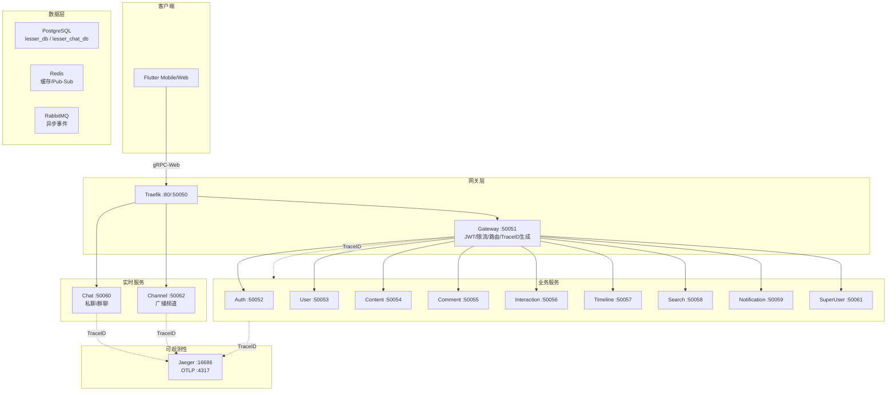

# Design Document: Service Refactoring

## Overview

本设计文档描述 Lesser 社交平台后端服务的全面重构方案，包括：
1. 服务目录结构和命名规范化
2. 独立 Channel 服务（从 Chat 服务拆分）
3. Jaeger 分布式追踪最佳实践
4. 服务间通信规范化
5. 错误处理和代码质量优化

## Architecture

### 重构后的服务架构



### 服务端口分配

| 服务 | 端口 | 说明 | 变更 |
|------|------|------|------|
| Gateway | 50051 | API 网关 | 无变更 |
| Auth | 50052 | 认证服务 | 无变更 |
| User | 50053 | 用户服务 | 无变更 |
| Content | 50054 | 内容服务 | 无变更 |
| Comment | 50055 | 评论服务 | 无变更 |
| Interaction | 50056 | 交互服务 | 无变更 |
| Timeline | 50057 | 时间线服务 | 无变更 |
| Search | 50058 | 搜索服务 | 无变更 |
| Notification | 50059 | 通知服务 | 无变更 |
| Chat | 50060 | 聊天服务（私聊/群聊） | 移除 CHANNEL 类型 |
| SuperUser | 50061 | 超级用户服务 | 无变更 |
| **Channel** | **50062** | **广播频道服务** | **新增** |

## Components and Interfaces

### 1. 标准服务目录结构

```
service/<name>/
├── cmd/
│   └── server/
│       └── main.go              # 服务入口
├── internal/
│   ├── handler/
│   │   ├── <service>_handler.go # gRPC 处理器
│   │   └── converters.go        # 类型转换（可选）
│   ├── logic/
│   │   ├── <service>_service.go # 核心业务逻辑
│   │   ├── interfaces.go        # 接口定义（可选）
│   │   └── errors.go            # 业务错误定义
│   ├── data_access/
│   │   ├── <entity>_repository.go # 数据访问
│   │   └── errors.go            # 数据访问错误
│   ├── remote/                  # 远程服务调用（可选）
│   │   └── <target>_client.go
│   └── messaging/               # 消息队列（可选）
│       ├── publisher.go         # 事件发布
│       └── event_worker.go      # 事件消费
├── gen_protos/                  # 生成的 proto 代码
├── go.mod
└── go.sum
```

### 2. Channel 服务设计

#### 2.1 Proto 定义 (protos/channel/channel.proto)

```protobuf
syntax = "proto3";
package channel;

option go_package = "github.com/funcdfs/lesser/channel/proto/channel";

import "common/common.proto";

// ChannelService 广播频道服务
// 处理频道管理、内容发布、订阅管理
service ChannelService {
  // 创建频道
  rpc CreateChannel(CreateChannelRequest) returns (Channel);
  // 获取频道信息
  rpc GetChannel(GetChannelRequest) returns (Channel);
  // 更新频道信息
  rpc UpdateChannel(UpdateChannelRequest) returns (Channel);
  // 删除频道
  rpc DeleteChannel(DeleteChannelRequest) returns (common.Empty);
  // 获取用户订阅的频道列表
  rpc GetSubscribedChannels(GetSubscribedChannelsRequest) returns (ChannelsResponse);
  // 获取用户管理的频道列表
  rpc GetOwnedChannels(GetOwnedChannelsRequest) returns (ChannelsResponse);
  
  // 订阅频道
  rpc Subscribe(SubscribeRequest) returns (common.Empty);
  // 取消订阅
  rpc Unsubscribe(UnsubscribeRequest) returns (common.Empty);
  // 获取频道订阅者列表
  rpc GetSubscribers(GetSubscribersRequest) returns (SubscribersResponse);
  
  // 发布频道内容
  rpc PublishPost(PublishPostRequest) returns (ChannelPost);
  // 获取频道内容列表
  rpc GetPosts(GetPostsRequest) returns (PostsResponse);
  // 删除频道内容
  rpc DeletePost(DeletePostRequest) returns (common.Empty);
  
  // 双向流：实时频道更新
  rpc StreamUpdates(stream ChannelClientEvent) returns (stream ChannelServerEvent);
}

// Channel 频道实体
message Channel {
  string id = 1;
  string name = 2;
  string description = 3;
  string avatar_url = 4;
  string owner_id = 5;
  repeated string admin_ids = 6;
  int64 subscriber_count = 7;
  int64 post_count = 8;
  common.Timestamp created_at = 9;
  common.Timestamp updated_at = 10;
  bool is_subscribed = 11;  // 当前用户是否已订阅
}

// ChannelPost 频道内容
message ChannelPost {
  string id = 1;
  string channel_id = 2;
  string author_id = 3;
  string content = 4;
  repeated string media_urls = 5;
  int64 view_count = 6;
  common.Timestamp created_at = 7;
}

// ... 其他消息定义
```

#### 2.2 Channel 服务目录结构

```
service/channel/
├── cmd/
│   └── server/
│       └── main.go
├── internal/
│   ├── handler/
│   │   ├── channel_handler.go
│   │   ├── stream.go
│   │   └── converters.go
│   ├── logic/
│   │   ├── channel_service.go
│   │   ├── interfaces.go
│   │   └── errors.go
│   ├── data_access/
│   │   ├── channel_repository.go
│   │   ├── post_repository.go
│   │   ├── subscription_repository.go
│   │   └── errors.go
│   └── remote/
│       └── user_client.go
├── gen_protos/
├── go.mod
└── go.sum
```

### 3. OpenTelemetry/Jaeger 集成设计

#### 3.1 Tracer 初始化 (service/pkg/tracing/tracer.go)

```go
package tracing

import (
    "context"
    "go.opentelemetry.io/otel"
    "go.opentelemetry.io/otel/exporters/otlp/otlptrace/otlptracegrpc"
    "go.opentelemetry.io/otel/sdk/resource"
    "go.opentelemetry.io/otel/sdk/trace"
    semconv "go.opentelemetry.io/otel/semconv/v1.21.0"
)

// InitTracer 初始化 OpenTelemetry Tracer
func InitTracer(ctx context.Context, serviceName string) (func(context.Context) error, error) {
    endpoint := os.Getenv("OTEL_EXPORTER_OTLP_ENDPOINT")
    if endpoint == "" {
        endpoint = "jaeger:4317"
    }
    
    exporter, err := otlptracegrpc.New(ctx,
        otlptracegrpc.WithEndpoint(endpoint),
        otlptracegrpc.WithInsecure(),
    )
    if err != nil {
        return nil, err
    }
    
    res, err := resource.New(ctx,
        resource.WithAttributes(
            semconv.ServiceName(serviceName),
        ),
    )
    if err != nil {
        return nil, err
    }
    
    tp := trace.NewTracerProvider(
        trace.WithBatcher(exporter),
        trace.WithResource(res),
    )
    
    otel.SetTracerProvider(tp)
    
    return tp.Shutdown, nil
}
```

#### 3.2 gRPC 拦截器增强 (service/pkg/middleware/grpc.go)

```go
// TraceInterceptor 创建链路追踪拦截器（增强版）
func TraceInterceptor() UnaryServerInterceptor {
    return func(ctx context.Context, req interface{}, info *grpc.UnaryServerInfo, handler grpc.UnaryHandler) (interface{}, error) {
        // 从 metadata 中提取 trace_id
        var traceID string
        if md, ok := metadata.FromIncomingContext(ctx); ok {
            if values := md.Get("trace_id"); len(values) > 0 {
                traceID = values[0]
            }
        }

        // 如果没有 trace_id，生成一个新的
        if traceID == "" {
            traceID = uuid.New().String()
        }

        // 注入到 context
        ctx = logger.ContextWithTraceID(ctx, traceID)
        
        // 创建 OpenTelemetry Span
        tracer := otel.Tracer("grpc-server")
        ctx, span := tracer.Start(ctx, info.FullMethod)
        defer span.End()
        
        // 设置 Span 属性
        span.SetAttributes(
            attribute.String("trace_id", traceID),
            attribute.String("rpc.method", info.FullMethod),
        )

        resp, err := handler(ctx, req)
        
        if err != nil {
            span.RecordError(err)
            span.SetStatus(codes.Error, err.Error())
        }
        
        return resp, err
    }
}
```

#### 3.3 RabbitMQ TraceID 传播 (service/pkg/broker/publisher.go)

```go
// PublishAsync 异步发布消息（带 TraceID）
func (p *Publisher) PublishAsync(ctx context.Context, routingKey string, event interface{}) {
    // 从 context 中提取 trace_id
    traceID := logger.TraceIDFromContext(ctx)
    
    body, err := json.Marshal(event)
    if err != nil {
        p.log.WithContext(ctx).Error("序列化事件失败", slog.Any("error", err))
        return
    }

    go func() {
        err := p.channel.Publish(
            p.exchange,
            routingKey,
            false,
            false,
            amqp.Publishing{
                ContentType: "application/json",
                Body:        body,
                Headers: amqp.Table{
                    "trace_id": traceID,  // 传递 trace_id
                },
            },
        )
        if err != nil {
            p.log.Error("发布消息失败",
                slog.String("routing_key", routingKey),
                slog.String("trace_id", traceID),
                slog.Any("error", err))
        }
    }()
}
```

### 4. Remote Client 规范化设计

#### 4.1 统一的 Remote Client 模式

```go
// service/<name>/internal/remote/<target>_client.go

package remote

import (
    "context"
    "github.com/funcdfs/lesser/pkg/grpcclient"
    "github.com/funcdfs/lesser/pkg/logger"
    pb "github.com/funcdfs/lesser/<target>/gen_protos/<target>"
)

// <Target>Client <目标服务>客户端
type <Target>Client struct {
    pool   *grpcclient.Pool
    log    *logger.Logger
}

// New<Target>Client 创建<目标服务>客户端
func New<Target>Client(addr string, log *logger.Logger) (*<Target>Client, error) {
    pool, err := grpcclient.NewPool(grpcclient.PoolConfig{
        Addr:         addr,
        MaxConns:     10,
        MaxRetries:   3,
        RetryBackoff: 100 * time.Millisecond,
    }, log)
    if err != nil {
        return nil, err
    }
    
    return &<Target>Client{
        pool: pool,
        log:  log,
    }, nil
}

// <Method> 调用目标服务方法
func (c *<Target>Client) <Method>(ctx context.Context, req *pb.<Request>) (*pb.<Response>, error) {
    conn, err := c.pool.Get(ctx)
    if err != nil {
        return nil, err
    }
    defer c.pool.Put(conn)
    
    client := pb.New<Target>ServiceClient(conn)
    return client.<Method>(ctx, req)
}

// Close 关闭客户端连接池
func (c *<Target>Client) Close() error {
    return c.pool.Close()
}
```

### 6. 公共库 (pkg) 包结构重构设计

#### 6.1 重构后的 pkg 目录结构

```
service/pkg/
├── app/                    # 应用生命周期管理（保留）
│   └── app.go
├── auth/                   # 认证模块（保留，职责清晰）
│   ├── jwt.go              # JWT 管理
│   ├── password.go         # 密码哈希
│   └── context.go          # 认证上下文
├── grpc/                   # gRPC 相关（合并 grpcclient/grpcserver/middleware）
│   ├── client/             # 客户端
│   │   ├── pool.go         # 连接池
│   │   ├── config.go       # 配置
│   │   └── interceptor.go  # 客户端拦截器
│   ├── server/             # 服务端
│   │   └── server.go       # 服务器封装
│   └── interceptor/        # 通用拦截器
│       ├── recovery.go     # panic 恢复
│       ├── logging.go      # 日志
│       ├── trace.go        # 链路追踪
│       └── ratelimit.go    # 限流
├── db/                     # 数据存储（合并 database/cache）
│   ├── postgres.go         # PostgreSQL
│   ├── redis.go            # Redis
│   ├── lock.go             # 分布式锁
│   └── config.go           # 配置
├── mq/                     # 消息队列（重命名 broker）
│   ├── publisher.go        # 发布者
│   ├── worker.go           # 消费者
│   └── events.go           # 事件定义
├── trace/                  # 链路追踪（重命名 tracing）
│   └── tracer.go           # OpenTelemetry 初始化
├── log/                    # 日志（重命名 logger）
│   └── logger.go           # 结构化日志
├── errors/                 # 错误处理（保留）
│   └── errors.go
├── id/                     # ID 生成（保留）
│   ├── uuid.go             # UUID（重命名 id.go）
│   └── snowflake.go        # 雪花 ID
├── validate/               # 验证（重命名 validator）
│   └── validator.go
├── page/                   # 分页（重命名 pagination）
│   └── pagination.go
├── config/                 # 配置（保留）
│   └── config.go
├── health/                 # 健康检查（保留）
│   └── health.go
├── gen_protos/             # 生成的 proto（保留）
│   └── common/
├── go.mod
└── go.sum
```

#### 6.2 删除/合并的包

| 原包名 | 处理方式 | 原因 |
|--------|----------|------|
| `convert` | 删除 | 功能可用标准库或泛型替代，冗余 |
| `timeutil` | 删除 | 功能简单，可直接使用标准库 time |
| `retry` | 合并到 `grpc/client` | 重试逻辑主要用于 gRPC 调用 |
| `structure` | 移至测试目录 | 仅包含测试文件 |
| `integration` | 移至测试目录 | 仅包含测试文件 |
| `grpcclient` | 合并到 `grpc/client` | 统一 gRPC 相关代码 |
| `grpcserver` | 合并到 `grpc/server` | 统一 gRPC 相关代码 |
| `middleware` | 合并到 `grpc/interceptor` | 统一 gRPC 相关代码 |
| `database` | 合并到 `db` | 简化命名 |
| `cache` | 合并到 `db` | 统一数据存储 |
| `broker` | 重命名为 `mq` | 更清晰的命名 |
| `tracing` | 重命名为 `trace` | 更简洁 |
| `logger` | 重命名为 `log` | 更简洁 |
| `validator` | 重命名为 `validate` | 动词形式更符合 Go 惯例 |
| `pagination` | 重命名为 `page` | 更简洁 |

#### 6.3 包命名规范

遵循 Go 官方包命名最佳实践：

1. **简短**: 使用简短、清晰的名称（`db` 而非 `database`）
2. **小写**: 全部小写，无下划线或驼峰
3. **单数**: 使用单数形式（`error` 而非 `errors`，但保留 `errors` 因为是标准库惯例）
4. **动词/名词**: 根据功能选择（`validate` 动词，`config` 名词）
5. **避免通用名**: 不使用 `util`、`common`、`misc` 等

#### 6.4 迁移策略

为确保平滑迁移，采用以下策略：

1. **创建新包结构**: 先创建新的包目录
2. **复制并重构**: 将代码复制到新位置并重构
3. **添加别名**: 在旧包位置添加类型别名和函数转发
4. **更新服务**: 逐个更新服务的 import
5. **删除旧包**: 确认所有服务更新后删除旧包

```go
// 旧包 service/pkg/grpcclient/pool.go 添加别名
package grpcclient

import "github.com/funcdfs/lesser/pkg/grpc/client"

// Deprecated: 使用 grpc/client.Pool
type Pool = client.Pool

// Deprecated: 使用 grpc/client.NewPool
var NewPool = client.NewPool
```

### 5. 错误处理规范化设计

#### 5.1 Data Access 层错误定义

```go
// service/<name>/internal/data_access/errors.go

package data_access

import "errors"

var (
    // ErrNotFound 资源不存在
    ErrNotFound = errors.New("资源不存在")
    // ErrDuplicate 资源已存在
    ErrDuplicate = errors.New("资源已存在")
    // ErrInvalidInput 无效输入
    ErrInvalidInput = errors.New("无效输入")
)
```

#### 5.2 Logic 层错误转换

```go
// service/<name>/internal/logic/errors.go

package logic

import (
    "errors"
    "github.com/funcdfs/lesser/<name>/internal/data_access"
    "google.golang.org/grpc/codes"
    "google.golang.org/grpc/status"
)

// ToGRPCError 将业务错误转换为 gRPC 错误
func ToGRPCError(err error) error {
    switch {
    case errors.Is(err, data_access.ErrNotFound):
        return status.Error(codes.NotFound, "资源不存在")
    case errors.Is(err, data_access.ErrDuplicate):
        return status.Error(codes.AlreadyExists, "资源已存在")
    case errors.Is(err, data_access.ErrInvalidInput):
        return status.Error(codes.InvalidArgument, "无效输入")
    case errors.Is(err, ErrUnauthorized):
        return status.Error(codes.PermissionDenied, "无权限操作")
    default:
        return status.Error(codes.Internal, "内部服务错误")
    }
}
```

## Data Models

### Channel 服务数据模型

```sql
-- 频道表
CREATE TABLE channels (
    id VARCHAR(36) PRIMARY KEY,
    name VARCHAR(100) NOT NULL,
    description TEXT,
    avatar_url VARCHAR(500),
    owner_id VARCHAR(36) NOT NULL,
    subscriber_count BIGINT DEFAULT 0,
    post_count BIGINT DEFAULT 0,
    created_at TIMESTAMP WITH TIME ZONE DEFAULT NOW(),
    updated_at TIMESTAMP WITH TIME ZONE DEFAULT NOW(),
    deleted_at TIMESTAMP WITH TIME ZONE
);

-- 频道管理员表
CREATE TABLE channel_admins (
    channel_id VARCHAR(36) NOT NULL,
    user_id VARCHAR(36) NOT NULL,
    created_at TIMESTAMP WITH TIME ZONE DEFAULT NOW(),
    PRIMARY KEY (channel_id, user_id)
);

-- 频道订阅表
CREATE TABLE channel_subscriptions (
    channel_id VARCHAR(36) NOT NULL,
    user_id VARCHAR(36) NOT NULL,
    created_at TIMESTAMP WITH TIME ZONE DEFAULT NOW(),
    PRIMARY KEY (channel_id, user_id)
);

-- 频道内容表
CREATE TABLE channel_posts (
    id VARCHAR(36) PRIMARY KEY,
    channel_id VARCHAR(36) NOT NULL,
    author_id VARCHAR(36) NOT NULL,
    content TEXT NOT NULL,
    media_urls TEXT[],
    view_count BIGINT DEFAULT 0,
    created_at TIMESTAMP WITH TIME ZONE DEFAULT NOW(),
    deleted_at TIMESTAMP WITH TIME ZONE
);

-- 索引
CREATE INDEX idx_channels_owner ON channels(owner_id);
CREATE INDEX idx_channel_subscriptions_user ON channel_subscriptions(user_id);
CREATE INDEX idx_channel_posts_channel ON channel_posts(channel_id);
CREATE INDEX idx_channel_posts_created ON channel_posts(created_at DESC);
```

## Correctness Properties

*A property is a characteristic or behavior that should hold true across all valid executions of a system-essentially, a formal statement about what the system should do. Properties serve as the bridge between human-readable specifications and machine-verifiable correctness guarantees.*

### Property 1: Service Directory Structure Compliance

*For any* service in the `service/` directory, the service SHALL contain the required directories: `cmd/server/`, `internal/handler/`, `internal/logic/`, `internal/data_access/`, and `gen_protos/`.

**Validates: Requirements 1.1**

### Property 2: File Naming Convention Compliance

*For any* file in a service's internal directories:
- Handler files SHALL be named `{service}_handler.go`
- Logic files SHALL be named `{service}_service.go` or `{domain}_service.go`
- Repository files SHALL be named `{entity}_repository.go`
- Remote client files SHALL be named `{target}_client.go`
- Messaging files SHALL be named `publisher.go` or `event_worker.go`

**Validates: Requirements 1.4, 1.5, 1.6, 1.7, 1.8**

### Property 3: Repository Method Naming Convention

*For any* repository type in the data_access layer, the methods SHALL follow CRUD naming patterns: `Create`, `GetByID`, `Update`, `Delete`, `List`, `FindBy{Field}`.

**Validates: Requirements 2.3**

### Property 4: Publisher Method Naming Convention

*For any* publisher type in the messaging layer, the methods SHALL be named `Publish{EventName}` (e.g., `PublishContentLiked`, `PublishUserFollowed`).

**Validates: Requirements 2.5**

### Property 5: Channel Access Control

*For any* channel and any non-admin subscriber, the subscriber SHALL only have read access to channel posts and SHALL NOT be able to publish posts.

**Validates: Requirements 3.5**

### Property 6: Channel Broadcast

*For any* channel post published by an admin, the post SHALL be visible to all subscribers of that channel.

**Validates: Requirements 3.6**

### Property 7: TraceID Generation

*For any* incoming request to the Gateway without an existing trace_id in metadata, the Gateway SHALL generate a new UUID as trace_id and inject it into the request context.

**Validates: Requirements 4.1**

### Property 8: TraceID Propagation in gRPC

*For any* gRPC call between services, the trace_id from the caller's context SHALL be propagated to the callee via gRPC metadata.

**Validates: Requirements 4.2, 4.5**

### Property 9: TraceID Propagation in Messages

*For any* message published to RabbitMQ, the trace_id SHALL be included in the message headers. *For any* message consumed from RabbitMQ, the trace_id SHALL be extracted from headers and injected into the handler's context.

**Validates: Requirements 4.3, 4.6, 4.7**

### Property 10: TraceID in Logs

*For any* log entry produced by a service, if the context contains a trace_id, the log entry SHALL include the trace_id field.

**Validates: Requirements 4.4**

### Property 11: Remote Client Retry

*For any* remote gRPC call that fails with a retryable error (Unavailable, ResourceExhausted, Aborted, DeadlineExceeded), the client SHALL retry with exponential backoff up to the configured maximum retries.

**Validates: Requirements 5.3**

### Property 12: Error Handling Consistency

*For any* error returned by the data_access layer, the logic layer SHALL translate it to an appropriate gRPC status code. *For any* error returned to the client, the error message SHALL be in Chinese.

**Validates: Requirements 6.2, 6.3, 6.4, 6.5**

### Property 13: Code Quality

*For any* Go source file in the service directories:
- The file SHALL pass `gofmt` formatting check
- The file SHALL not contain unused imports (verified by `go vet`)
- All exported functions and types SHALL have Chinese comments

**Validates: Requirements 7.1, 7.3, 7.4**

### Property 14: Configuration Fail-Fast

*For any* required environment variable that is missing at service startup, the service SHALL fail immediately with a clear error message indicating which configuration is missing.

**Validates: Requirements 8.4**

## Error Handling

### 错误分层处理

```
┌─────────────────────────────────────────────────────────────┐
│                      Handler Layer                           │
│  - 参数验证错误 → codes.InvalidArgument                      │
│  - 调用 Logic 层，转换返回的错误                             │
└─────────────────────────────────────────────────────────────┘
                              │
                              ▼
┌─────────────────────────────────────────────────────────────┐
│                      Logic Layer                             │
│  - 业务规则错误 → 自定义错误类型                             │
│  - 调用 Data Access 层，转换返回的错误                       │
│  - 使用 ToGRPCError() 转换为 gRPC 状态码                    │
└─────────────────────────────────────────────────────────────┘
                              │
                              ▼
┌─────────────────────────────────────────────────────────────┐
│                   Data Access Layer                          │
│  - 数据库错误 → 领域错误 (ErrNotFound, ErrDuplicate)        │
│  - 记录详细错误日志（含 trace_id）                          │
└─────────────────────────────────────────────────────────────┘
```

### 错误码映射

| 领域错误 | gRPC 状态码 | 中文消息 |
|---------|------------|---------|
| ErrNotFound | NotFound | 资源不存在 |
| ErrDuplicate | AlreadyExists | 资源已存在 |
| ErrInvalidInput | InvalidArgument | 无效输入 |
| ErrUnauthorized | PermissionDenied | 无权限操作 |
| ErrUnauthenticated | Unauthenticated | 未认证 |
| 其他错误 | Internal | 内部服务错误 |

## Testing Strategy

### 测试分层

1. **单元测试** - 验证具体示例和边界情况
   - Logic 层业务逻辑测试
   - Data Access 层数据操作测试
   - Handler 层参数验证测试

2. **属性测试** - 验证通用属性在所有输入上成立
   - 使用 `gopter` 或 `rapid` 库
   - 每个属性测试至少运行 100 次迭代
   - 测试标注格式: `// Feature: service-refactoring, Property N: {property_text}`

3. **集成测试** - 验证服务间通信
   - TraceID 传播测试
   - 错误处理一致性测试
   - 消息队列集成测试

### 属性测试配置

```go
// 使用 gopter 进行属性测试
import (
    "github.com/leanovate/gopter"
    "github.com/leanovate/gopter/gen"
    "github.com/leanovate/gopter/prop"
)

func TestTraceIDPropagation(t *testing.T) {
    // Feature: service-refactoring, Property 8: TraceID Propagation in gRPC
    properties := gopter.NewProperties(gopter.DefaultTestParameters())
    properties.Property("trace_id is propagated through gRPC calls", prop.ForAll(
        func(traceID string) bool {
            // 测试实现
            return true
        },
        gen.UUIDString(),
    ))
    properties.TestingRun(t)
}
```

### 测试覆盖要求

| 层级 | 覆盖率要求 | 测试类型 |
|------|-----------|---------|
| Handler | >= 70% | 单元测试 |
| Logic | >= 80% | 单元测试 + 属性测试 |
| Data Access | >= 70% | 单元测试 |
| Remote | >= 60% | 集成测试 |
| Messaging | >= 60% | 集成测试 |

