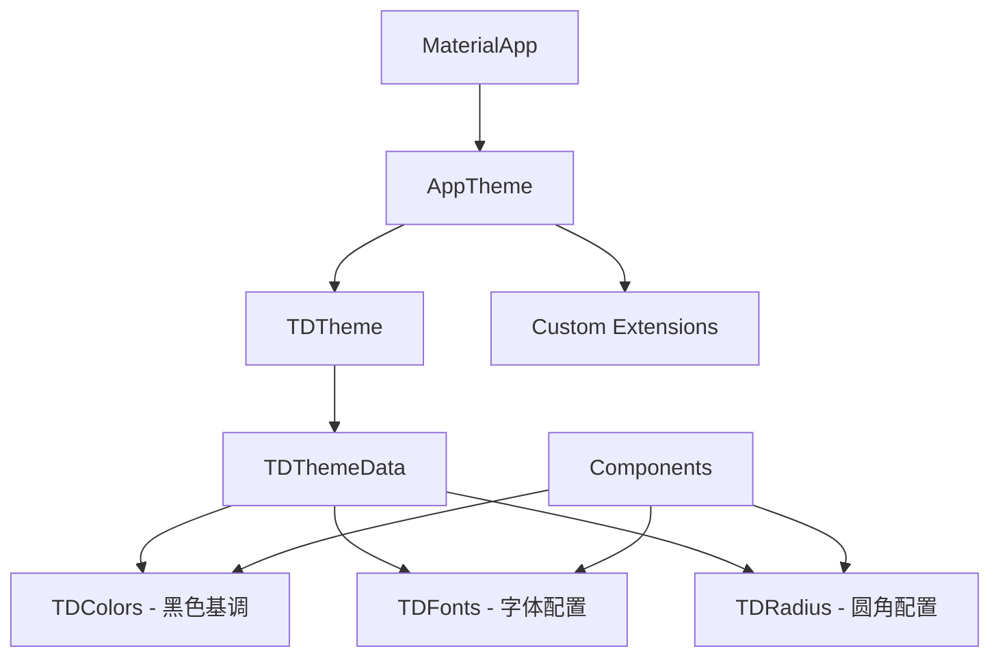

# Design Document: TDesign UI Unification

## Overview

本设计文档描述了将 Flutter 前端 UI 组件统一迁移到腾讯 TDesign 组件库的技术方案。迁移将分阶段进行，确保应用在迁移过程中保持可用状态。

核心目标：
1. 使用 `tdesign_flutter` 作为统一的 UI 组件库
2. 建立黑色基调的主题系统
3. 移除所有遗留的混杂 UI 代码（forui、自定义组件等）

## Architecture

### 整体架构

```
┌─────────────────────────────────────────────────────────────┐
│                      Application Layer                       │
│  (Screens, Features)                                        │
├─────────────────────────────────────────────────────────────┤
│                    TDesign Components                        │
│  TDButton, TDInput, TDNavBar, TDCell, TDDialog, etc.       │
├─────────────────────────────────────────────────────────────┤
│                    Theme System                              │
│  AppTheme (TDTheme wrapper with dark color scheme)          │
├─────────────────────────────────────────────────────────────┤
│                    Design Tokens                             │
│  Colors, Spacing, Typography, Radius                        │
└─────────────────────────────────────────────────────────────┘
```

### 主题系统架构



## Components and Interfaces

### 1. 主题配置组件

#### AppTheme (主题入口)

```dart
/// 应用主题配置 - 基于 TDesign 的黑色基调主题
class AppTheme {
  /// 获取深色主题数据
  static TDThemeData get darkTheme => TDThemeData(
    // 品牌色 - 使用黑色系
    brandNormalColor: AppColors.primary,
    // 其他颜色配置...
  );
  
  /// 包装 MaterialApp 的主题
  static ThemeData get materialTheme => ThemeData(
    useMaterial3: true,
    brightness: Brightness.dark,
    scaffoldBackgroundColor: AppColors.background,
    // ...
  );
}
```

#### AppColors (颜色令牌)

```dart
/// 黑色基调的颜色系统
class AppColors {
  // 基础色板 - 黑色系
  static const Color black = Color(0xFF000000);
  static const Color gray950 = Color(0xFF0A0A0A);
  static const Color gray900 = Color(0xFF171717);
  static const Color gray800 = Color(0xFF262626);
  static const Color gray700 = Color(0xFF404040);
  static const Color gray600 = Color(0xFF525252);
  static const Color gray500 = Color(0xFF737373);
  static const Color gray400 = Color(0xFFA3A3A3);
  static const Color gray300 = Color(0xFFD4D4D4);
  static const Color gray200 = Color(0xFFE5E5E5);
  static const Color gray100 = Color(0xFFF5F5F5);
  static const Color white = Color(0xFFFFFFFF);
  
  // 语义化颜色
  static const Color primary = gray900;           // 主色 - 深黑
  static const Color primaryForeground = white;   // 主色上的文字
  static const Color background = black;          // 背景色 - 纯黑
  static const Color surface = gray950;           // 表面色
  static const Color surfaceVariant = gray900;    // 表面变体
  static const Color onSurface = white;           // 表面上的文字
  static const Color onSurfaceVariant = gray400;  // 次要文字
  static const Color border = gray800;            // 边框色
  static const Color divider = gray800;           // 分割线
  
  // 功能色
  static const Color error = Color(0xFFEF4444);
  static const Color success = Color(0xFF22C55E);
  static const Color warning = Color(0xFFF59E0B);
  static const Color info = Color(0xFF3B82F6);
}
```

#### AppSpacing (间距令牌)

```dart
/// 间距系统 - 基于 4px 网格
class AppSpacing {
  static const double xs = 4.0;
  static const double sm = 8.0;
  static const double md = 12.0;
  static const double lg = 16.0;
  static const double xl = 24.0;
  static const double xxl = 32.0;
  static const double xxxl = 48.0;
}
```

#### AppRadius (圆角令牌)

```dart
/// 圆角系统
class AppRadius {
  static const double none = 0.0;
  static const double sm = 4.0;
  static const double md = 8.0;
  static const double lg = 12.0;
  static const double xl = 16.0;
  static const double full = 9999.0;
}
```

### 2. 组件映射关系

| 现有组件 | TDesign 组件 | 说明 |
|---------|-------------|------|
| FButton (forui) | TDButton | 按钮组件 |
| FTextField (forui) | TDInput | 输入框组件 |
| ElevatedButton | TDButton(type: primary) | 主要按钮 |
| TextButton | TDButton(type: text) | 文字按钮 |
| OutlinedButton | TDButton(type: outline) | 轮廓按钮 |
| BottomNavigationBar | TDBottomTabBar | 底部导航 |
| AppBar | TDNavBar | 顶部导航 |
| Card | TDCell / Container | 卡片容器 |
| ListTile | TDCell | 列表项 |
| AlertDialog | TDDialog | 对话框 |
| SnackBar | TDToast | 提示消息 |
| CircleAvatar | TDAvatar | 头像 |
| CircularProgressIndicator | TDLoading | 加载指示器 |

### 3. 组件封装接口

#### AppButton (按钮封装)

```dart
/// 统一按钮组件 - 封装 TDButton
class AppButton extends StatelessWidget {
  final String text;
  final VoidCallback? onPressed;
  final AppButtonType type;
  final AppButtonSize size;
  final bool isLoading;
  final bool isDisabled;
  final Widget? icon;
  
  const AppButton({
    required this.text,
    this.onPressed,
    this.type = AppButtonType.primary,
    this.size = AppButtonSize.medium,
    this.isLoading = false,
    this.isDisabled = false,
    this.icon,
  });
  
  @override
  Widget build(BuildContext context) {
    return TDButton(
      text: text,
      type: _mapButtonType(type),
      size: _mapButtonSize(size),
      disabled: isDisabled || isLoading,
      onTap: onPressed,
      icon: isLoading ? TDLoading(size: TDLoadingSize.small) : icon,
    );
  }
}

enum AppButtonType { primary, secondary, outline, text, danger }
enum AppButtonSize { small, medium, large }
```

#### AppInput (输入框封装)

```dart
/// 统一输入框组件 - 封装 TDInput
class AppInput extends StatelessWidget {
  final TextEditingController? controller;
  final String? hintText;
  final String? labelText;
  final String? errorText;
  final bool obscureText;
  final Widget? prefixIcon;
  final Widget? suffixIcon;
  final ValueChanged<String>? onChanged;
  
  const AppInput({
    this.controller,
    this.hintText,
    this.labelText,
    this.errorText,
    this.obscureText = false,
    this.prefixIcon,
    this.suffixIcon,
    this.onChanged,
  });
  
  @override
  Widget build(BuildContext context) {
    return TDInput(
      controller: controller,
      hintText: hintText,
      type: obscureText ? TDInputType.special : TDInputType.normal,
      obscureText: obscureText,
      leftIcon: prefixIcon,
      rightBtn: suffixIcon,
      onChanged: onChanged,
      // 应用深色主题样式
      backgroundColor: AppColors.surface,
      textStyle: TextStyle(color: AppColors.onSurface),
    );
  }
}
```

#### AppNavBar (导航栏封装)

```dart
/// 统一顶部导航栏 - 封装 TDNavBar
class AppNavBar extends StatelessWidget implements PreferredSizeWidget {
  final String? title;
  final Widget? leading;
  final List<Widget>? actions;
  final bool centerTitle;
  
  const AppNavBar({
    this.title,
    this.leading,
    this.actions,
    this.centerTitle = true,
  });
  
  @override
  Widget build(BuildContext context) {
    return TDNavBar(
      title: title,
      titleWidget: title != null ? Text(
        title!,
        style: TextStyle(
          color: AppColors.onSurface,
          fontSize: 18,
          fontWeight: FontWeight.w600,
        ),
      ) : null,
      leftBarItems: leading != null ? [TDNavBarItem(icon: leading)] : null,
      rightBarItems: actions?.map((a) => TDNavBarItem(icon: a)).toList(),
      backgroundColor: AppColors.background,
    );
  }
  
  @override
  Size get preferredSize => const Size.fromHeight(44);
}
```

## Data Models

### 主题配置模型

```dart
/// 主题配置数据模型
@freezed
class ThemeConfig with _$ThemeConfig {
  const factory ThemeConfig({
    @Default(ThemeMode.dark) ThemeMode mode,
    @Default(true) bool useTDesign,
    String? customPrimaryColor,
  }) = _ThemeConfig;
  
  factory ThemeConfig.fromJson(Map<String, dynamic> json) =>
      _$ThemeConfigFromJson(json);
}
```

### 组件样式配置

```dart
/// 按钮样式配置
class ButtonStyleConfig {
  final Color backgroundColor;
  final Color foregroundColor;
  final Color borderColor;
  final double borderRadius;
  final EdgeInsets padding;
  
  const ButtonStyleConfig({
    required this.backgroundColor,
    required this.foregroundColor,
    this.borderColor = Colors.transparent,
    this.borderRadius = AppRadius.md,
    this.padding = const EdgeInsets.symmetric(
      horizontal: AppSpacing.lg,
      vertical: AppSpacing.md,
    ),
  });
}
```

## Correctness Properties

*A property is a characteristic or behavior that should hold true across all valid executions of a system-essentially, a formal statement about what the system should do. Properties serve as the bridge between human-readable specifications and machine-verifiable correctness guarantees.*

### Property 1: No Legacy UI Imports

*For any* Dart file in the `frontend/lib` directory, the file SHALL NOT contain imports from `forui` package or usage of `FTextField`, `FButton`, or other forui components.

**Validates: Requirements 1.2, 4.3, 10.1**

### Property 2: No Hardcoded Colors in UI Components

*For any* Dart file in the `frontend/lib/features` or `frontend/lib/shared/widgets` directories, the file SHALL NOT contain hardcoded color values (e.g., `Color(0xFF...)`, `Colors.blue`, etc.) outside of the theme definition files.

**Validates: Requirements 2.7, 10.3**

### Property 3: Theme Color Consistency

*For any* color token defined in `AppColors`, when used in a component, the component SHALL render with the exact color value defined in the token.

**Validates: Requirements 2.1, 2.2**

### Property 4: Avatar Size Consistency

*For any* valid avatar size (small, medium, large), the `AppAvatar` component SHALL render with the correct predefined dimensions.

**Validates: Requirements 8.3**

### Property 5: Navigation State Integrity

*For any* navigation action (push, pop, replace), the navigation state SHALL correctly reflect the current route and the bottom navigation bar SHALL highlight the correct tab.

**Validates: Requirements 5.4**

## Error Handling

### 主题加载错误

```dart
/// 主题加载失败时的回退策略
class ThemeErrorHandler {
  static TDThemeData getFallbackTheme() {
    // 返回默认的深色主题
    return TDThemeData.defaultData();
  }
  
  static void handleThemeError(Object error, StackTrace stack) {
    debugPrint('Theme loading error: $error');
    // 记录错误但不崩溃，使用回退主题
  }
}
```

### 组件渲染错误

```dart
/// 组件渲染错误边界
class ComponentErrorBoundary extends StatelessWidget {
  final Widget child;
  final Widget? fallback;
  
  const ComponentErrorBoundary({
    required this.child,
    this.fallback,
  });
  
  @override
  Widget build(BuildContext context) {
    return ErrorWidget.builder = (FlutterErrorDetails details) {
      return fallback ?? Container(
        color: AppColors.error.withOpacity(0.1),
        child: Center(
          child: Text(
            'Component Error',
            style: TextStyle(color: AppColors.error),
          ),
        ),
      );
    };
  }
}
```

## Testing Strategy

### 单元测试

1. **主题配置测试**
   - 验证所有颜色令牌正确定义
   - 验证间距和圆角令牌值正确
   - 验证主题数据结构完整

2. **组件封装测试**
   - 验证 AppButton 正确映射到 TDButton
   - 验证 AppInput 正确映射到 TDInput
   - 验证组件属性正确传递

### 属性测试 (Property-Based Testing)

使用 `glados` 库进行属性测试：

1. **Property 1: No Legacy UI Imports**
   - 扫描所有 Dart 文件
   - 验证无 forui 导入

2. **Property 2: No Hardcoded Colors**
   - 扫描 UI 组件文件
   - 验证无硬编码颜色值

3. **Property 4: Avatar Size Consistency**
   - 生成随机有效尺寸
   - 验证渲染尺寸正确

### Widget 测试

1. **按钮组件测试**
   - 测试各种按钮类型渲染
   - 测试加载状态
   - 测试禁用状态

2. **输入框组件测试**
   - 测试文本输入
   - 测试密码输入
   - 测试错误状态显示

3. **导航组件测试**
   - 测试导航栏渲染
   - 测试底部导航切换
   - 测试导航状态同步

### 测试配置

```dart
// 属性测试配置
// 每个属性测试至少运行 100 次迭代
// 使用 glados 库进行属性测试

// 测试标签格式:
// **Feature: tdesign-ui-unification, Property {number}: {property_text}**
```
