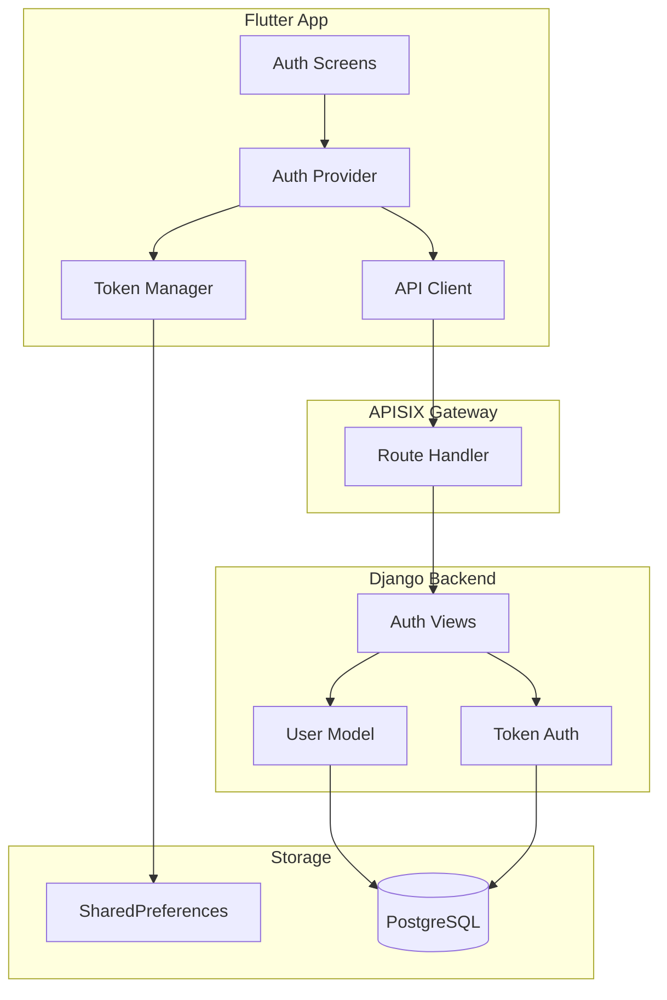
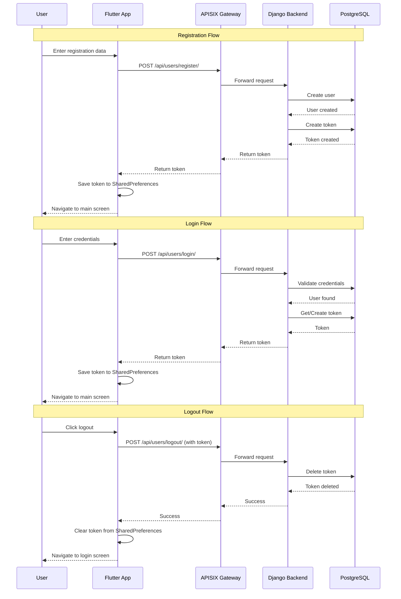

# Design Document: User Authentication

## Overview

本设计文档描述了用户认证功能的技术实现方案，包括前端（Flutter）和后端（Django REST Framework）的完整集成。系统通过 APISIX API 网关进行请求路由，使用 Token 认证机制保护 API 端点。

### 技术栈

- **前端**: Flutter + Riverpod (状态管理) + Chopper (HTTP 客户端)
- **后端**: Django REST Framework + Token Authentication
- **API 网关**: APISIX
- **数据库**: PostgreSQL
- **本地存储**: SharedPreferences (Flutter)

## Architecture



### 认证流程



## Components and Interfaces

### Frontend Components

#### 1. AuthProvider (Riverpod StateNotifier)

```dart
// lib/features/auth/presentation/providers/auth_provider.dart

@riverpod
class Auth extends _$Auth {
  @override
  AuthState build() => const AuthState.initial();
  
  Future<void> login({required String username, required String password});
  Future<void> register({
    required String username,
    required String email,
    required String password,
    required String confirmPassword,
  });
  Future<void> logout();
  Future<void> checkAuthStatus();
}

@freezed
class AuthState with _$AuthState {
  const factory AuthState.initial() = _Initial;
  const factory AuthState.loading() = _Loading;
  const factory AuthState.authenticated(User user) = _Authenticated;
  const factory AuthState.unauthenticated() = _Unauthenticated;
  const factory AuthState.error(String message) = _Error;
}
```

#### 2. AuthRepository

```dart
// lib/features/auth/data/auth_repository.dart

class AuthRepository {
  final ApiClient _apiClient;
  final TokenManager _tokenManager;
  
  Future<AuthResponse> register(RegisterRequest request);
  Future<AuthResponse> login(LoginRequest request);
  Future<void> logout();
  Future<bool> isAuthenticated();
}
```

#### 3. TokenManager (已存在，需增强)

```dart
// lib/core/network/token_manager.dart

class TokenManager {
  static Future<void> saveToken(String token);
  static Future<String?> getToken();
  static Future<void> deleteToken();
  static Future<bool> hasToken();
}
```

#### 4. API Service (Chopper)

```dart
// lib/core/network/chopper_api_service.dart

@ChopperApi()
abstract class ChopperApiService extends ChopperService {
  @Post(path: '/users/register/')
  Future<Response<Map<String, dynamic>>> register(@Body() Map<String, dynamic> body);
  
  @Post(path: '/users/login/')
  Future<Response<Map<String, dynamic>>> login(@Body() Map<String, dynamic> body);
  
  @Post(path: '/users/logout/')
  Future<Response> logout();
}
```

### Backend Components

#### 1. RegisterAPI View (已存在，需修复)

```python
# backend/django_code/app/users/views.py

class RegisterAPI(APIView):
    permission_classes = [AllowAny]
    
    def post(self, request):
        # 验证输入
        # 创建用户
        # 生成 Token
        # 返回响应
```

#### 2. LoginAPI View (已存在，需修复)

```python
class LoginAPI(APIView):
    permission_classes = [AllowAny]
    
    def post(self, request):
        # 验证凭证
        # 获取或创建 Token
        # 返回响应
```

#### 3. LogoutAPI View (已存在)

```python
class LogoutAPI(APIView):
    def post(self, request):
        # 删除 Token
        # 返回成功响应
```

### API Gateway Configuration

APISIX 路由通过 Admin API 动态配置。配置脚本位于 `infra/apisix/setup_routes.sh`。

#### 上游服务配置

```json
{
    "name": "django-backend",
    "desc": "Django REST API 后端服务",
    "type": "roundrobin",
    "nodes": {
        "django:8000": 1
    },
    "timeout": {
        "connect": 6,
        "send": 6,
        "read": 6
    }
}
```

#### 用户认证路由配置

```json
{
    "name": "user-auth-routes",
    "desc": "用户认证相关路由 (register, login, logout, profile)",
    "uri": "/api/users/*",
    "methods": ["GET", "POST", "PUT", "DELETE", "OPTIONS"],
    "upstream_id": 1,
    "plugins": {
        "cors": {
            "allow_origins": "*",
            "allow_methods": "GET,POST,PUT,DELETE,OPTIONS",
            "allow_headers": "Authorization,Content-Type,Accept,Origin,X-Requested-With",
            "expose_headers": "*",
            "max_age": 3600,
            "allow_credential": false
        }
    }
}
```

#### 配置命令

```bash
# 手动配置路由
./dev.sh routes

# 或直接运行脚本
bash infra/apisix/setup_routes.sh
```

#### 测试端点

```bash
# 健康检查
curl http://localhost:9080/health/

# 用户注册
curl -X POST http://localhost:9080/api/users/register/ \
  -H 'Content-Type: application/json' \
  -d '{"username":"testuser","email":"test@example.com","password":"testpass123","password1":"testpass123","password2":"testpass123"}'

# 用户登录
curl -X POST http://localhost:9080/api/users/login/ \
  -H 'Content-Type: application/json' \
  -d '{"username":"testuser","password":"testpass123"}'

# 用户退出
curl -X POST http://localhost:9080/api/users/logout/ \
  -H 'Authorization: Token <your-token>'
```

## Data Models

### Frontend Models

```dart
// lib/features/auth/domain/models/auth_response.dart

@freezed
class AuthResponse with _$AuthResponse {
  const factory AuthResponse({
    required String token,
    required int userId,
    required String username,
  }) = _AuthResponse;
  
  factory AuthResponse.fromJson(Map<String, dynamic> json) => 
      _$AuthResponseFromJson(json);
}

// lib/features/auth/domain/models/register_request.dart

@freezed
class RegisterRequest with _$RegisterRequest {
  const factory RegisterRequest({
    required String username,
    required String email,
    required String password,
    required String confirmPassword,
  }) = _RegisterRequest;
  
  Map<String, dynamic> toJson() => {
    'username': username,
    'email': email,
    'password1': password,
    'password2': confirmPassword,
  };
}

// lib/features/auth/domain/models/login_request.dart

@freezed
class LoginRequest with _$LoginRequest {
  const factory LoginRequest({
    required String username,
    required String password,
  }) = _LoginRequest;
  
  Map<String, dynamic> toJson() => {
    'username': username,
    'password': password,
  };
}
```

### Backend Models

```python
# 已存在: backend/django_code/app/users/models.py

class CustomUser(AbstractUser):
    nickname = models.CharField(max_length=50, blank=True, null=True)
    avatar = models.ImageField(upload_to='avatars/', blank=True, null=True)
    bio = models.TextField(max_length=500, blank=True, null=True)
    # ... 其他字段
```

## Correctness Properties

*A property is a characteristic or behavior that should hold true across all valid executions of a system—essentially, a formal statement about what the system should do. Properties serve as the bridge between human-readable specifications and machine-verifiable correctness guarantees.*

### Property 1: Valid Registration Returns Token

*For any* valid registration request with unique username, non-empty email, and matching passwords (password == confirmPassword), the Auth_System SHALL return a response containing a non-empty authentication token.

**Validates: Requirements 1.1**

### Property 2: Password Mismatch Rejection

*For any* registration request where password != confirmPassword, the Auth_System SHALL reject the request with an error response (status code 400) and the response SHALL contain an error message.

**Validates: Requirements 1.2**

### Property 3: Empty Field Validation Rejection

*For any* authentication request (registration or login) where any required field is empty or whitespace-only, the Auth_System SHALL reject the request with an error response (status code 400).

**Validates: Requirements 1.4, 2.3**

### Property 4: Valid Login Returns Token

*For any* existing user with username U and password P, a login request with credentials (U, P) SHALL return a response containing a non-empty authentication token.

**Validates: Requirements 2.1**

### Property 5: Invalid Credentials Rejection

*For any* login request with credentials that do not match any existing user, the Auth_System SHALL reject the request with an error response (status code 400 or 401).

**Validates: Requirements 2.2**

### Property 6: Successful Auth Persists Token

*For any* successful authentication (registration or login), the Token_Manager SHALL persist the returned token such that immediately calling getToken() returns the same token value.

**Validates: Requirements 1.5, 2.4**

### Property 7: Logout Clears Tokens

*For any* authenticated user, after a successful logout operation, both the server-side token (verified by subsequent API calls returning 401) and the local token (getToken() returns null) SHALL be cleared.

**Validates: Requirements 3.1, 3.2**

### Property 8: Token Round-Trip

*For any* valid token string T, calling saveToken(T) followed by getToken() SHALL return a value equal to T.

**Validates: Requirements 6.3**

### Property 9: Server Validation Errors Propagate

*For any* server response containing a validation error message, the Auth_System SHALL display that exact error message to the user (not a generic message).

**Validates: Requirements 7.2**

## Error Handling

### Frontend Error Handling

```dart
class AuthException implements Exception {
  final String message;
  final AuthErrorType type;
  
  const AuthException(this.message, this.type);
}

enum AuthErrorType {
  networkError,
  invalidCredentials,
  validationError,
  serverError,
  unknown,
}

// Error handling in AuthRepository
Future<AuthResponse> login(LoginRequest request) async {
  try {
    final response = await _apiClient.apiService.login(request.toJson());
    
    if (response.isSuccessful && response.body != null) {
      return AuthResponse.fromJson(response.body!);
    }
    
    // Handle specific error codes
    if (response.statusCode == 400) {
      final error = response.body?['error'] ?? 'Invalid credentials';
      throw AuthException(error, AuthErrorType.invalidCredentials);
    }
    
    if (response.statusCode == 401) {
      throw AuthException('Unauthorized', AuthErrorType.invalidCredentials);
    }
    
    throw AuthException('Server error', AuthErrorType.serverError);
  } on SocketException {
    throw AuthException('Network error. Please check your connection.', 
        AuthErrorType.networkError);
  } catch (e) {
    if (e is AuthException) rethrow;
    throw AuthException('An unexpected error occurred', AuthErrorType.unknown);
  }
}
```

### Backend Error Handling

```python
# Standardized error response format
def error_response(message, status_code=400):
    return Response({'error': message}, status=status_code)

# In views
class RegisterAPI(APIView):
    def post(self, request):
        username = request.data.get('username', '').strip()
        password1 = request.data.get('password1', '').strip()
        password2 = request.data.get('password2', '').strip()
        email = request.data.get('email', '').strip()
        
        # Validation
        if not username or not password1 or not password2:
            return error_response('请填写所有必填字段')
        
        if password1 != password2:
            return error_response('两次输入的密码不一致')
        
        if CustomUser.objects.filter(username=username).exists():
            return error_response('用户名已存在')
        
        # ... create user
```

## Testing Strategy

### Unit Tests

单元测试用于验证具体的示例和边界情况：

1. **TokenManager Tests**
   - Test saving and retrieving a token
   - Test deleting a token
   - Test hasToken() returns correct boolean

2. **AuthRepository Tests**
   - Test successful registration flow
   - Test successful login flow
   - Test logout flow
   - Test error handling for various HTTP status codes

3. **Backend View Tests**
   - Test registration with valid data
   - Test registration with duplicate username
   - Test login with valid credentials
   - Test login with invalid credentials
   - Test logout with valid token

### Property-Based Tests

属性测试用于验证跨所有输入的通用属性。使用 `fast_check` (Dart) 和 `hypothesis` (Python) 进行属性测试。

**Dart Property Tests (Frontend)**:

```dart
// test/features/auth/auth_property_test.dart

import 'package:fast_check/fast_check.dart';

void main() {
  group('Token Manager Properties', () {
    // Property 8: Token Round-Trip
    // Feature: user-authentication, Property 8: Token Round-Trip
    test('saveToken then getToken returns same token', () {
      fc.assert(
        fc.property(
          fc.string(minLength: 1, maxLength: 100),
          (token) async {
            await TokenManager.saveToken(token);
            final retrieved = await TokenManager.getToken();
            return retrieved == token;
          },
        ),
        numRuns: 100,
      );
    });
  });
}
```

**Python Property Tests (Backend)**:

```python
# backend/django_code/app/users/tests/test_properties.py

from hypothesis import given, strategies as st
from hypothesis.extra.django import TestCase

class AuthPropertyTests(TestCase):
    # Property 2: Password Mismatch Rejection
    # Feature: user-authentication, Property 2: Password Mismatch Rejection
    @given(
        username=st.text(min_size=3, max_size=20),
        email=st.emails(),
        password1=st.text(min_size=8, max_size=50),
        password2=st.text(min_size=8, max_size=50),
    )
    def test_password_mismatch_rejected(self, username, email, password1, password2):
        assume(password1 != password2)
        response = self.client.post('/api/users/register/', {
            'username': username,
            'email': email,
            'password1': password1,
            'password2': password2,
        })
        self.assertEqual(response.status_code, 400)
        self.assertIn('error', response.json())
    
    # Property 3: Empty Field Validation Rejection
    # Feature: user-authentication, Property 3: Empty Field Validation Rejection
    @given(
        username=st.one_of(st.just(''), st.text(alphabet=' \t\n', max_size=10)),
        password=st.text(min_size=8, max_size=50),
    )
    def test_empty_username_rejected(self, username, password):
        response = self.client.post('/api/users/login/', {
            'username': username,
            'password': password,
        })
        self.assertEqual(response.status_code, 400)
```

### Integration Tests

集成测试验证前后端的完整流程：

1. **End-to-End Registration Flow**
   - Register → Token saved → Navigate to main

2. **End-to-End Login Flow**
   - Login → Token saved → Navigate to main

3. **End-to-End Logout Flow**
   - Logout → Token cleared → Navigate to login

4. **Session Persistence**
   - Login → Close app → Reopen → Auto-navigate to main

### Test Configuration

- **Property tests**: Minimum 100 iterations per property
- **Backend tests**: Use Django TestCase with test database
- **Frontend tests**: Use flutter_test with mock SharedPreferences
