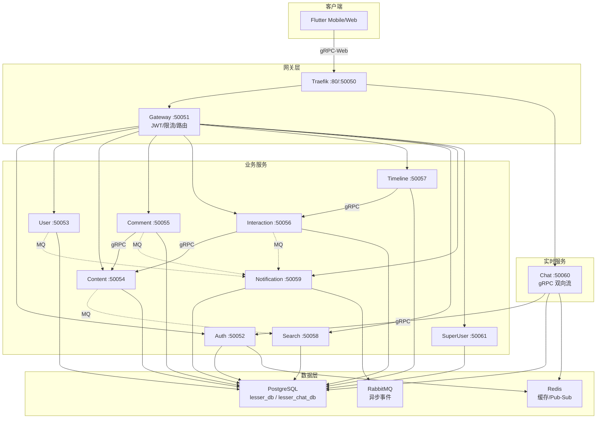
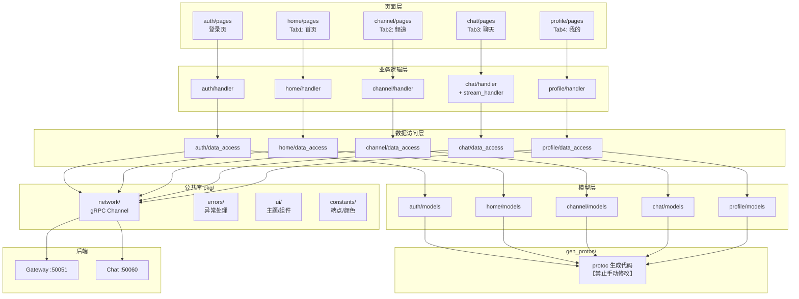

# 项目架构

## 后端服务架构



## Flutter 客户端架构



## 服务端口

| 服务 | 端口 | 说明 |
|------|------|------|
| Traefik HTTP | 80 | HTTP 入口 |
| Traefik gRPC | 50050 | gRPC 统一入口 |
| Gateway | 50051 | API 网关 (JWT/限流/路由) |
| Auth | 50052 | 认证服务 |
| User | 50053 | 用户服务 |
| Content | 50054 | 内容服务 |
| Comment | 50055 | 评论服务 |
| Interaction | 50056 | 交互服务 |
| Timeline | 50057 | 时间线服务 |
| Search | 50058 | 搜索服务 |
| Notification | 50059 | 通知服务 |
| Chat | 50060 | 聊天服务 (gRPC 双向流) |
| SuperUser | 50061 | 超级用户服务 |

## 目录结构

### Go 后端

```
service/<name>/
├── cmd/                # 入口
│   └── main.go
├── internal/
│   ├── handler/        # gRPC 处理器（协议对接、参数转换）
│   ├── logic/          # 核心业务规则（权限判断、缓存策略）
│   ├── remote/         # 外部服务调用（跨服务 gRPC 调用）
│   ├── data_access/    # 数据库存取（SQL/NoSQL 操作）
│   └── messaging/      # 异步消息发布/订阅（RabbitMQ）
├── gen_protos/         # 生成的 proto 代码【禁止手动修改】
├── go.mod
└── go.sum

service/pkg/            # 共享公共库
```

### Flutter 客户端

```
lib/
├── gen_protos/         # protoc 生成代码【禁止手动修改】
├── pkg/
│   ├── constants/
│   ├── network/
│   ├── errors/
│   ├── logs/
│   ├── ui/
│   └── utils/
├── features/
│   ├── auth/           # 登录页
│   ├── home/           # Tab 1
│   ├── channel/        # Tab 2
│   ├── chat/           # Tab 3
│   └── profile/        # Tab 4
├── app.dart
└── main.dart

features/<name>/
├── handler/
├── data_access/
├── models/
├── pages/
└── widgets/
```

## 底部导航栏

| Tab | 名称 | 后端服务 |
|-----|------|---------|
| 1 | 首页 | Timeline + Content + Comment + Interaction + Search |
| 2 | 频道 | Chat (CHANNEL 类型) |
| 3 | 聊天 | Chat + Notification |
| 4 | 我的 | User |

登录页独立，不在底部导航栏。

## 调用链路

```
Flutter:  pages → handler → data_access → gRPC → Gateway → Service
Go:       handler → logic → data_access → PostgreSQL/Redis
          handler → logic → remote → 其他服务
          handler → logic → messaging → RabbitMQ (异步事件)
```

## Messaging 层详解

### 设计原则

- `logic/` 层定义 `EventPublisher` 接口
- `messaging/` 层实现该接口
- 调用流：`logic` → `messaging.Publish(...)`

### 目录结构

```
service/<name>/internal/messaging/
├── publisher.go     # 实现 logic 层的发布接口（发送消息）
├── event_worker.go  # 启动监听，管理 RabbitMQ 连接（消费者）
```

### 消息发布者（Publisher）

| 服务 | 发布事件 |
|------|---------|
| user | UserFollowed（关注） |
| interaction | ContentLiked, ContentBookmarked, ContentReposted（点赞/收藏/转发） |
| comment | CommentCreated, CommentLiked（评论/评论点赞） |
| content | ContentCreated/Updated/Deleted（搜索索引） |

### 消息消费者（Consumer）

`notification` 服务订阅以下事件：

- `content.liked` - 内容点赞通知
- `content.bookmarked` - 内容收藏通知
- `content.reposted` - 内容转发通知
- `comment.created` - 评论/回复通知
- `comment.liked` - 评论点赞通知
- `user.followed` - 关注通知
- `user.mentioned` - @ 提及通知

`search` 服务订阅以下事件：

- `content.created` - 索引新内容
- `content.updated` - 更新内容索引
- `content.deleted` - 删除内容索引

### 接口定义示例

```go
// logic/xxx_service.go
type EventPublisher interface {
    PublishContentLiked(ctx context.Context, contentID, contentAuthorID, likerID string)
    // ...
}

// messaging/publisher.go
type EventPublisher struct {
    publisher *broker.Publisher
}

func (p *EventPublisher) PublishContentLiked(ctx context.Context, contentID, contentAuthorID, likerID string) {
    event := broker.ContentLikedEvent{...}
    p.publisher.PublishAsync(ctx, broker.EventContentLiked, event)
}
```

### 注入方式

```go
// main.go
publisher := broker.NewPublisher(rabbitURL, log)
if err := publisher.Connect(); err == nil {
    eventPublisher := messaging.NewEventPublisher(publisher)
    svc.SetPublisher(eventPublisher)
}
```
