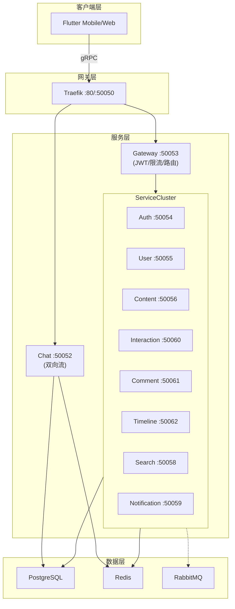

# 项目架构梳理

> 纯 gRPC + gRPC 双向流架构

---

## 整体架构



### 通信协议

| 协议 | 用途 |
|------|------|
| gRPC | 所有 API 调用 |
| gRPC 双向流 | Chat 实时消息 |
| gRPC-Web | Web 客户端 |

---

## 服务职责

### Content Service (:50056)

内容生命周期管理：
- 内容 CRUD（Story/Short/Article）
- 草稿管理
- 统计计数更新（供 Interaction/Comment 调用）
- 内容存在性检查

### Interaction Service (:50060)

用户交互管理：
- 点赞/取消点赞
- 收藏/取消收藏
- 转发/删除转发
- 批量获取交互状态

```
Interaction Service ──gRPC──► Content Service
                              (UpdateCounter, CheckContentExists)
```

### Comment Service (:50061)

评论系统：
- 评论 CRUD
- 评论列表（支持嵌套回复）
- 评论计数

```
Comment Service ──gRPC──► Content Service
                          (UpdateCounter, CheckContentExists)
```

### Timeline Service (:50062)

Feed 流聚合：
- 关注用户 Feed
- 用户主页 Feed
- 热门 Feed
- 内容详情（含交互状态）

```
Timeline Service ──gRPC──► Interaction Service
                           (BatchGetInteractionStatus)
```

### 其他服务

| 服务 | 端口 | 职责 |
|------|------|------|
| Auth | 50054 | 登录/注册/Token/JWT 密钥 |
| User | 50055 | 用户资料/关注关系 |
| Search | 50058 | 搜索 |
| Notification | 50059 | 通知 |
| Chat | 50052 | 实时聊天（双向流） |

---

## 数据库表归属

| 表 | 服务 |
|------|------|
| contents | Content |
| likes, bookmarks, reposts | Interaction |
| comments | Comment |
| users, follows | User |
| conversations, messages | Chat |

---

## Chat 双向流

### 消息流程

```
客户端                    服务端
   │                        │
   │── Subscribe(convId) ──>│
   │<── Subscribed ─────────│
   │                        │
   │── SendMessage ────────>│
   │<── NewMessage ─────────│  (广播)
   │                        │
   │── Typing ─────────────>│
   │<── TypingIndicator ────│
   │                        │
   │── Ping ───────────────>│
   │<── Pong ───────────────│
```

### 事件类型

客户端事件：`Subscribe`, `Unsubscribe`, `SendMessage`, `Typing`, `Ping`

服务端事件：`NewMessage`, `MessageRead`, `TypingIndicator`, `Pong`, `Error`

### Flutter 使用

```dart
// 订阅会话
eventHandler.subscribeConversation(conversationId);

// 监听新消息
eventHandler.onNewMessage.listen((msg) => ...);

// 发送消息
await eventHandler.sendMessage(conversationId: id, content: text);

// 取消订阅
eventHandler.unsubscribeConversation(conversationId);
```

### 重连机制

- 指数退避：1s → 2s → 4s → ... → 30s（最大）
- 重连后自动重新订阅之前的会话
- 心跳间隔：30s，超时：10s

---

## 目录结构

### 后端服务

```
service/
├── gateway/           # API 网关
├── auth/              # 认证
├── user/              # 用户
├── content/           # 内容
├── interaction/       # 交互（点赞/收藏/转发）
├── comment/           # 评论
├── timeline/          # 时间线（Feed 流）
├── search/            # 搜索
├── notification/      # 通知
├── chat/              # 聊天
└── pkg/               # 公共库
    ├── database/      # PostgreSQL
    ├── cache/         # Redis
    ├── broker/        # RabbitMQ
    ├── logger/        # slog 日志
    └── grpcclient/    # gRPC 客户端
```

### Flutter 客户端

```
lib/
├── core/
│   ├── network/       # gRPC 客户端、双向流
│   ├── di/            # 依赖注入
│   └── router/        # 路由
├── features/          # 功能模块
│   ├── auth/
│   ├── chat/
│   ├── feeds/
│   └── ...
└── generated/         # Proto 生成代码
```

---

## 配置参数

### 服务端口

| 服务 | 端口 |
|------|------|
| Traefik HTTP | 80 |
| Traefik gRPC | 50050 |
| Gateway | 50053 |
| Auth | 50054 |
| User | 50055 |
| Content | 50056 |
| Search | 50058 |
| Notification | 50059 |
| Interaction | 50060 |
| Comment | 50061 |
| Timeline | 50062 |
| Chat | 50052 |

### 环境变量

| 变量 | 默认值 |
|------|--------|
| DB_HOST | postgres |
| DB_PORT | 5432 |
| DB_USER | lesser |
| DB_NAME | lesser_db |
| REDIS_URL | redis://redis:6379/0 |
| CONTENT_SERVICE_ADDR | content:50056 |
| INTERACTION_SERVICE_ADDR | interaction:50060 |
| COMMENT_SERVICE_ADDR | comment:50061 |
| TIMELINE_SERVICE_ADDR | timeline:50062 |

---

## 新增路由流程

1. `protos/<service>/<service>.proto` - 定义消息和 RPC
2. `service/<service>/internal/handler/` - gRPC 处理器
3. `service/<service>/internal/service/` - 业务逻辑
4. `service/gateway/internal/router/` - Gateway 路由
5. `client/mobile_flutter/lib/features/<module>/` - 客户端
