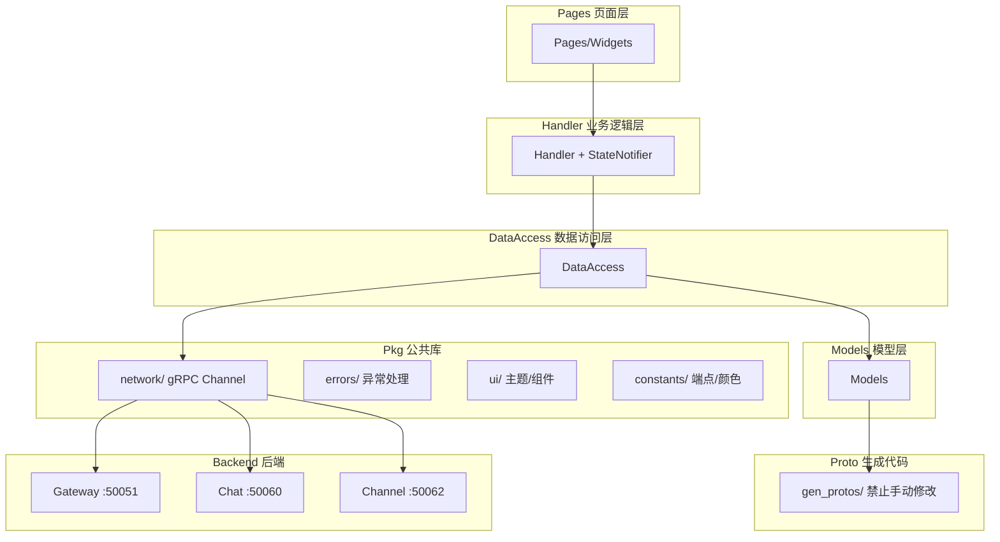
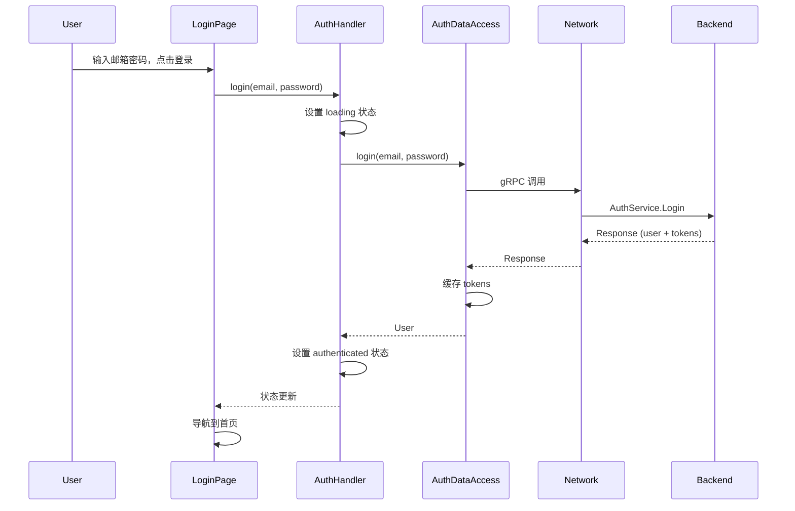
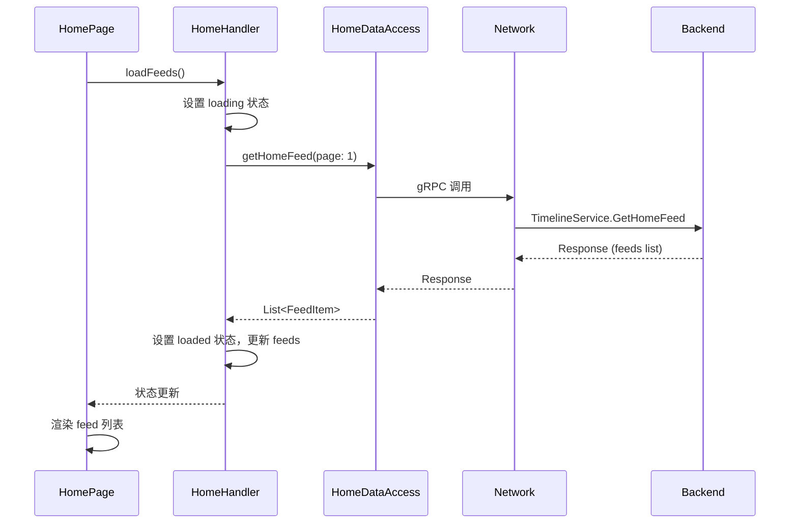
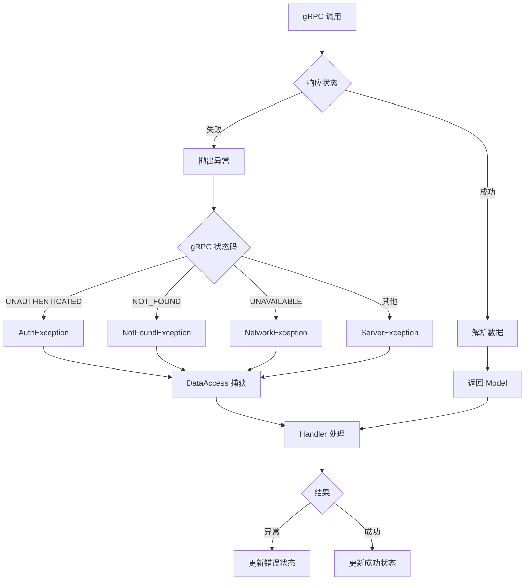
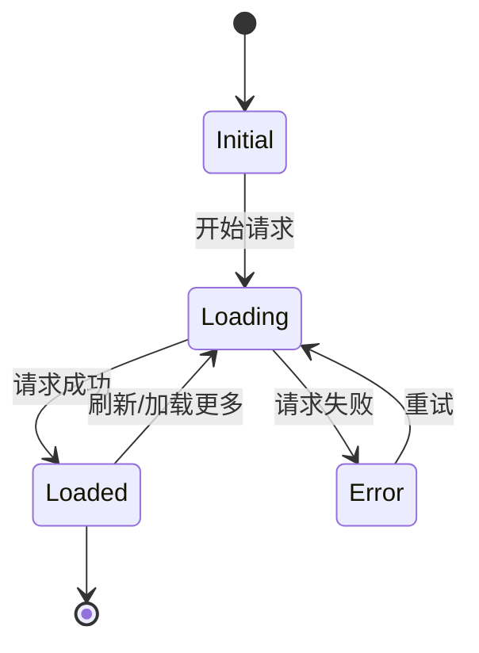
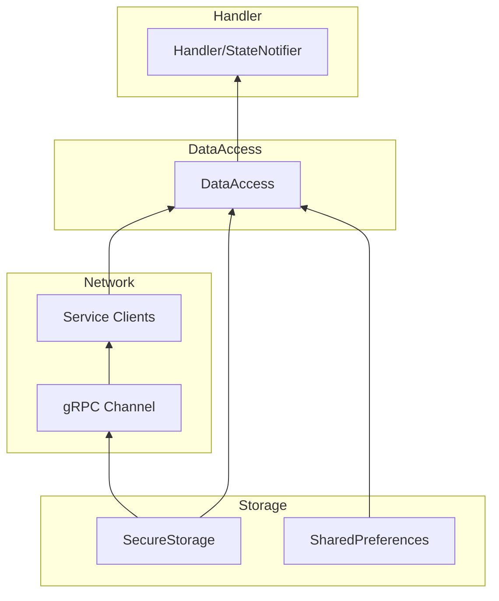

# Flutter 客户端架构流程图

## 整体架构概览



## 调用链路

```
pages → handler → data_access → gRPC → Gateway → Service
```

## 数据流向详解

### 1. 用户操作流程（以登录为例）



### 2. 数据获取流程（以获取 Feeds 为例）



## 各层职责说明

### Pages 页面层

| 组件 | 职责 |
|------|------|
| **pages/** | 页面 UI 组件，负责布局和用户交互 |
| **widgets/** | 可复用的 UI 组件 |

```dart
// Page 示例
class LoginPage extends ConsumerWidget {
  @override
  Widget build(BuildContext context, WidgetRef ref) {
    final state = ref.watch(authHandlerProvider);
    
    return Scaffold(
      body: state.when(
        initial: () => LoginForm(onSubmit: (email, password) {
          ref.read(authHandlerProvider.notifier).login(email, password);
        }),
        loading: () => LoadingIndicator(),
        authenticated: (user) => HomePage(),
        error: (message) => ErrorView(message: message),
      ),
    );
  }
}
```

### Handler 业务逻辑层

| 组件 | 职责 |
|------|------|
| **handler/** | 状态管理，连接 UI 和数据访问层 |
| **stream_handler/** | 处理 gRPC 双向流（Chat/Channel） |

```dart
// Handler 示例
class AuthHandler extends StateNotifier<AuthState> {
  final AuthDataAccess _dataAccess;
  
  AuthHandler(this._dataAccess) : super(AuthState.initial());
  
  Future<void> login(String email, String password) async {
    state = AuthState.loading();
    try {
      final user = await _dataAccess.login(email: email, password: password);
      state = AuthState.authenticated(user);
    } catch (e) {
      state = AuthState.error(e.toString());
    }
  }
}
```

### DataAccess 数据访问层

| 组件 | 职责 |
|------|------|
| **data_access/** | 处理 gRPC 调用，管理本地缓存 |

```dart
// DataAccess 示例
class AuthDataAccess {
  final AuthServiceClient _client;
  final TokenStorage _tokenStorage;
  
  Future<User> login({required String email, required String password}) async {
    final request = LoginRequest()
      ..email = email
      ..password = password;
    
    final response = await _client.login(request);
    
    // 缓存 tokens
    await _tokenStorage.saveTokens(
      accessToken: response.accessToken,
      refreshToken: response.refreshToken,
    );
    
    return User.fromProto(response.user);
  }
}
```

### Models 模型层

| 组件 | 职责 |
|------|------|
| **models/** | 业务模型，封装 Proto 对象 |

```dart
// Model 示例
class User {
  final String id;
  final String username;
  final String email;
  final String? displayName;
  final String? avatarUrl;
  
  User({
    required this.id,
    required this.username,
    required this.email,
    this.displayName,
    this.avatarUrl,
  });
  
  // 从 Proto 转换
  factory User.fromProto(UserProto proto) {
    return User(
      id: proto.id,
      username: proto.username,
      email: proto.email,
      displayName: proto.displayName.isEmpty ? null : proto.displayName,
      avatarUrl: proto.avatarUrl.isEmpty ? null : proto.avatarUrl,
    );
  }
}
```

### Pkg 公共库

| 组件 | 职责 |
|------|------|
| **network/** | gRPC Channel 管理，拦截器 |
| **errors/** | 异常类型定义 |
| **ui/** | 主题、通用组件 |
| **constants/** | 端点、颜色常量 |
| **utils/** | 工具函数 |
| **logs/** | 日志工具 |

## Feature 模块结构

```
features/<name>/
├── handler/
│   └── xxx_handler.dart       # 状态管理
├── data_access/
│   └── xxx_data_access.dart   # gRPC 调用
├── models/
│   └── xxx_model.dart         # 业务模型
├── pages/
│   └── xxx_page.dart          # 页面
└── widgets/
    └── xxx_widget.dart        # 组件
```

## 错误处理流程



## 状态管理流程



## 依赖注入关系



## 底部导航栏

| Tab | 名称 | Feature | 后端服务 |
|-----|------|---------|---------|
| 1 | 首页 | home | Timeline + Content + Comment + Interaction + Search |
| 2 | 频道 | channel | Channel (广播频道服务) |
| 3 | 聊天 | chat | Chat (私聊/群聊) + Notification |
| 4 | 我的 | profile | User |

登录页（auth）独立，不在底部导航栏。

## 总结

1. **简洁分层**: pages → handler → data_access → models → gen_protos
2. **单向数据流**: UI 触发 Handler，Handler 调用 DataAccess，DataAccess 返回 Model
3. **gRPC 通信**: 所有后端通信通过 gRPC，Proto 文件自动生成
4. **状态管理**: 使用 Riverpod + StateNotifier 管理状态
5. **可测试性**: 各层职责清晰，便于单元测试
