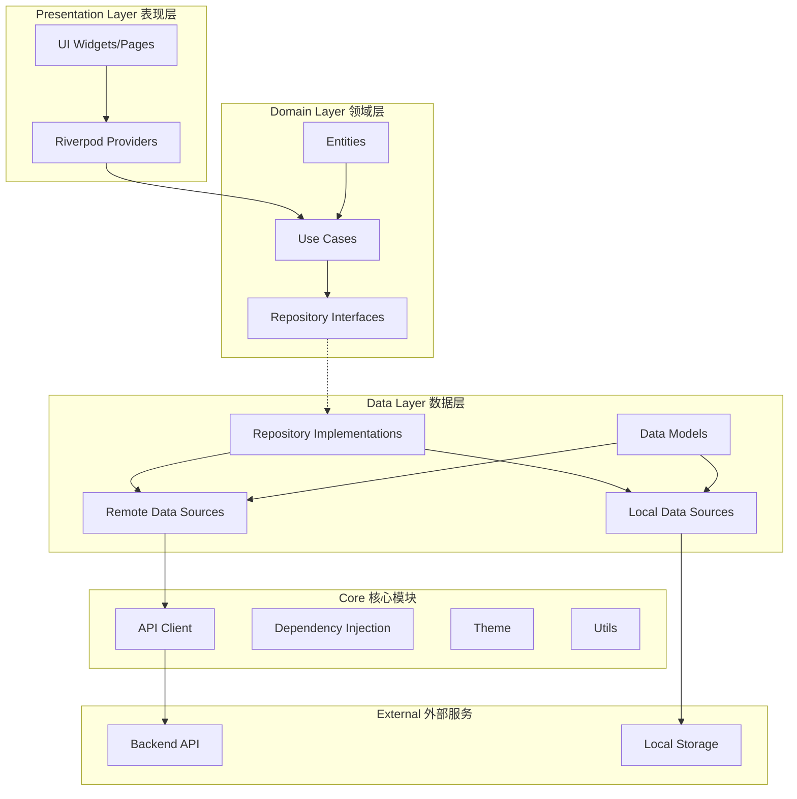
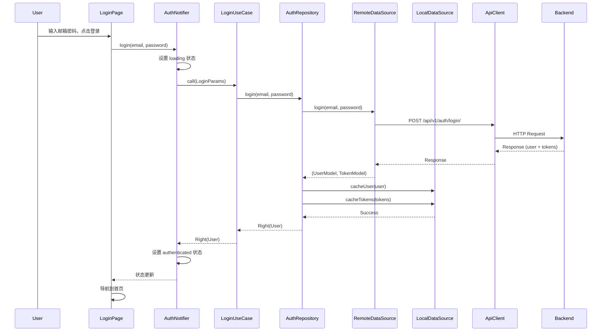
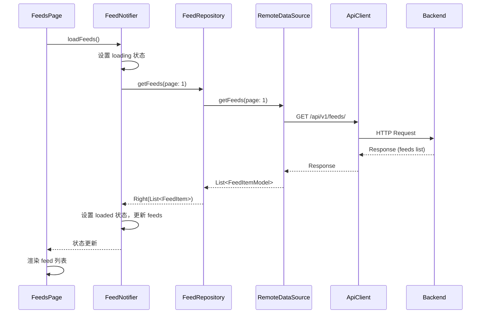
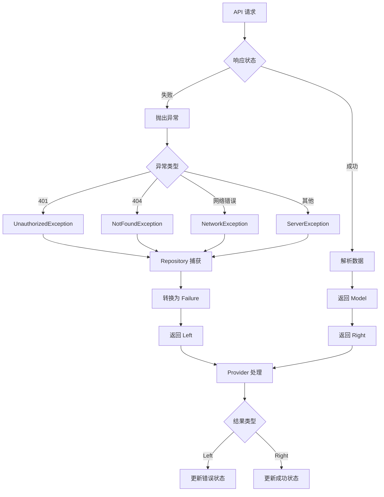
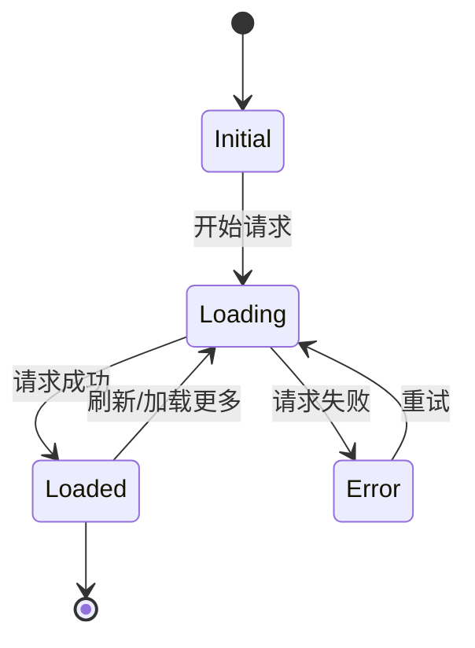
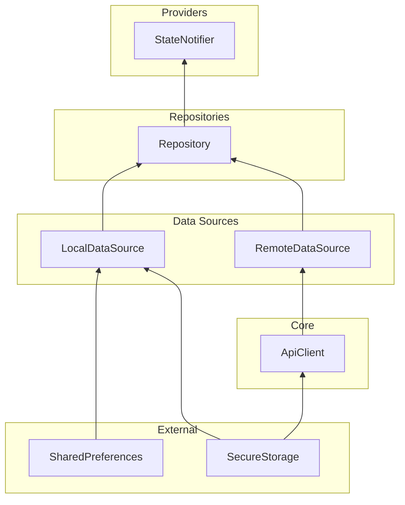

# Flutter 客户端架构流程图

## 整体架构概览



## 数据流向详解

### 1. 用户操作流程 (以登录为例)



### 2. 数据获取流程 (以获取 Feeds 为例)



## 各层职责说明

### Presentation Layer (表现层)

| 组件 | 职责 |
|------|------|
| **Pages** | 页面 UI 组件，负责布局和用户交互 |
| **Widgets** | 可复用的 UI 组件 |
| **Providers** | 状态管理，连接 UI 和业务逻辑 |

```dart
// Provider 示例
class AuthNotifier extends StateNotifier<AuthState> {
  final AuthRepository _repository;
  
  Future<void> login({required String email, required String password}) async {
    state = state.copyWith(status: AuthStatus.loading);
    final result = await _repository.login(email: email, password: password);
    result.fold(
      (failure) => state = state.copyWith(status: AuthStatus.error),
      (user) => state = state.copyWith(status: AuthStatus.authenticated, user: user),
    );
  }
}
```

### Domain Layer (领域层)

| 组件 | 职责 |
|------|------|
| **Entities** | 核心业务对象，纯 Dart 类 |
| **Use Cases** | 单一业务操作，封装业务逻辑 |
| **Repository Interfaces** | 定义数据操作契约 |

```dart
// Use Case 示例
class LoginUseCase {
  final AuthRepository _repository;
  
  Future<Either<Failure, User>> call(LoginParams params) {
    return _repository.login(
      email: params.email,
      password: params.password,
    );
  }
}
```

### Data Layer (数据层)

| 组件 | 职责 |
|------|------|
| **Repository Impl** | 实现 Repository 接口，协调数据源 |
| **Remote Data Source** | 处理网络请求 |
| **Local Data Source** | 处理本地存储 |
| **Models** | 数据传输对象，包含序列化逻辑 |

```dart
// Repository 实现示例
class AuthRepositoryImpl implements AuthRepository {
  final AuthRemoteDataSource _remoteDataSource;
  final AuthLocalDataSource _localDataSource;
  
  @override
  Future<Either<Failure, User>> login({...}) async {
    try {
      final result = await _remoteDataSource.login(...);
      await _localDataSource.cacheUser(result.user);
      await _localDataSource.cacheTokens(...);
      return Right(result.user);
    } on ServerException catch (e) {
      return Left(ServerFailure(message: e.message));
    }
  }
}
```

### Core (核心模块)

| 组件 | 职责 |
|------|------|
| **API Client** | HTTP 客户端，处理请求/响应 |
| **DI** | 依赖注入配置 |
| **Theme** | 主题和样式配置 |
| **Utils** | 工具函数和扩展 |
| **Errors** | 异常和失败类型定义 |

## Feature 模块结构

每个 Feature 模块遵循 Clean Architecture:

```
feature/
├── data/
│   ├── datasources/
│   │   ├── xxx_remote_datasource.dart
│   │   └── xxx_local_datasource.dart
│   ├── models/
│   │   └── xxx_model.dart
│   └── repositories/
│       └── xxx_repository_impl.dart
├── domain/
│   ├── entities/
│   │   └── xxx.dart
│   ├── repositories/
│   │   └── xxx_repository.dart
│   └── usecases/
│       └── xxx_usecase.dart
└── presentation/
    ├── providers/
    │   └── xxx_provider.dart
    ├── pages/
    │   └── xxx_page.dart
    └── widgets/
        └── xxx_widget.dart
```

## 错误处理流程



## 状态管理流程



## 依赖注入关系



## 总结

1. **单向数据流**: UI → Provider → UseCase → Repository → DataSource → API
2. **依赖倒置**: 高层模块不依赖低层模块，都依赖抽象
3. **关注点分离**: 每层只关注自己的职责
4. **可测试性**: 通过接口抽象，便于单元测试和 Mock
5. **可维护性**: 清晰的模块边界，便于修改和扩展
