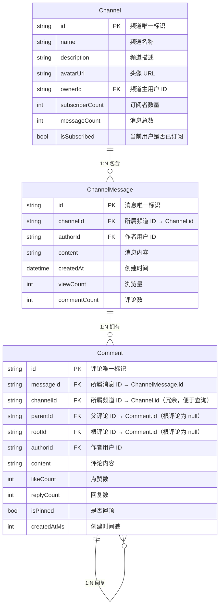
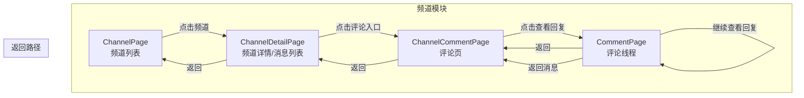
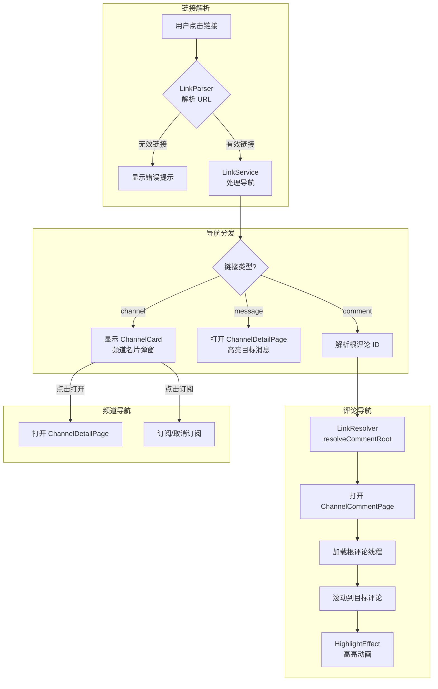
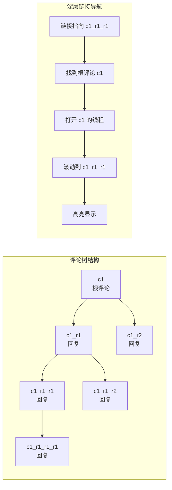

# Channel 频道模块

频道模块实现类似 Telegram Channel 的广播频道功能，支持频道消息、评论系统和深层链接导航。

## 模块结构

```
channel/
├── data_access/
│   ├── channel_mock_data_source.dart    # 频道 Mock 数据源
│   └── channel_comment_data_source.dart # 评论数据源
├── handler/
│   ├── channel_handler.dart             # 频道业务逻辑
│   └── channel_mock_data.dart           # Mock 数据定义
├── models/
│   ├── channel_model.dart               # 频道模型
│   ├── channel_message_model.dart       # 频道消息模型
│   └── channel_comment_model.dart       # 评论模型
├── pages/
│   ├── channel_page.dart                # 频道列表页
│   ├── channel_detail_page.dart         # 频道详情页（消息列表）
│   └── channel_comment_page.dart        # 评论页
└── widgets/
    ├── channel_item.dart                # 频道列表项
    ├── channel_message.dart             # 消息组件
    └── ...
```

## 数据模型关系

### ER 图



### 键说明

| 模型 | 字段 | 类型 | 说明 |
|------|------|------|------|
| Channel | id | PK | 频道主键，全局唯一 |
| Channel | ownerId | FK | 外键，关联用户表 |
| ChannelMessage | id | PK | 消息主键，全局唯一 |
| ChannelMessage | channelId | FK | 外键，关联 Channel.id |
| Comment | id | PK | 评论主键，全局唯一 |
| Comment | messageId | FK | 外键，关联 ChannelMessage.id |
| Comment | channelId | FK | 冗余外键，便于按频道查询评论 |
| Comment | parentId | FK | 自引用外键，指向直接父评论（根评论为 null） |
| Comment | rootId | FK | 自引用外键，指向评论树根节点（根评论为 null） |

### 评论树结构

评论采用扁平化存储 + 双指针设计：

```
parentId: 指向直接父评论，用于显示"回复 @xxx"
rootId:   指向评论树根节点，用于加载整个线程

示例：
c1 (根评论)           → parentId: null, rootId: null
├── c1_r1 (回复 c1)   → parentId: c1,   rootId: c1
│   ├── c1_r1_r1      → parentId: c1_r1, rootId: c1
│   └── c1_r1_r2      → parentId: c1_r1, rootId: c1
└── c1_r2 (回复 c1)   → parentId: c1,   rootId: c1
```

这种设计的优势：
- 加载线程只需一次查询：`WHERE rootId = ?`
- 显示回复关系：通过 `parentId` 找到被回复的评论
- 深层链接导航：通过 `rootId` 快速定位根评论

## 页面导航流程



## 深层链接系统

### 链接格式

```
https://lesser.app/channel/{channelId}
https://lesser.app/channel/{channelId}/message/{messageId}
https://lesser.app/channel/{channelId}/message/{messageId}/comment/{commentId}
```

### 链接导航流程



### 评论树导航示例



## 高亮效果

消息和评论支持高亮动画效果，用于深层链接导航时吸引用户注意力：

```mermaid
sequenceDiagram
    participant User as 用户
    participant Link as LinkService
    participant Page as 页面
    participant Effect as HighlightEffect

    User->>Link: 点击深层链接
    Link->>Page: 导航到目标页面
    Page->>Page: 加载数据
    Page->>Page: 滚动到目标位置
    Page->>Effect: 设置 isHighlighted=true
    Effect->>Effect: 播放高亮动画 (1.5s)
    Effect->>Page: onHighlightComplete
    Page->>Page: 清除高亮状态
```

## 组件使用

### ChannelDetailPage

```dart
// 普通导航
Navigator.push(
  context,
  MaterialPageRoute(
    builder: (_) => ChannelDetailPage(
      channelId: 'test',
      initialChannel: channel, // 可选，避免重复加载
    ),
  ),
);

// 深层链接导航（高亮消息）
Navigator.push(
  context,
  MaterialPageRoute(
    builder: (_) => ChannelDetailPage(
      channelId: 'test',
      highlightMessageId: 'post_1', // 需要高亮的消息 ID
    ),
  ),
);
```

### ChannelCommentPage

```dart
// 普通导航（从消息进入评论）
Navigator.push(
  context,
  MaterialPageRoute(
    builder: (_) => ChannelCommentPage(
      messageId: 'post_1',
      channelId: 'test',
    ),
  ),
);

// 深层链接导航（高亮评论）
Navigator.push(
  context,
  MaterialPageRoute(
    builder: (_) => ChannelCommentPage(
      messageId: 'post_1',
      channelId: 'test',
      rootCommentId: 'c1',           // 根评论 ID
      targetCommentId: 'c1_r1_r1',   // 目标评论 ID
    ),
  ),
);
```

### LinkService 使用

```dart
// 初始化（在 main.dart 中）
LinkService.instance.init(
  dataSource: LinkMockDataSource(),
  onNavigateToChannel: _navigateToChannel,
  onNavigateToMessage: _navigateToMessage,
  onNavigateToComment: _navigateToComment,
);

// 导航到链接
await LinkService.instance.navigate(context, url);

// 获取链接元数据（用于渲染预览卡片）
final metadata = await LinkService.instance.getMetadata(url);
```

## UI 组件

### InlineLinkCard

内联链接卡片，用于在文本中渲染链接预览：

```
┌─────────────────────────────────┐
│ 🔗 频道：测试频道。评论：xxxx... │
└─────────────────────────────────┘
```

### ChannelCard

频道名片弹窗，点击频道链接时显示：

```
┌─────────────────────────────────┐
│         ─────                   │
│                                 │
│  [头像]  频道名称               │
│          1,234 订阅者           │
│                                 │
│  ┌─────────────────────────┐   │
│  │ 频道描述文本...          │   │
│  └─────────────────────────┘   │
│                                 │
│  [  订阅  ]    [  打开频道  ]   │
└─────────────────────────────────┘
```

## 相关模块

- `pkg/link/` - 深层链接公共组件
- `pkg/comment/` - 通用评论组件
- `pkg/ui/effects/` - UI 效果组件（高亮动画等）
