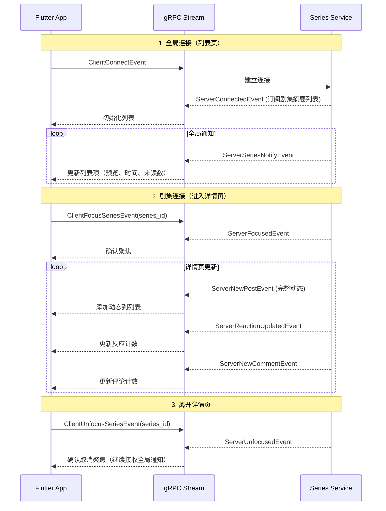
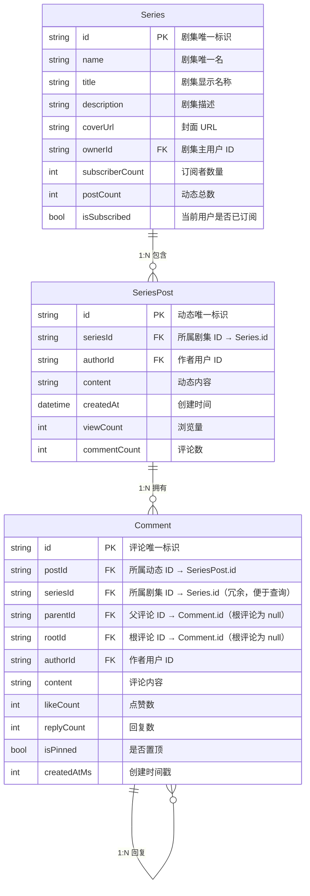
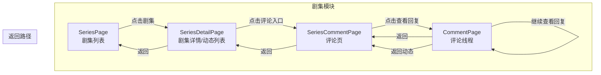
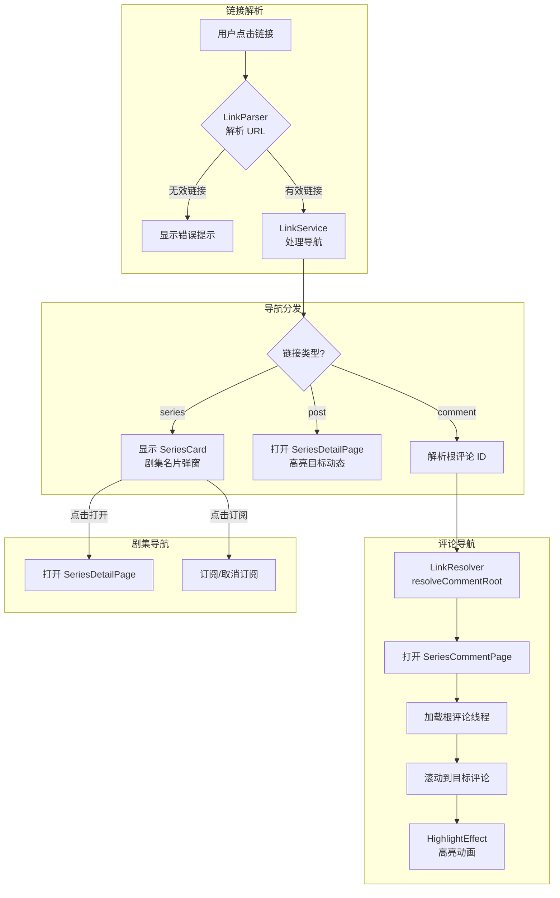
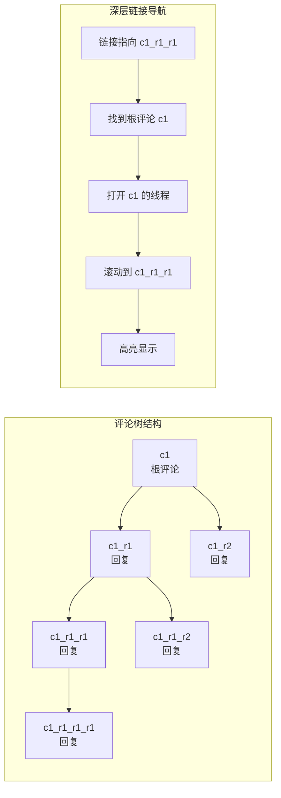

# Series 剧集模块

剧集模块（Series）实现类似 IMDB/Douban 的影视剧集结构，支持剧集动态、评论系统和深层链接导航。

## 实时推送架构

### 两层推送设计

剧集模块采用两层推送架构，优化网络流量和用户体验：

```
┌─────────────────────────────────────────────────────────────────────────────┐
│                           两层推送架构                                        │
├─────────────────────────────────────────────────────────────────────────────┤
│                                                                             │
│  ┌─────────────────────────────────────────────────────────────────────┐   │
│  │                    全局连接（列表页）                                  │   │
│  │                                                                       │   │
│  │  • 建立时机：用户打开剧集列表页                                         │   │
│  │  • 推送范围：所有订阅剧集                                              │   │
│  │  • 推送内容：轻量级通知                                                │   │
│  │    - 剧集 ID、名称、封面                                               │   │
│  │    - 预览文本（截断）                                                  │   │
│  │    - 动态时间                                                         │   │
│  │    - 未读数                                                           │   │
│  │    - 是否有媒体                                                        │   │
│  │    - 作者名称                                                         │   │
│  │                                                                       │   │
│  └─────────────────────────────────────────────────────────────────────┘   │
│                                    │                                        │
│                                    │ 用户进入详情页                          │
│                                    ▼                                        │
│  ┌─────────────────────────────────────────────────────────────────────┐   │
│  │                    剧集连接（详情页）                                  │   │
│  │                                                                       │   │
│  │  • 建立时机：用户进入剧集详情页（发送 FocusSeries）                     │   │
│  │  • 推送范围：仅当前打开的剧集                                          │   │
│  │  • 推送内容：完整更新                                                  │   │
│  │    - 完整动态内容（文本、媒体、链接）                                    │   │
│  │    - 反应变化（emoji 计数、我的反应）                                   │   │
│  │    - 评论变化（新评论、删除、点赞）                                     │   │
│  │    - 动态编辑、删除、置顶                                              │   │
│  │                                                                       │   │
│  └─────────────────────────────────────────────────────────────────────┘   │
│                                                                             │
└─────────────────────────────────────────────────────────────────────────────┘
```

### 事件流程



### 客户端事件

| 事件 | 说明 | 使用场景 |
|------|------|---------|
| `ClientConnectEvent` | 建立全局连接 | 打开剧集列表页 |
| `ClientDisconnectEvent` | 断开全局连接 | 关闭剧集模块 |
| `ClientFocusSeriesEvent` | 聚焦剧集 | 进入剧集详情页 |
| `ClientUnfocusSeriesEvent` | 取消聚焦 | 离开剧集详情页 |
| `ClientPingEvent` | 心跳 | 保持连接活跃 |
| `ClientMarkReadEvent` | 标记已读 | 用户阅读动态 |
| `ClientAckEvent` | 确认收到 | 可靠投递确认 |

### 服务端事件

| 事件 | 推送层级 | 说明 |
|------|---------|------|
| `ServerConnectedEvent` | 连接 | 全局连接成功，返回订阅剧集摘要 |
| `ServerFocusedEvent` | 连接 | 剧集聚焦成功 |
| `ServerUnfocusedEvent` | 连接 | 剧集取消聚焦成功 |
| `ServerSeriesNotifyEvent` | 全局 | 剧集新动态通知（轻量） |
| `ServerNewPostEvent` | 详情 | 新动态（完整内容） |
| `ServerPostEditedEvent` | 详情 | 动态编辑 |
| `ServerPostDeletedEvent` | 详情 | 动态删除 |
| `ServerReactionUpdatedEvent` | 详情 | 反应变化 |
| `ServerNewCommentEvent` | 详情 | 新评论 |
| `ServerCommentDeletedEvent` | 详情 | 评论删除 |
| `ServerCommentLikedEvent` | 详情 | 评论点赞变化 |
| `ServerSeriesUpdatedEvent` | 全局 | 剧集信息更新 |
| `ServerSeriesDeletedEvent` | 全局 | 剧集删除 |

### 数据结构

#### SeriesSummary（剧集摘要，列表页使用）

```dart
class SeriesSummary {
  final String seriesId;
  final String seriesName;
  final String title;
  final String? coverUrl;
  final String? lastPostPreview;   // 最后动态预览
  final DateTime? lastPostTime;    // 最后动态时间
  final int unreadCount;              // 未读数
  final bool isMuted;                 // 是否静音
  final bool isPinned;                // 是否置顶
}
```

#### ServerSeriesNotifyEvent（剧集通知，轻量级）

```dart
class SeriesNotify {
  final String seriesId;
  final String title;
  final String? coverUrl;
  final String postId;
  final String previewText;           // 预览文本（截断）
  final DateTime postTime;
  final int unreadCount;
  final bool hasMedia;
  final String authorName;
}
```

## 模块结构

```
series/
├── data_access/
│   ├── series_data_source.dart         # 剧集数据源接口
│   ├── series_mock_data_source.dart    # 剧集 Mock 数据源
│   ├── series_comment_data_source.dart # 评论数据源
│   └── mock/
│       └── series_mock_data.dart       # Mock 数据定义
├── handler/
│   └── series_handler.dart             # 剧集业务逻辑
├── models/
│   ├── series_model.dart               # 剧集模型
│   ├── series_post_model.dart          # 剧集动态模型
│   ├── series_comment_model.dart       # 评论模型
│   └── series_tag.dart                 # 剧集标签模型
├── pages/
│   ├── series_page.dart                # 剧集列表页
│   ├── series_detail_page.dart         # 剧集详情页（动态列表）
│   └── series_comment_page.dart        # 评论页
└── widgets/
    ├── series_item.dart                # 剧集列表项
    ├── series_post.dart                # 动态组件
    ├── detail_app_bar.dart              # 详情页 AppBar
    ├── post_list_view.dart           # 动态列表视图
    ├── post_list_controller.dart     # 动态列表控制器（缓存+高亮）
    ├── comment_page_scaffold.dart       # 评论页脚手架
    └── ...
```

## 架构设计原则

### 分层架构

```
pages → handler → data_access → models
```

- `pages/`: UI 层，只负责渲染和用户交互
- `handler/`: 业务逻辑层，处理状态管理和业务规则
- `data_access/`: 数据访问层，抽象数据源（Mock/gRPC）
- `models/`: 数据模型层，纯数据结构

### 接口定义位置

- 数据源接口（如 `SeriesDataSource`）定义在 `data_access/` 目录
- Handler 通过依赖注入使用数据源接口

### Widget 拆分原则

- 私有方法返回 Widget 应改为私有 Widget 类
- 复杂页面拆分为独立组件（如 `DetailAppBar`、`PostListView`）
- 缓存逻辑抽离到控制器类（如 `PostListController`）

### 状态管理

- 选中状态由 UI 层管理（使用 `Set<String>`），不在 Model 中存储
- 临时 UI 状态（如高亮）通过控制器管理

## 数据模型关系

### ER 图



### 键说明

| 模型 | 字段 | 类型 | 说明 |
|------|------|------|------|
| Series | id | PK | 剧集主键，全局唯一 |
| Series | ownerId | FK | 外键，关联用户表 |
| SeriesPost | id | PK | 动态主键，全局唯一 |
| SeriesPost | seriesId | FK | 外键，关联 Series.id |
| Comment | id | PK | 评论主键，全局唯一 |
| Comment | postId | FK | 外键，关联 SeriesPost.id |
| Comment | seriesId | FK | 冗余外键，便于按剧集查询评论 |
| Comment | parentId | FK | 自引用外键，指向直接父评论（根评论为 null） |
| Comment | rootId | FK | 自引用外键，指向评论树根节点（根评论为 null） |

### 评论树结构

评论采用扁平化存储 + 双指针设计：

```
parentId: 指向直接父评论，用于显示"回复 @xxx"
rootId:   指向评论树根节点，用于加载整个线程

示例：
c1 (根评论)           → parentId: null, rootId: null
├── c1_r1 (回复 c1)   → parentId: c1,   rootId: c1
│   ├── c1_r1_r1      → parentId: c1_r1, rootId: c1
│   └── c1_r1_r2      → parentId: c1_r1, rootId: c1
└── c1_r2 (回复 c1)   → parentId: c1,   rootId: c1
```

这种设计的优势：
- 加载线程只需一次查询：`WHERE rootId = ?`
- 显示回复关系：通过 `parentId` 找到被回复的评论
- 深层链接导航：通过 `rootId` 快速定位根评论

## 页面导航流程



## 深层链接系统

### 链接格式

```
https://lesser.app/s/{seriesId}
https://lesser.app/s/{seriesId}/p/{postId}
https://lesser.app/s/{seriesId}/p/{postId}/c/{commentId}
```

### 链接导航流程



### 评论树导航示例



## 高亮效果

动态和评论支持高亮动画效果，用于深层链接导航时吸引用户注意力：

```mermaid
sequenceDiagram
    participant User as 用户
    participant Link as LinkService
    participant Page as 页面
    participant Effect as HighlightEffect

    User->>Link: 点击深层链接
    Link->>Page: 导航到目标页面
    Page->>Page: 加载数据
    Page->>Page: 滚动到目标位置
    Page->>Effect: 设置 isHighlighted=true
    Effect->>Effect: 播放高亮动画 (1.5s)
    Effect->>Page: onHighlightComplete
    Page->>Page: 清除高亮状态
```

## 组件使用

### SeriesDetailPage

```dart
// 普通导航
Navigator.push(
  context,
  MaterialPageRoute(
    builder: (_) => SeriesDetailPage(
      seriesId: 'test',
      initialSeries: series, // 可选，避免重复加载
    ),
  ),
);

// 深层链接导航（高亮动态）
Navigator.push(
  context,
  MaterialPageRoute(
    builder: (_) => SeriesDetailPage(
      seriesId: 'test',
      highlightPostId: 'post_1', // 需要高亮的动态 ID
    ),
  ),
);
```

### SeriesCommentPage

```dart
// 普通导航（从动态进入评论）
Navigator.push(
  context,
  MaterialPageRoute(
    builder: (_) => SeriesCommentPage(
      postId: 'post_1',
      seriesId: 'test',
    ),
  ),
);

// 深层链接导航（高亮评论）
Navigator.push(
  context,
  MaterialPageRoute(
    builder: (_) => SeriesCommentPage(
      postId: 'post_1',
      seriesId: 'test',
      rootCommentId: 'c1',           // 根评论 ID
      targetCommentId: 'c1_r1_r1',   // 目标评论 ID
    ),
  ),
);
```

### LinkService 使用

```dart
// 初始化（在 main.dart 中）
LinkService.instance.init(
  dataSource: LinkMockDataSource(),
  onNavigateToSeries: _navigateToSeries,
  onNavigateToPost: _navigateToPost,
  onNavigateToComment: _navigateToComment,
);

// 导航到链接
await LinkService.instance.navigate(context, url);

// 获取链接元数据（用于渲染预览卡片）
final metadata = await LinkService.instance.getMetadata(url);
```

## UI 组件

### InlineLinkCard

内联链接卡片，用于在文本中渲染链接预览：

```
┌─────────────────────────────────┐
│ 🔗 剧集：测试剧集。评论：xxxx... │
└─────────────────────────────────┘
```

### SeriesCard

剧集名片弹窗，点击剧集链接时显示：

```
┌─────────────────────────────────┐
│         ─────                   │
│                                 │
│  [封面]  剧集名称               │
│          1,234 订阅者           │
│                                 │
│  ┌─────────────────────────┐   │
│  │ 剧集描述文本...          │   │
│  └─────────────────────────┘   │
│                                 │
│  [  订阅  ]    [  打开剧集  ]   │
└─────────────────────────────────┘
```

## 相关模块

- `pkg/link/` - 深层链接公共组件
- `pkg/comment/` - 通用评论组件
- `pkg/ui/effects/` - UI 效果组件（高亮动画等）
