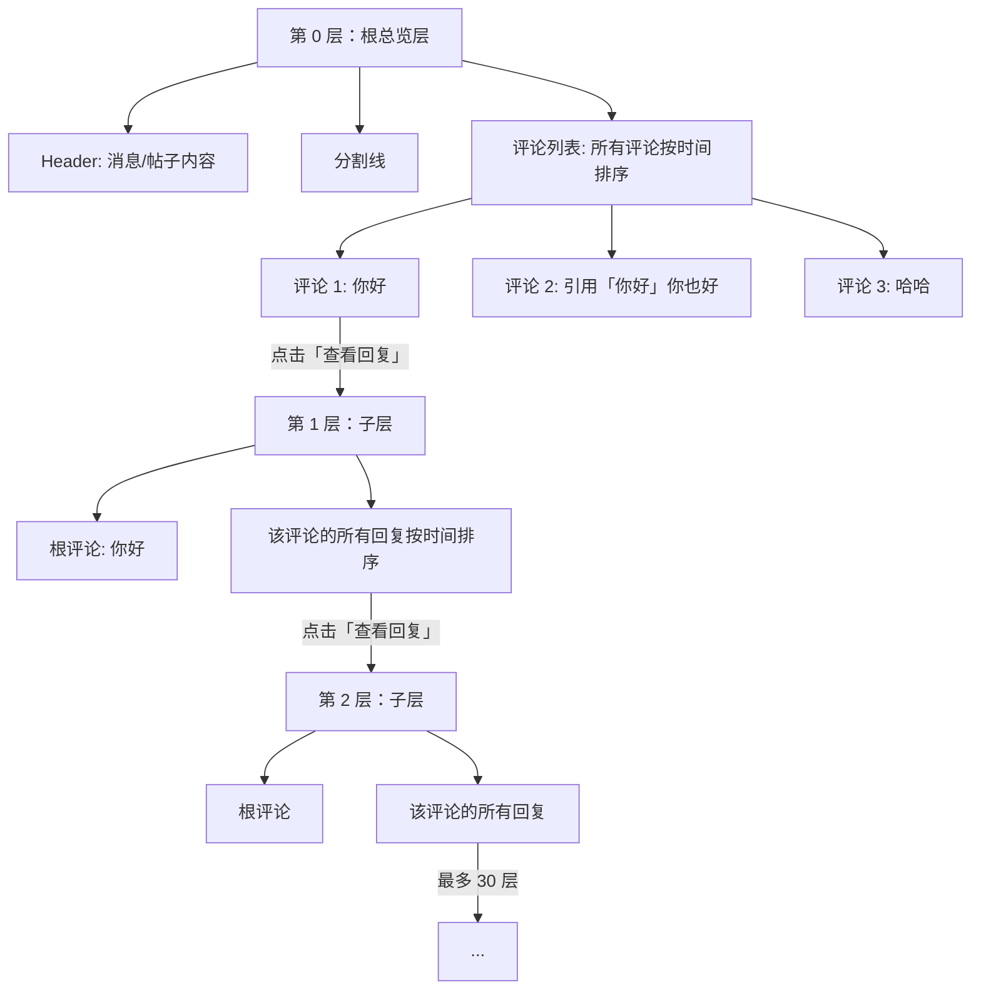
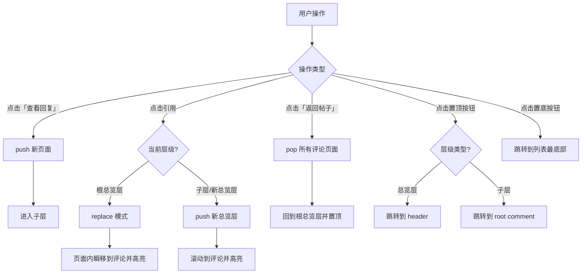
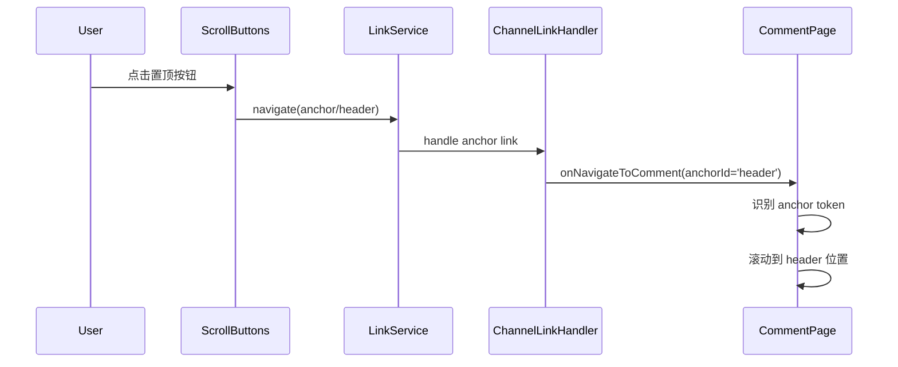

# Comment 评论组件包

独立的评论系统，可在任何场景复用（帖子、频道消息、文章等）。

## 架构

```
comment/
├── comment.dart           # 统一导出
├── comment_page.dart      # 评论页面
├── utils.dart             # 工具函数
├── logic/                 # 业务逻辑层（与 UI 分离）
│   ├── logic.dart             # 逻辑层导出
│   ├── comment_handler.dart   # 评论业务处理器
│   ├── comment_navigator.dart # 页面导航管理器
│   └── scroll_controller.dart # 滚动控制器
├── models/
│   └── comment_model.dart # 数据模型
└── widgets/               # 纯 UI 组件
    ├── widgets.dart           # 组件导出
    ├── comment_list.dart      # 评论列表
    ├── comment_item.dart      # 评论项
    ├── comment_bubble.dart    # 评论气泡
    ├── comment_actions.dart   # 操作按钮（点赞/回复）
    ├── comment_input_bar.dart # 输入栏
    ├── comment_highlight.dart # 高亮动画（深层链接）
    ├── message_header.dart    # 消息头部
    └── scroll_buttons.dart    # 滚动按钮
```

## 设计原则

### UI 与逻辑分离

- `logic/` 目录包含所有业务逻辑，不依赖 Flutter UI
- `widgets/` 目录包含纯 UI 组件，通过回调与逻辑层交互
- 页面组件（`comment_page.dart`）负责组装 UI 和逻辑

---

## 整体工作流程

### 1. 入口与外部交互

**入口形式**：【堆叠头像】【xxx 条评论】

评论接口提供具体的数据，头像和评论数的渲染由使用者自行决定。

```dart
// 返回值
CommentEntryData(
  avatarUrls: ['a', 'b', 'c', 'd', 'e'],  // 头像列表
  count: 1234,                             // 评论总数
)

// 使用示例
Widget build() {
  return Row(
    children: [
      AvatarStack(avatars: entryData.avatarUrls),
      Text('${entryData.count} 条评论'),
    ],
  );
}
```

**需要的参数**：一个 `content id`（如 `messageId`），作为这一颗评论树的根节点。

### 2. 内部实现架构

进入评论区后，任何外部行为与内部评论区无关。

#### 数据结构

- **存储方式**：多叉树结构（推荐使用闭包表 Closure Table）
- **UI 展示**：`Stack<Page>` 页面栈

#### 层级结构



**层级说明**：

| 层级类型 | 说明 | Header |
|---------|------|--------|
| 根总览层 | 第一个打开的评论页面 | 帖子/消息 header |
| 子层 | 某条评论的回复线程 | rootComment |
| 新总览层 | 引用点击产生的新页面 | 帖子/消息 header |

**层级限制**：最多 30 层。超过时提示：「当前讨论层级过深，建议通过评论链接继续讨论」

### 3. 导航与跳转流程



### 4. 滚动行为

| 层级 | 置顶 | 置底 |
|------|------|------|
| 总览层 | header（瞬移） | 列表最底部（瞬移） |
| 子层 | root comment（瞬移） | 列表最底部（瞬移） |

### 5. Link 系统集成

所有跳转行为统一使用 Link 系统实现：

| 操作 | Link 类型 | 行为 |
|------|----------|------|
| 置顶按钮 | `anchor/header` | 跳转到 header |
| 置底按钮 | `anchor/bottom` | 跳转到列表最底部 |
| 回复引用 | `comment/{id}` | 跳转到原评论 |
| 查看回复 | push 新页面 | 进入评论线程 |

#### Anchor Token 设计

Anchor 是特殊的 Link 类型，用于页面内定位：

- `header`：总览层的顶部（消息/帖子 header）
- `bottom`：当前页面的最底部评论
- 在子层中，`header` 指向 root comment

**URL 格式**：
```
lesser.app/channel/{channelId}/message/{messageId}/anchor/header
lesser.app/channel/{channelId}/message/{messageId}/anchor/bottom
```

**实现原理**：
- `CommentScrollController` 维护 `topAnchorId` 和 `bottomAnchorId`
- 通过 `LinkService.navigate()` 触发跳转
- `onNavigateToComment` 回调接收 anchor token 并执行滚动

---

## 使用方式

### 1. 实现数据源接口

```dart
class MyCommentDataSource implements CommentDataSource {
  @override
  Future<CommentListState> loadComments(String targetId, String targetType) async {
    final response = await _client.getComments(...);
    return CommentListState(
      comments: response.comments.map(_toModel).toList(),
      totalCount: response.totalCount,
      hasMore: response.hasMore,
      cursor: response.cursor,
    );
  }

  @override
  Future<CommentListState> loadThread(CommentModel rootComment) async {
    // 加载子评论线程
  }

  @override
  int getDescendantCount(String commentId) {
    // 获取子孙评论数量（闭包表查询）
  }

  @override
  Future<void> toggleLike(String commentId) async {
    // 切换点赞
  }

  @override
  Future<CommentModel> submitComment({...}) async {
    // 发表评论
  }

  // ... 其他方法
}
```

### 2. 获取评论入口数据

```dart
final entryData = CommentEntryData(
  avatarUrls: ['url1', 'url2', 'url3'],
  count: 42,
);

// 使用方自行渲染
Row(
  children: [
    AvatarStack(avatarUrls: entryData.avatarUrls),
    const SizedBox(width: 8),
    Text('${entryData.count} 条评论'),
    const Spacer(),
    Icon(Icons.chevron_right_rounded),
  ],
)
```

### 3. 打开评论页面

```dart
Navigator.push(
  context,
  MaterialPageRoute(
    builder: (context) => CommentPage(
      targetId: postId,
      targetType: 'post',
      dataSource: MyCommentDataSource(),
      title: '评论',
      channelId: channelId,  // 用于构建 Link
    ),
  ),
);
```

### 4. 打开子评论线程

```dart
CommentPage(
  targetId: postId,
  targetType: 'post',
  dataSource: dataSource,
  rootComment: parentComment,  // 传入根评论进入线程视图
)
```

### 5. 深层链接跳转

```dart
// 打开评论页面并定位到指定评论
CommentPage(
  targetId: postId,
  targetType: 'post',
  dataSource: dataSource,
  targetCommentId: 'comment_123',  // 自动滚动并高亮
)

// 页面内跳转（replace 模式）
LinkService.instance.navigate(
  context,
  'lesser.app/channel/$channelId/message/$messageId/comment/$commentId',
  mode: LinkNavigateMode.replace,
);
```

---

## 核心类

### CommentDataSource（数据源接口）

| 方法 | 说明 |
|------|------|
| `loadComments()` | 加载评论列表 |
| `loadMoreComments()` | 加载更多（分页） |
| `loadThread()` | 加载子评论线程 |
| `getDescendantCount()` | 获取子孙评论数量 |
| `toggleLike()` | 切换点赞 |
| `submitComment()` | 发表评论 |
| `deleteComment()` | 删除评论 |

### CommentHandler（业务处理器）

位于 `logic/comment_handler.dart`，继承 `ChangeNotifier`：

- `listState` - 评论列表状态
- `inputState` - 输入框状态
- 乐观更新：点赞/删除操作立即更新 UI，失败时回滚

### CommentNavigator（页面导航器）

位于 `logic/comment_navigator.dart`，单例模式：

- 页面栈管理（根总览层、子层、新总览层）
- replace/push 模式导航
- 返回帖子功能

**注意**：此类仅在主 isolate 中使用，不支持多 isolate 场景。

### CommentScrollController（滚动控制器）

位于 `logic/scroll_controller.dart`：

```dart
// 控制器初始化
final controller = CommentScrollController(
  channelId: 'channel_1',
  messageId: 'msg_1',
);

// 更新锚点（数据加载后调用）
controller.updateAnchorsForOverview(bottomCommentId: 'latest_comment');
// 或
controller.updateAnchorsForThread(
  rootCommentId: 'first_comment',
  bottomCommentId: 'latest_comment',
);

// 新消息到达
controller.onNewMessage('new_comment_id');

// 通过 Link 系统跳转
LinkService.instance.navigate(
  context,
  'lesser.app/channel/$channelId/message/$messageId/anchor/header',
  mode: LinkNavigateMode.replace,
);
```

### CommentModel（评论模型）

```dart
CommentModel(
  id: 'comment_id',
  targetId: 'post_id',
  targetType: 'post',
  author: CommentAuthor(...),
  content: '评论内容',
  replyTo: ReplyTarget(...),  // 回复目标（可选）
  replyCount: 5,
  likeCount: 10,
  isLiked: false,
  createdAtMs: 1234567890000,
  isPinned: false,
  isDeleted: false,
  interactionState: CommentIconState.normal,
)
```

---

## 特性

- **线程视图**：支持多级评论嵌套，点击"查看回复"进入子线程
- **深层链接**：支持 `targetCommentId` 参数，自动滚动并高亮目标评论
- **乐观更新**：点赞/删除操作即时响应，失败自动回滚
- **置顶评论**：支持 `pinnedComment` 显示在列表顶部
- **上下文菜单**：点击显示操作菜单（回复、复制、转发等）
- **层级限制**：最多 30 层嵌套，防止过深讨论
- **Anchor 导航**：通过 `header`/`bottom` token 实现快速定位

---

## 实现细节

### 1. Handler 化架构

所有业务逻辑封装在 `CommentHandler` 中：

```dart
class CommentHandler extends ChangeNotifier {
  // 状态管理
  CommentListState _listState;
  CommentInputState _inputState;
  
  // 业务方法
  Future<void> loadComments();
  Future<void> loadMore();
  Future<void> submitComment(String content);
  Future<void> toggleLike(String commentId);
  Future<void> deleteComment(String commentId);
  
  // 乐观更新
  void _optimisticUpdate(String commentId, Function update);
  void _rollback(String commentId);
}
```

### 2. Anchor Token 设计

Anchor 是特殊的 Link 类型，用于页面内快速定位：

```dart
// CommentScrollController 维护锚点
class CommentScrollController {
  String? topAnchorId;    // 'header' 或 rootCommentId
  String? bottomAnchorId; // 最新评论 ID
  
  void updateAnchorsForOverview({required String bottomCommentId}) {
    topAnchorId = 'header';
    bottomAnchorId = bottomCommentId;
  }
  
  void updateAnchorsForThread({
    required String rootCommentId,
    required String bottomCommentId,
  }) {
    topAnchorId = rootCommentId;
    bottomAnchorId = bottomCommentId;
  }
}
```

**跳转流程**：



### 3. 分片加载

如果某一层有大量回复（如 10w 条），多叉树节点需要支持 Cursor-based Pagination（基于游标的分页），避免 `ORDER BY` 在深分页时拖慢数据库。

```dart
Future<CommentListState> loadMoreComments(String cursor) async {
  final response = await _client.getComments(
    targetId: targetId,
    cursor: cursor,
    limit: 20,
  );
  
  return CommentListState(
    comments: response.comments,
    cursor: response.nextCursor,
    hasMore: response.hasMore,
  );
}
```

### 4. Link 系统耦合

确保 Link 系统返回的 Header 包含足够的元数据（如原作者状态、是否删除等），防止第 0 层显示异常。

### 5. 数据库存储

推荐使用闭包表（Closure Table）存储评论树结构，专门开一张关联表记录所有节点之间的祖先-后代关系。

```sql
-- 评论表
CREATE TABLE comments (
  id BIGINT PRIMARY KEY,
  target_id BIGINT NOT NULL,
  target_type VARCHAR(50) NOT NULL,
  author_id BIGINT NOT NULL,
  content TEXT NOT NULL,
  reply_to_id BIGINT,
  created_at TIMESTAMP NOT NULL
);

-- 闭包表
CREATE TABLE comment_closure (
  ancestor_id BIGINT NOT NULL,
  descendant_id BIGINT NOT NULL,
  depth INT NOT NULL,
  PRIMARY KEY (ancestor_id, descendant_id),
  FOREIGN KEY (ancestor_id) REFERENCES comments(id),
  FOREIGN KEY (descendant_id) REFERENCES comments(id)
);

-- 查询某评论的所有子孙数量
SELECT COUNT(*) FROM comment_closure
WHERE ancestor_id = ? AND depth > 0;

-- 查询某评论的根节点
SELECT ancestor_id FROM comment_closure
WHERE descendant_id = ? AND depth = (
  SELECT MAX(depth) FROM comment_closure WHERE descendant_id = ?
);
```

---

## 调试日志

所有关键路径都包含 debug 日志，便于追踪问题：

```dart
// LinkService.navigate() 入口
[Link] navigate() entry: url=... mode=...
[Link] navigate() failed: service not initialized
[Link] navigate() failed: empty url
[Link] navigate() failed: invalid link format url=...

// ChannelLinkHandler 处理
[Link][Channel] handle url=... segments=... mode=...
[Link][Channel] invalidLink: invalid channelKey format channelKey=...
[Link][Channel] invalidLink: first segment not "channel" segments=...
[Link][Channel] invalidLink: missing channelId segments=...
[Link][Channel] invalidLink: invalid anchorId (must be header/bottom) anchorId=...
[Link][Channel] invalidLink: unrecognized path pattern segments=...

// 导航结果
[Link][Channel] notFound: channel not found channelKey=...
[Link][Channel] notFound: comment root not resolved commentId=...
[Link][Channel] failed: context not mounted channelKey=...
[Link][Channel] success: channel card shown channelKey=...
[Link][Channel] success: comment navigation result commentId=... rootCommentId=...
```

---

## 工具函数

```dart
// 用户名颜色（根据 ID 哈希）
Color color = getNameColor(userId);

// 格式化数量
String count = formatCount(12345);  // "1.2w"

// 格式化时间
String time = formatTime(dateTime);  // "刚刚" / "5分钟前" / "昨天"

// 截断文本
String text = truncateText(content, 100);
```

---

## 最佳实践

1. **始终通过 Handler 操作数据**：不要在 Widget 中直接调用数据源
2. **使用 Link 系统进行跳转**：统一的跳转逻辑，便于维护和调试
3. **合理使用 Anchor**：`header`/`bottom` 提供快速定位能力
4. **注意层级限制**：超过 30 层时引导用户使用链接
5. **乐观更新要有回滚**：网络失败时恢复原状态
6. **分页加载要用游标**：避免深分页性能问题
7. **闭包表查询要加索引**：`(ancestor_id, depth)` 和 `(descendant_id, depth)`
