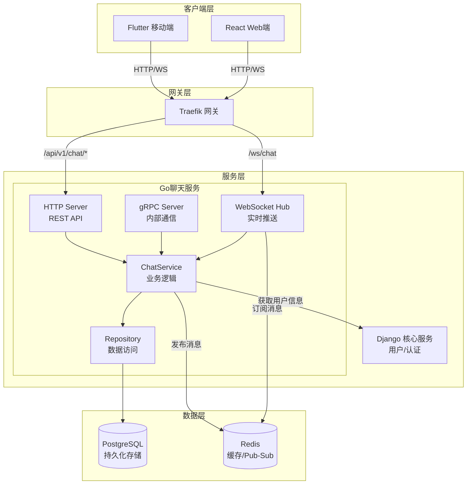
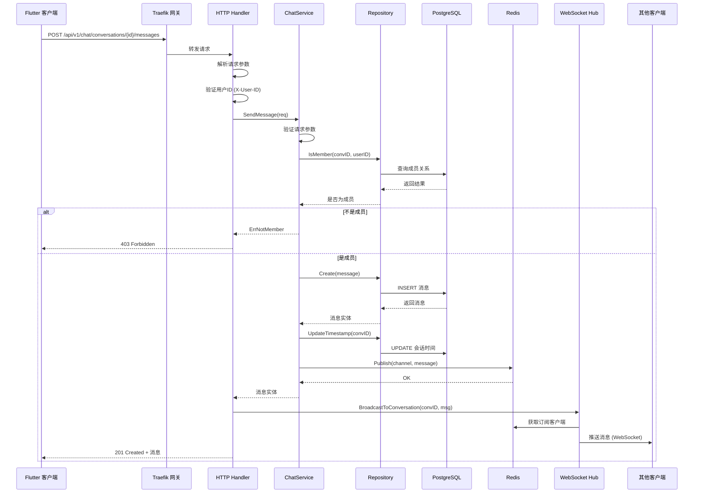
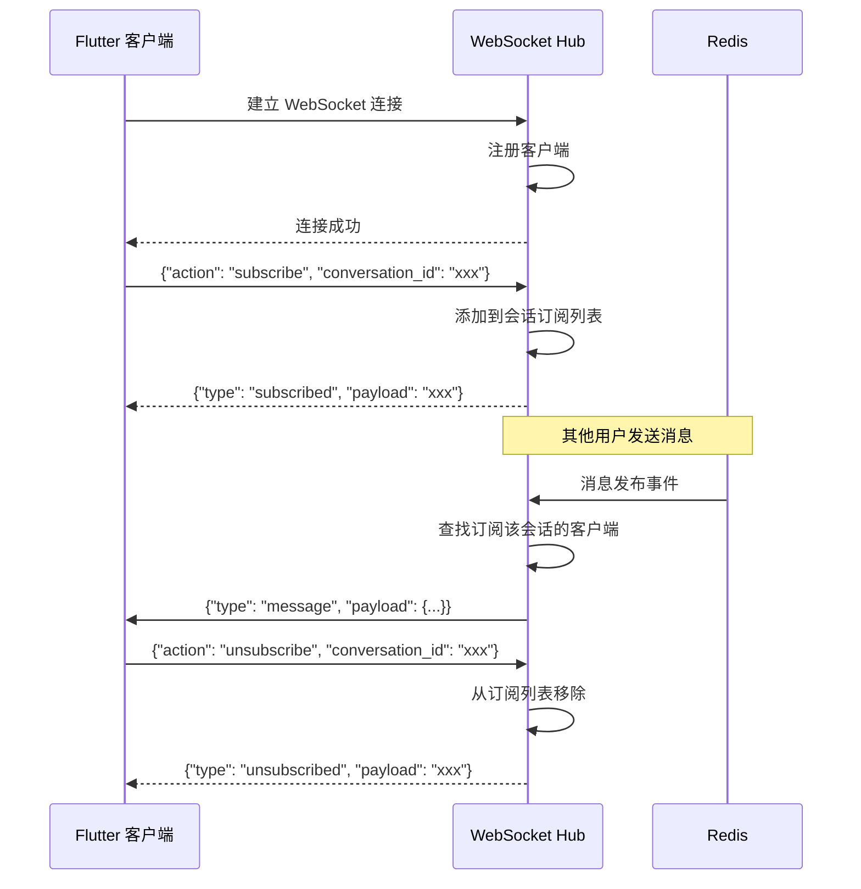

# 开发准则 - Development Guidelines

## 0. Python 环境管理 (UV)

### 0.1 UV 简介

UV 是一个用 Rust 编写的极速 Python 包管理器，比 pip 快 10-100 倍。本项目使用 UV 作为 Python 依赖管理工具。

**当前推荐版本 (2025年12月):**
- **Python**: 3.14.x (最新版)
- **Django**: 6.x (最新稳定版，支持 Python 3.12-3.14)
- **UV**: 0.5.x+ (最新稳定版)

### 0.2 UV 安装

```bash
# macOS/Linux
curl -LsSf https://astral.sh/uv/install.sh | sh

# 或使用 pip
pip install uv

# 或使用 Homebrew (macOS)
brew install uv
```

### 0.3 UV 常用命令

```bash
# 创建虚拟环境
uv venv

# 激活虚拟环境
source .venv/bin/activate  # macOS/Linux
.venv\Scripts\activate     # Windows

# 安装依赖
uv pip install -r requirements.txt

# 安装单个包
uv pip install django

# 同步依赖 (推荐)
uv pip sync requirements.txt

# 生成锁定文件
uv pip compile requirements.in -o requirements.txt

# 安装指定 Python 版本
uv python install 3.13
```

### 0.4 项目 UV 配置

Django 服务使用 UV 进行依赖管理： 
docker 中和 python 相关的也都要使用 UV 进行管理。

```bash
# 进入 Django 服务目录
cd service/core_django

# 创建虚拟环境 (使用 Python 3.13)
uv venv --python 3.13

# 激活环境
source .venv/bin/activate

# 安装依赖
uv pip install -r requirements.txt

# 运行 Django
python manage.py runserver
```

### 0.5 Docker 中使用 UV

Dockerfile 中使用 UV 加速依赖安装：

```dockerfile
# 安装 UV
COPY --from=ghcr.io/astral-sh/uv:latest /uv /usr/local/bin/uv

# 使用 UV 安装依赖
RUN uv pip install --system --no-cache -r requirements.txt
```

---

## 1. AI 辅助开发准则

### 1.1 代码生成规范

AI 生成代码时必须遵循以下原则：

- **最小化原则**: 只生成完成任务所需的最少代码，避免过度设计
- **一致性原则**: 遵循项目现有的代码风格和架构模式
- **可测试性**: 生成的代码必须易于测试，保持单一职责

### 1.2 新增路由完整流程

当需要添加新的 API 路由时，必须按以下顺序修改：

```
┌─────────────────────────────────────────────────────────────────────────┐
│                        新增路由修改流程图                                 │
└─────────────────────────────────────────────────────────────────────────┘

1. Proto 定义 (如需 gRPC)
   └── protos/<service>/<service>.proto
       ├── 添加 message 定义
       └── 添加 rpc 方法

2. 后端服务
   ├── Django (REST API)
   │   ├── apps/<module>/models.py        # 数据模型
   │   ├── apps/<module>/serializers.py   # 序列化器
   │   ├── apps/<module>/views.py         # 视图/控制器
   │   ├── apps/<module>/urls.py          # 模块路由
   │   ├── apps/<module>/services.py      # 业务逻辑
   │   └── config/urls.py                 # 根路由注册
   │
   └── Go Chat (如涉及聊天)
       ├── internal/model/*.go            # 数据模型
       ├── internal/repository/*.go       # 数据访问
       ├── internal/service/*.go          # 业务逻辑
       ├── internal/handler/grpc/*.go     # gRPC 处理器
       └── internal/server/router.go      # 路由注册

3. 网关配置
   └── infra/gateway/dynamic/routes.yml   # Traefik 路由规则

4. 客户端
   ├── Flutter
   │   ├── lib/features/<module>/data/datasources/   # 数据源
   │   ├── lib/features/<module>/data/models/        # 数据模型
   │   ├── lib/features/<module>/data/repositories/  # 仓库实现
   │   ├── lib/features/<module>/domain/entities/    # 实体
   │   ├── lib/features/<module>/domain/usecases/    # 用例
   │   └── lib/features/<module>/presentation/       # UI 层
   │
   └── React
       ├── src/features/<module>/api/     # API 调用
       ├── src/features/<module>/types/   # 类型定义
       └── src/features/<module>/hooks/   # React Hooks
```

### 1.3 新增路由检查清单

添加新路由前，确认以下事项：

- [ ] Proto 定义已更新（如需 gRPC）
- [ ] 后端 Model 已创建并迁移
- [ ] Serializer/DTO 已定义
- [ ] View/Handler 已实现
- [ ] URL 路由已注册
- [ ] Traefik 路由规则已配置（如需新路径前缀）
- [ ] 客户端数据层已实现
- [ ] 客户端 UI 已对接
- [ ] 单元测试已编写
- [ ] API 文档已更新

### 1.4 禁止行为

AI 辅助开发时禁止：

- ❌ 随意修改现有架构模式
- ❌ 在不理解上下文的情况下删除代码
- ❌ 添加未使用的依赖
- ❌ 硬编码敏感信息
- ❌ 跳过错误处理
- ❌ 生成未经测试的代码直接合并

### 1.5 推荐做法

- ✅ 先理解现有代码结构再修改
- ✅ 遵循项目的分层架构
- ✅ 使用项目已有的工具函数和基类
- ✅ 保持代码风格一致
- ✅ 添加必要的注释和文档
- ✅ 编写对应的测试用例

---

## 2. 架构原则

### 1.1 API 设计原则
- **对外 API**: 使用 DRF (Django REST Framework) 提供 RESTful API，满足前端和第三方调用
- **内部服务通信**: 使用 gRPC 实现微服务间的高效调用（如 Django 后端调用聊天服务、数据处理服务）
- **复用数据层**: 无论是 DRF 还是 gRPC，都基于 Django 的 Models/ORM 操作数据库，避免重复编写数据逻辑

### 2.2 服务划分
- **Django Core Service**: 认证、帖子、Feed、搜索、通知等核心业务
- **Go Chat Service**: 高并发实时聊天、WebSocket 连接管理
- **C++/Rust Compute Service**: 计算密集型任务（可选）

## 3. 代码规范

### 3.1 Python/Django 规范
```python
# 使用类型注解
def get_user(user_id: str) -> User:
    pass

# 使用 dataclass 或 Pydantic 定义数据结构
from dataclasses import dataclass

@dataclass
class UserDTO:
    id: str
    username: str
    email: str

# Service 层封装业务逻辑
class UserService:
    def __init__(self, repository: UserRepository):
        self.repository = repository
    
    def create_user(self, data: CreateUserDTO) -> User:
        # 业务逻辑
        pass
```

### 3.2 Go 规范
```go
// 使用接口定义依赖
type ChatService interface {
    SendMessage(ctx context.Context, msg *Message) error
    GetMessages(ctx context.Context, conversationID string) ([]*Message, error)
}

// 错误处理使用 errors 包
import "errors"

var ErrNotFound = errors.New("resource not found")

// 使用 context 传递请求上下文
func (s *service) SendMessage(ctx context.Context, msg *Message) error {
    // 实现
}
```

### 3.3 Flutter/Dart 规范
```dart
// 使用 Clean Architecture 分层
// data -> domain -> presentation

// Entity (Domain Layer)
class User {
  final String id;
  final String username;
  
  const User({required this.id, required this.username});
}

// Repository Interface (Domain Layer)
abstract class AuthRepository {
  Future<Either<Failure, User>> login(String email, String password);
}

// Use Case (Domain Layer)
class LoginUseCase {
  final AuthRepository repository;
  
  LoginUseCase(this.repository);
  
  Future<Either<Failure, User>> call(LoginParams params) {
    return repository.login(params.email, params.password);
  }
}
```

## 4. 目录结构规范

### 4.1 环境变量管理
```
infra/env/
├── dev.env.example    # 开发环境模板
├── dev.env            # 开发环境配置 (git ignored)
├── prod.env.example   # 生产环境模板
└── prod.env           # 生产环境配置 (git ignored)
```

**规则**:
- 所有环境变量文件统一放在 `infra/env/` 目录
- `.env` 文件永远不提交到 Git
- 只提交 `.env.example` 模板文件
- 敏感信息（密码、密钥）使用占位符

### 4.2 Proto 文件管理
```
protos/
├── common/common.proto      # 通用类型定义
├── auth/auth.proto          # 认证服务
├── chat/chat.proto          # 聊天服务
├── feed/feed.proto          # Feed 服务
├── post/post.proto          # 帖子服务
└── notification/notification.proto  # 通知服务
```

**规则**:
- Proto 文件集中在 `protos/` 目录
- 生成的代码放在各服务的 `generated/` 目录
- 生成的代码不提交到 Git（通过 CI/CD 生成）

### 4.3 生成代码目录
```
service/core_django/generated/protos/   # Django gRPC 生成代码
service/chat_gin/generated/             # Go gRPC 生成代码
client/mobile_flutter/lib/generated/    # Flutter gRPC 生成代码
client/web_react/src/generated/         # React gRPC 生成代码
```

## 5. Git 提交规范

### 5.1 Commit Message 格式
```
<type>(<scope>): <subject>

<body>

<footer>
```

**Type 类型**:
- `feat`: 新功能
- `fix`: Bug 修复
- `docs`: 文档更新
- `style`: 代码格式（不影响功能）
- `refactor`: 重构
- `test`: 测试相关
- `chore`: 构建/工具相关

**示例**:
```
feat(auth): add JWT token refresh endpoint

- Add refresh token validation
- Implement token rotation
- Add rate limiting for refresh requests

Closes #123
```

### 5.2 分支命名
- `main`: 主分支，生产环境
- `develop`: 开发分支
- `feature/<name>`: 功能分支
- `fix/<name>`: Bug 修复分支
- `release/<version>`: 发布分支

## 6. 测试规范

### 6.1 测试分层
```
tests/
├── unit/           # 单元测试 - 测试单个函数/类
├── integration/    # 集成测试 - 测试模块间交互
└── e2e/            # 端到端测试 - 测试完整流程
```

### 6.2 测试命名
```python
# Python
def test_user_can_login_with_valid_credentials():
    pass

def test_login_fails_with_invalid_password():
    pass
```

```go
// Go
func TestUserCanLoginWithValidCredentials(t *testing.T) {}
func TestLoginFailsWithInvalidPassword(t *testing.T) {}
```

```dart
// Dart
test('user can login with valid credentials', () {});
test('login fails with invalid password', () {});
```

### 6.3 测试覆盖率要求
- 核心业务逻辑: >= 80%
- 工具函数: >= 90%
- API 端点: >= 70%

## 7. API 设计规范

### 7.1 RESTful API
```
GET    /api/v1/users          # 获取用户列表
GET    /api/v1/users/{id}     # 获取单个用户
POST   /api/v1/users          # 创建用户
PUT    /api/v1/users/{id}     # 更新用户
DELETE /api/v1/users/{id}     # 删除用户
```

### 7.2 响应格式
```json
// 成功响应
{
  "success": true,
  "data": { ... },
  "meta": {
    "page": 1,
    "page_size": 20,
    "total": 100
  }
}

// 错误响应
{
  "success": false,
  "error": {
    "code": "VALIDATION_ERROR",
    "message": "Invalid email format",
    "details": { ... }
  }
}
```

### 7.3 HTTP 状态码
- `200`: 成功
- `201`: 创建成功
- `400`: 请求参数错误
- `401`: 未认证
- `403`: 无权限
- `404`: 资源不存在
- `422`: 验证失败
- `500`: 服务器错误

## 8. 安全规范

### 8.1 认证与授权
- 使用 JWT 进行 API 认证
- Access Token 有效期: 开发环境 1 小时，生产环境 30 分钟
- Refresh Token 有效期: 开发环境 7 天，生产环境 1 天
- 敏感操作需要二次验证

### 8.2 数据安全
- 密码使用 bcrypt/argon2 加密存储
- 敏感数据传输使用 HTTPS
- 数据库连接使用 SSL
- 日志中不记录敏感信息

### 8.3 输入验证
- 所有用户输入必须验证
- 使用参数化查询防止 SQL 注入
- 对输出进行 HTML 转义防止 XSS

## 9. 开发流程

### 9.1 本地开发
```bash
# 1. 启动所有服务
./dev.sh start

# 2. 只启动后端服务
./dev.sh start service

# 3. 只启动前端客户端
./dev.sh start client

# 4. 查看日志
./dev.sh logs [service_name]

# 5. 停止所有服务
./dev.sh stop
```

### 9.2 代码审查清单
- [ ] 代码符合规范
- [ ] 有适当的测试覆盖
- [ ] 没有硬编码的敏感信息
- [ ] 错误处理完善
- [ ] 有必要的注释和文档
- [ ] 性能考虑（N+1 查询、缓存等）

## 10. 性能优化指南

### 10.1 数据库优化
- 使用索引优化查询
- 避免 N+1 查询问题
- 使用 select_related/prefetch_related
- 大数据量使用分页

### 10.2 缓存策略
- 热点数据使用 Redis 缓存
- 设置合理的缓存过期时间
- 使用缓存失效策略

### 10.3 API 优化
- 使用分页返回列表数据
- 支持字段选择（GraphQL 风格）
- 使用 gzip 压缩响应

## 11. 监控与日志

### 11.1 日志级别
- `DEBUG`: 调试信息（仅开发环境）
- `INFO`: 一般信息
- `WARNING`: 警告信息
- `ERROR`: 错误信息
- `CRITICAL`: 严重错误

### 11.2 日志格式
```
[2024-01-01 12:00:00] [INFO] [request_id:abc123] [user_id:123] Message here
```

### 11.3 监控指标
- 请求响应时间
- 错误率
- 数据库查询时间
- 缓存命中率
- 内存/CPU 使用率


---

## 12. gRPC 实践指南

### 12.1 gRPC 概述

gRPC 是一个高性能、开源的远程过程调用（RPC）框架，基于 HTTP/2 协议和 Protocol Buffers 序列化。本项目在聊天服务中使用 gRPC 实现微服务间通信。

**gRPC 优势**:
- 高性能：基于 HTTP/2，支持多路复用、头部压缩
- 强类型：Protocol Buffers 提供类型安全
- 双向流：支持客户端流、服务端流、双向流
- 跨语言：支持多种编程语言

### 12.2 聊天服务数据流架构



### 12.3 消息发送流程



### 12.4 WebSocket 实时通信流程



### 12.5 gRPC 服务定义示例

```protobuf
// protos/chat/chat.proto
syntax = "proto3";

package chat;

option go_package = "github.com/lesser/chat/generated/chat";

// 聊天服务定义
service ChatService {
  // 获取用户的会话列表
  rpc GetConversations(GetConversationsRequest) returns (ConversationsResponse);
  
  // 获取单个会话详情
  rpc GetConversation(GetConversationRequest) returns (Conversation);
  
  // 创建新会话
  rpc CreateConversation(CreateConversationRequest) returns (Conversation);
  
  // 获取会话消息列表
  rpc GetMessages(GetMessagesRequest) returns (MessagesResponse);
  
  // 发送消息
  rpc SendMessage(SendMessageRequest) returns (Message);
  
  // 实时消息流（服务端流式 RPC）
  rpc StreamMessages(StreamRequest) returns (stream Message);
}

// 会话类型枚举
enum ConversationType {
  PRIVATE = 0;  // 私聊
  GROUP = 1;    // 群聊
  CHANNEL = 2;  // 频道
}

// 会话实体
message Conversation {
  string id = 1;
  ConversationType type = 2;
  string name = 3;
  repeated string member_ids = 4;
  string creator_id = 5;
  google.protobuf.Timestamp created_at = 6;
  Message last_message = 7;
}

// 消息实体
message Message {
  string id = 1;
  string conversation_id = 2;
  string sender_id = 3;
  string content = 4;
  string message_type = 5;
  google.protobuf.Timestamp created_at = 6;
}
```

### 12.6 gRPC 最佳实践

#### 12.6.1 错误处理

```go
// 使用 gRPC 状态码
import "google.golang.org/grpc/codes"
import "google.golang.org/grpc/status"

// 参数验证错误
if req.UserId == "" {
    return nil, status.Error(codes.InvalidArgument, "用户ID不能为空")
}

// 权限错误
if !isMember {
    return nil, status.Error(codes.PermissionDenied, "您不是该会话的成员")
}

// 资源不存在
if conv == nil {
    return nil, status.Error(codes.NotFound, "会话不存在")
}

// 内部错误
if err != nil {
    return nil, status.Error(codes.Internal, err.Error())
}
```

#### 12.6.2 类型转换

```go
// 模型层与 Proto 层的类型转换应封装为独立函数
func modelToProtoConversation(conv *model.Conversation) *Conversation {
    // 转换逻辑
}

func protoToModelConversationType(t ConversationType) model.ConversationType {
    // 转换逻辑
}
```

#### 12.6.3 分层架构

```
internal/
├── handler/
│   ├── grpc/          # gRPC 处理器（协议层）
│   │   ├── chat.go    # 聊天服务处理器
│   │   └── types.go   # Proto 类型定义
│   └── ws/            # WebSocket 处理器
│       └── hub.go     # 连接管理中心
├── service/           # 业务逻辑层
│   ├── chat.go        # 聊天业务服务
│   └── errors.go      # 错误定义
├── repository/        # 数据访问层
│   ├── conversation.go
│   └── message.go
├── model/             # 数据模型层
│   ├── conversation.go
│   └── message.go
└── server/            # 服务器配置
    └── http.go        # HTTP 服务器
```

### 12.7 客户端集成

#### 12.7.1 Flutter 端架构

```
lib/features/chat/
├── data/
│   ├── datasources/
│   │   ├── chat_remote_datasource.dart  # HTTP API 调用
│   │   └── chat_websocket_service.dart  # WebSocket 实时通信
│   ├── models/
│   │   ├── conversation_model.dart
│   │   └── message_model.dart
│   └── repositories/
│       └── chat_repository_impl.dart    # 仓库实现
├── domain/
│   ├── entities/
│   │   ├── conversation.dart
│   │   └── message.dart
│   └── repositories/
│       └── chat_repository.dart         # 仓库接口
└── presentation/
    ├── pages/
    │   ├── chat_room_page.dart
    │   └── conversations_page.dart
    ├── providers/
    │   └── chat_provider.dart           # Riverpod 状态管理
    └── widgets/
        ├── chat_input.dart
        └── message_bubble.dart
```

#### 12.7.2 WebSocket 消息格式

```json
// 订阅会话
{"action": "subscribe", "conversation_id": "uuid"}

// 取消订阅
{"action": "unsubscribe", "conversation_id": "uuid"}

// 服务端推送消息
{
  "type": "message",
  "payload": {
    "id": "uuid",
    "conversation_id": "uuid",
    "sender_id": "uuid",
    "content": "消息内容",
    "message_type": "text",
    "created_at": "2025-12-28T10:00:00Z"
  }
}

// 订阅确认
{"type": "subscribed", "payload": "conversation_id"}

// 取消订阅确认
{"type": "unsubscribed", "payload": "conversation_id"}
```

### 12.8 注意事项

1. **认证处理**: 当前实现使用 `X-User-ID` 请求头传递用户ID，生产环境应使用 JWT Token 并在中间件中验证
2. **成员权限**: 所有消息操作都需要验证用户是否为会话成员
3. **私聊限制**: 私聊会话不能添加新成员
4. **实时推送**: 消息通过 Redis Pub/Sub 发布，WebSocket Hub 订阅并推送给客户端
5. **重连机制**: 客户端 WebSocket 断开后应自动重连并重新订阅会话
6. **乐观更新**: 发送消息时客户端可先显示，收到服务端确认后更新状态
