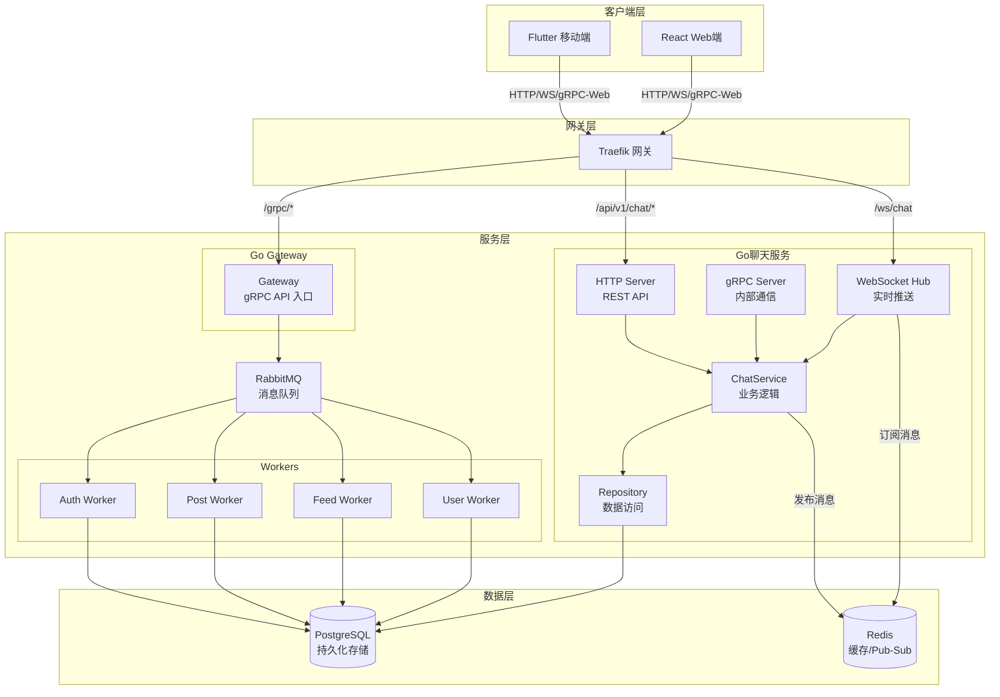

# 开发准则

项目提供两种开发环境管理方式：
1. **推荐**: Rust CLI 工具 `dev`（位于 `infra/cli/`），提供 shell 补全、彩色输出和更好的用户体验
2. **兼容**: 原有的 `dev.sh` bash 脚本

当添加什么新功能之后要审视 CLI 工具和脚本是否应该发生部分更新。 

## 0. 环境管理


**当前推荐版本 (2025年12月):**
- **Go**: 1.23.x (最新版)
- 用到的 flutter 库：都要是最新的。每次运行的时候都确保 API 来自官方的最新的版本。 
- 用到的各种库，docker。函数。写法。用例。都要是最新的。因为新的总是更好的。 


---

## 1. AI 辅助开发准则

### 1.1 代码生成规范

- **最小化原则**: 只生成完成任务所需的最少代码，避免过度设计
- **一致性原则**: 遵循项目现有的代码风格和架构模式
- **可测试性**: 生成的代码必须易于测试，保持单一职责

### 1.2 新增路由完整流程

```
┌─────────────────────────────────────────────────────────────────────────┐
│                        新增路由修改流程图                                 │
└─────────────────────────────────────────────────────────────────────────┘

1. Proto 定义 (gRPC 通信)
   └── protos/<service>/<service>.proto
       ├── 添加 message 定义
       └── 添加 rpc 方法

2. 后端服务
   ├── Gateway (路由配置)
   │   └── service/gateway/internal/router/
   │
   ├── Service (业务处理)
   │   ├── service/<service>/internal/handler/
   │   └── service/<service>/internal/service/
   │
   └── Chat Service (如涉及聊天功能)
       ├── service/chat/internal/handler/grpc/
       ├── service/chat/internal/service/
       └── service/chat/internal/repository/

3. 网关配置
   └── infra/gateway/dynamic/routes.yml   # Traefik 路由规则

4. 客户端
   └── Flutter
       ├── lib/features/<module>/data/datasources/   # gRPC 数据源
       ├── lib/features/<module>/data/models/        # 数据模型
       ├── lib/features/<module>/data/repositories/  # 仓库实现
       ├── lib/features/<module>/domain/entities/    # 实体
       ├── lib/features/<module>/domain/usecases/    # 用例
       └── lib/features/<module>/presentation/       # UI 层
```

### 1.3 新增路由检查清单

- [ ] Proto 定义已更新
- [ ] Service gRPC 处理器已实现
- [ ] Gateway 路由已配置
- [ ] Traefik 路由规则已配置（如需新路径前缀）
- [ ] 客户端 gRPC 数据源已实现
- [ ] 客户端 UI 已对接

### 1.4 禁止行为

- ❌ 随意修改现有架构模式
- ❌ 在不理解上下文的情况下删除代码
- ❌ 添加未使用的依赖
- ❌ 硬编码敏感信息
- ❌ 跳过错误处理
- ❌ 生成未经测试的代码直接合并

### 1.5 推荐做法

- ✅ 先理解现有代码结构再修改
- ✅ 遵循项目的分层架构
- ✅ 使用项目已有的工具函数和基类
- ✅ 保持代码风格一致
- ✅ 添加必要的注释和文档
- ✅ 编写对应的测试用例

---

## 2. 架构原则

### 2.1 API 设计原则
- **对外 API**: 使用 gRPC / gRPC-Web 通过 Gateway 提供统一 API
- **内部服务通信**: 使用 gRPC 同步调用
- **实时通信**: 使用 gRPC 双向流 (Chat Service)
- **异步任务**: RabbitMQ 仅用于次要、非阻塞的异步逻辑（通知推送、搜索索引）

### 2.2 服务划分
- **Gateway**: gRPC API 入口，JWT 验签、限流、路由转发
- **Service Cluster**: Auth/User/Post/Feed/Search/Notification Service
- **Chat Service**: 高并发实时聊天、gRPC 双向流

---

## 3. 代码规范

### 3.1 注释语言规范

**所有代码注释统一使用中文**，包括：
- 文件头注释
- 函数/方法注释
- 行内注释
- TODO/FIXME 注释

### 3.2 Go 规范
```go
// 使用接口定义依赖
type ChatService interface {
    SendMessage(ctx context.Context, msg *Message) error
    GetMessages(ctx context.Context, conversationID string) ([]*Message, error)
}

// 错误处理使用 errors 包
var ErrNotFound = errors.New("resource not found")

// 使用 context 传递请求上下文
func (s *service) SendMessage(ctx context.Context, msg *Message) error {
    // 实现
}
```

### 3.3 Flutter/Dart 规范
```dart
// 使用 Clean Architecture 分层: data -> domain -> presentation

// Entity (Domain Layer)
class User {
  final String id;
  final String username;
  const User({required this.id, required this.username});
}

// Repository Interface (Domain Layer)
abstract class AuthRepository {
  Future<Either<Failure, User>> login(String email, String password);
}

// Use Case (Domain Layer)
class LoginUseCase {
  final AuthRepository repository;
  LoginUseCase(this.repository);
  
  Future<Either<Failure, User>> call(LoginParams params) {
    return repository.login(params.email, params.password);
  }
}
```

---

## 4. 目录结构规范

### 4.1 环境变量管理
```
infra/env/
├── dev.env.example    # 开发环境模板（提交）
├── dev.env            # 开发环境配置（不提交）
├── prod.env.example   # 生产环境模板（提交）
└── prod.env           # 生产环境配置（不提交）
```

### 4.2 Proto 文件管理
```
protos/
├── common/common.proto      # 通用类型定义
├── auth/auth.proto          # 认证服务
├── chat/chat.proto          # 聊天服务
├── feed/feed.proto          # Feed 服务
├── post/post.proto          # 帖子服务
├── user/user.proto          # 用户服务
├── search/search.proto      # 搜索服务
├── gateway/gateway.proto    # 网关服务
└── notification/notification.proto  # 通知服务
```

### 4.3 生成代码目录
```
service/gateway/generated/              # Gateway gRPC 生成代码
service/chat_gin/generated/             # Chat gRPC 生成代码
service/<xxx>_worker/generated/         # Worker gRPC 生成代码
client/mobile_flutter/lib/generated/    # Flutter gRPC 生成代码
client/web_react/src/generated/         # React gRPC 生成代码
```

---

## 5. Git 提交规范

### 5.1 Commit Message 格式
```
<type>(<scope>): <subject>

<body>

<footer>
```

**Type 类型**: `feat` | `fix` | `docs` | `style` | `refactor` | `test` | `chore`

### 5.2 分支命名
- `main`: 主分支，生产环境
- `develop`: 开发分支
- `feature/<name>`: 功能分支
- `fix/<name>`: Bug 修复分支

---

## 6. 测试规范

### 6.1 测试分层
```
tests/
├── unit/           # 单元测试
├── integration/    # 集成测试
└── e2e/            # 端到端测试
```

### 6.2 测试覆盖率要求
- 核心业务逻辑: >= 80%
- 工具函数: >= 90%
- API 端点: >= 70%

---

## 7. API 设计规范

### 7.1 RESTful API
```
GET    /api/v1/users          # 获取用户列表
GET    /api/v1/users/{id}     # 获取单个用户
POST   /api/v1/users          # 创建用户
PUT    /api/v1/users/{id}     # 更新用户
DELETE /api/v1/users/{id}     # 删除用户
```

### 7.2 响应格式
```json
// 成功响应
{"success": true, "data": {...}, "meta": {"page": 1, "page_size": 20, "total": 100}}

// 错误响应
{"success": false, "error": {"code": "VALIDATION_ERROR", "message": "...", "details": {...}}}
```

### 7.3 HTTP 状态码
- `200`: 成功 | `201`: 创建成功 | `400`: 参数错误 | `401`: 未认证 | `403`: 无权限 | `404`: 不存在 | `500`: 服务器错误

---

## 8. 安全规范

### 8.1 认证与授权
- 使用 JWT 进行 API 认证
- Access Token 有效期: 开发环境 1 小时，生产环境 30 分钟
- Refresh Token 有效期: 开发环境 7 天，生产环境 1 天

### 8.2 数据安全
- 密码使用 bcrypt/argon2 加密存储
- 敏感数据传输使用 HTTPS
- 数据库连接使用 SSL
- 日志中不记录敏感信息

### 8.3 输入验证
- 所有用户输入必须验证
- 使用参数化查询防止 SQL 注入
- 对输出进行 HTML 转义防止 XSS

---

## 9. 开发流程

### 9.1 本地开发

推荐使用 Rust CLI 工具 `dev`（位于 `infra/cli/`），提供更好的用户体验：

```bash
# 安装 CLI 工具
cargo install --path infra/cli

# 配置 shell 补全 (可选，推荐)
eval "$(dev completion zsh)"   # Zsh
eval "$(dev completion bash)"  # Bash

# 服务管理
dev start              # 启动所有服务
dev start service      # 只启动后端服务
dev start infra        # 只启动基础设施 (PostgreSQL + Redis + RabbitMQ + Traefik)
dev start client       # 只启动前端客户端
dev stop               # 停止所有服务
dev restart gateway    # 重启指定服务
dev status             # 查看服务状态
dev logs gateway       # 查看日志
dev logs gateway -f    # 实时跟踪日志

# 数据库操作
dev db shell           # 进入 psql
dev db reset           # 重置数据库 (会提示确认)

# 构建和更新
dev build              # 构建镜像
dev rebuild gateway    # 重新构建 (无缓存)
dev proto              # 生成 Proto 代码
dev update             # 更新环境 (proto + rebuild)

# 开发调试
dev enter postgres     # 进入 PostgreSQL
dev enter redis        # 进入 Redis
dev bash gateway       # 进入容器 bash

# 环境信息
dev env                # 显示环境变量 (敏感值会被掩码)
dev urls               # 显示服务访问地址
dev check              # 检查依赖

# 清理
dev clean              # 清理所有
dev clean containers   # 仅清理容器
dev clean volumes      # 清理数据卷
```

也可以继续使用原有的 bash 脚本：

```bash
./dev.sh start           # 启动所有服务
./dev.sh start service   # 只启动后端服务
./dev.sh start client    # 只启动前端客户端
./dev.sh logs [name]     # 查看日志
./dev.sh stop            # 停止所有服务
```

### 9.2 代码审查清单
- [ ] 代码符合规范
- [ ] 有适当的测试覆盖
- [ ] 没有硬编码的敏感信息
- [ ] 错误处理完善
- [ ] 有必要的注释和文档
- [ ] 性能考虑（N+1 查询、缓存等）

---

## 10. 性能优化指南

### 10.1 数据库优化
- 使用索引优化查询
- 避免 N+1 查询问题
- 使用 select_related/prefetch_related
- 大数据量使用分页

### 10.2 缓存策略
- 热点数据使用 Redis 缓存
- 设置合理的缓存过期时间
- 使用缓存失效策略

### 10.3 API 优化
- 使用分页返回列表数据
- 支持字段选择
- 使用 gzip 压缩响应

---

## 11. 监控与日志

### 11.1 日志级别
- `DEBUG`: 调试信息（仅开发环境）
- `INFO`: 一般信息
- `WARNING`: 警告信息
- `ERROR`: 错误信息
- `CRITICAL`: 严重错误

### 11.2 日志格式
```
[2024-01-01 12:00:00] [INFO] [request_id:abc123] [user_id:123] Message here
```

### 11.3 监控指标
- 请求响应时间
- 错误率
- 数据库查询时间
- 缓存命中率
- 内存/CPU 使用率

---

## 12. gRPC 实践指南

### 12.1 gRPC 概述

gRPC 是一个高性能、开源的远程过程调用（RPC）框架，基于 HTTP/2 协议和 Protocol Buffers 序列化。

**gRPC 优势**:
- 高性能：基于 HTTP/2，支持多路复用、头部压缩
- 强类型：Protocol Buffers 提供类型安全
- 双向流：支持客户端流、服务端流、双向流
- 跨语言：支持多种编程语言

### 12.2 聊天服务数据流架构



### 12.3 gRPC 服务定义示例

```protobuf
// protos/chat/chat.proto
syntax = "proto3";
package chat;

// 聊天服务定义
service ChatService {
  rpc GetConversations(GetConversationsRequest) returns (ConversationsResponse);
  rpc GetConversation(GetConversationRequest) returns (Conversation);
  rpc CreateConversation(CreateConversationRequest) returns (Conversation);
  rpc GetMessages(GetMessagesRequest) returns (MessagesResponse);
  rpc SendMessage(SendMessageRequest) returns (Message);
  rpc StreamMessages(StreamRequest) returns (stream Message);
}

// 会话类型枚举
enum ConversationType {
  PRIVATE = 0;  // 私聊
  GROUP = 1;    // 群聊
  CHANNEL = 2;  // 频道
}
```

### 12.4 gRPC 最佳实践

#### 错误处理
```go
import "google.golang.org/grpc/codes"
import "google.golang.org/grpc/status"

// 参数验证错误
if req.UserId == "" {
    return nil, status.Error(codes.InvalidArgument, "用户ID不能为空")
}

// 权限错误
if !isMember {
    return nil, status.Error(codes.PermissionDenied, "您不是该会话的成员")
}
```

#### 分层架构
```
internal/
├── handler/
│   ├── grpc/          # gRPC 处理器
│   └── ws/            # WebSocket 处理器
├── service/           # 业务逻辑层
├── repository/        # 数据访问层
├── model/             # 数据模型层
└── server/            # 服务器配置
```

### 12.5 客户端集成

#### Flutter 端架构
```
lib/features/chat/
├── data/
│   ├── datasources/
│   │   ├── chat_remote_datasource.dart  # HTTP API 调用
│   │   └── chat_websocket_service.dart  # WebSocket 实时通信
│   ├── models/
│   └── repositories/
├── domain/
│   ├── entities/
│   └── repositories/
└── presentation/
    ├── pages/
    ├── providers/
    └── widgets/
```

#### WebSocket 消息格式
```json
// 订阅会话（进入聊天室时发送）
{"action": "subscribe", "conversation_id": "uuid"}

// 取消订阅（离开聊天室时发送）
{"action": "unsubscribe", "conversation_id": "uuid"}

// 服务端推送 - 完整消息（订阅会话后收到）
{"type": "message", "payload": {...}}

// 服务端推送 - 会话更新通知（不需要订阅，所有在线成员都会收到）
{"type": "conversation_update", "payload": {"conversation_id": "...", "unread_count": 1}}

// 订阅确认
{"type": "subscribed", "payload": "conversation_id"}
```

### 12.6 注意事项

1. **认证处理**: 当前使用 `X-User-ID` 请求头，生产环境应使用 JWT Token
2. **成员权限**: 所有消息操作都需要验证用户是否为会话成员
3. **私聊限制**: 私聊会话不能添加新成员
4. **实时推送**: 消息通过 Redis Pub/Sub 发布，WebSocket Hub 订阅并推送
5. **重连机制**: 客户端 WebSocket 断开后应自动重连并重新订阅会话
6. **乐观更新**: 发送消息时客户端先显示临时消息，收到确认后替换
7. **WebSocket 连接时机**: 
   - 用户登录成功后立即建立 WebSocket 连接
   - App 启动时如果已登录，自动重连 WebSocket
   - 用户登出时断开 WebSocket 连接
8. **消息分级推送**:
   - `conversation_update`: 用户不在聊天室时收到，用于更新导航栏小红点
   - `message`: 用户订阅了具体会话后才收到完整消息内容
9. **并发安全**: Hub 使用 `sync.RWMutex` 保护 clients 和 conversationClients map
10. **消息去重**: 客户端通过消息ID去重，发送者不会收到自己发送的消息广播
