# 项目架构梳理

> 本文档详细描述项目的整体架构、数据流程和各端实现细节。

---

## 目录

1. [整体架构概览](#整体架构概览)
2. [前端架构 (Flutter)](#前端架构-flutter)
3. [后端架构](#后端架构)
   - [大一统数据流程](#大一统数据流程)
   - [Django 内部数据流程](#django-内部数据流程)
   - [Gin 内部数据流程](#gin-内部数据流程)
4. [新增路由修改流程](#新增路由修改流程)
5. [配置参数汇总](#配置参数汇总)

---

## 整体架构概览

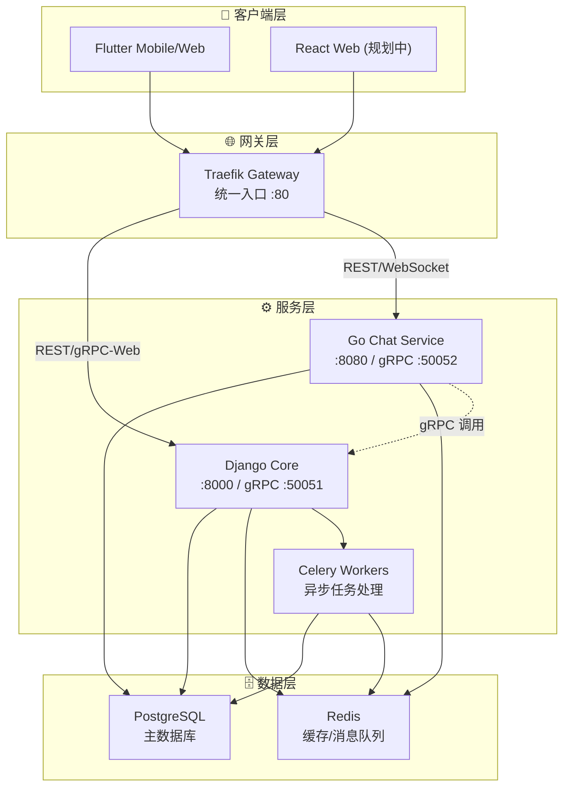


### 技术栈说明

| 层级 | 技术 | 说明 |
|------|------|------|
| 客户端 | Flutter 3.x | 跨平台移动端 + Web |
| 网关 | Traefik 3.x | 反向代理、负载均衡、WebSocket 支持 |
| 核心服务 | Django 5.x + DRF | 用户、帖子、Feed、通知等核心业务 |
| 聊天服务 | Go 1.21 + Gin | 高性能实时聊天、WebSocket |
| 异步任务 | Celery + Redis | Feed 生成、通知推送等 |
| 数据库 | PostgreSQL 16 | 主数据存储 |
| 缓存 | Redis 7 | 会话、缓存、消息队列 |

---

## 前端架构 (Flutter)

### 目录结构概览

```
lib/
├── main.dart                    # 应用入口
├── core/                        # 核心基础设施
│   ├── api/                     # HTTP 客户端封装
│   ├── grpc/                    # gRPC 客户端
│   ├── di/                      # 依赖注入 (GetIt)
│   ├── router/                  # 路由配置 (GoRouter)
│   ├── theme/                   # 主题样式
│   ├── utils/                   # 工具函数
│   ├── errors/                  # 异常处理
│   ├── storage/                 # 本地存储
│   └── constants/               # 常量定义
├── features/                    # 功能模块 (按业务划分)
│   ├── auth/                    # 认证模块
│   ├── chat/                    # 聊天模块
│   ├── feeds/                   # 动态流模块
│   ├── post/                    # 帖子模块
│   ├── profile/                 # 个人资料
│   ├── search/                  # 搜索模块
│   ├── notifications/           # 通知模块
│   └── navigation/              # 导航模块
├── shared/                      # 共享组件
│   ├── widgets/                 # 通用 UI 组件
│   ├── models/                  # 共享数据模型
│   └── providers/               # 共享状态
└── generated/                   # 自动生成代码 (Proto)
    └── protos/
```


### 架构分层图 (Clean Architecture)

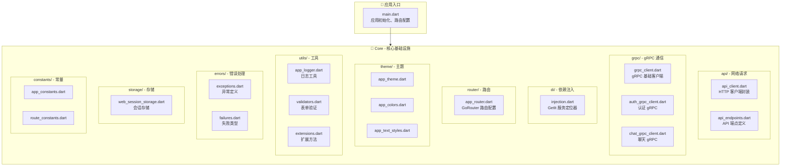


### 功能模块架构

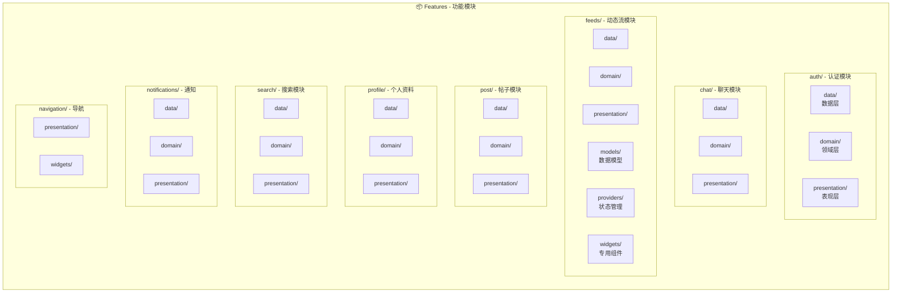


### Clean Architecture 分层详解

> 项目采用 Clean Architecture（整洁架构），将代码按职责分为三层。初看可能觉得复杂，但熟悉后会发现改代码很有章法。

#### 三层架构总览

```
用户点击按钮
    ↓
┌─────────────────────────────────────────────────────────┐
│  presentation/ (展示层) - 用户能看到的东西              │
│  ├── pages/     → 页面（LoginPage、HomePage）           │
│  ├── widgets/   → UI 组件（按钮、卡片、输入框）          │
│  └── providers/ → 状态管理（loading、error、数据）       │
└─────────────────────────────────────────────────────────┘
    ↓ 调用
┌─────────────────────────────────────────────────────────┐
│  domain/ (领域层) - 业务规则                            │
│  ├── entities/     → 业务对象（User、Post）             │
│  ├── repositories/ → 仓库接口（定义"能做什么"）          │
│  └── usecases/     → 用例（登录、发帖、点赞）            │
└─────────────────────────────────────────────────────────┘
    ↓ 调用
┌─────────────────────────────────────────────────────────┐
│  data/ (数据层) - 数据从哪来                            │
│  ├── models/       → 数据模型（JSON 转对象）            │
│  ├── datasources/  → 数据源（API 请求、本地存储）        │
│  └── repositories/ → 仓库实现（具体怎么拿数据）          │
└─────────────────────────────────────────────────────────┘
    ↓
服务器 / 本地数据库
```

#### 各层职责说明

| 层级 | 目录 | 职责 | 示例 |
|------|------|------|------|
| **展示层** | `presentation/pages/` | 页面组件，组织 UI 布局 | `LoginPage`、`HomePage` |
| | `presentation/widgets/` | 可复用的 UI 组件 | 登录表单、帖子卡片 |
| | `presentation/providers/` | 状态管理 (Riverpod)，处理 loading/error/data | `AuthProvider`、`FeedProvider` |
| **领域层** | `domain/entities/` | 纯业务对象，不依赖任何框架 | `User`、`Post`、`Message` |
| | `domain/repositories/` | 仓库接口（抽象类），定义能做什么 | `AuthRepository.login()` |
| | `domain/usecases/` | 用例，封装单个业务操作 | `LoginUseCase`、`CreatePostUseCase` |
| **数据层** | `data/models/` | 数据模型，处理 JSON 序列化 | `UserModel.fromJson()` |
| | `data/datasources/` | 数据源，实际的 API 调用或本地存储 | `AuthRemoteDataSource` |
| | `data/repositories/` | 仓库实现，协调数据源 | `AuthRepositoryImpl` |

#### 登录流程示例

```dart
// 1️⃣ presentation/pages/login_page.dart - 用户界面
// 用户输入账号密码，点击登录按钮
ElevatedButton(
  onPressed: () => ref.read(authProvider.notifier).login(email, password),
  child: Text('登录'),
)

// 2️⃣ presentation/providers/auth_provider.dart - 状态管理
// 管理登录状态：loading → success/error
Future<void> login(String email, String password) async {
  state = const AsyncLoading();
  final result = await _loginUseCase.execute(email, password);
  state = result.fold(
    (failure) => AsyncError(failure),
    (user) => AsyncData(user),
  );
}

// 3️⃣ domain/usecases/login_usecase.dart - 业务用例
// 纯业务逻辑，调用仓库接口
Future<Either<Failure, User>> execute(String email, String password) {
  return _authRepository.login(email, password);
}

// 4️⃣ domain/repositories/auth_repository.dart - 仓库接口
// 抽象类，定义"能做什么"，不关心"怎么做"
abstract class AuthRepository {
  Future<Either<Failure, User>> login(String email, String password);
}

// 5️⃣ data/repositories/auth_repository_impl.dart - 仓库实现
// 具体实现：调 API → 存 Token → 返回结果
Future<Either<Failure, User>> login(String email, String password) async {
  try {
    final model = await _remoteDataSource.login(email, password);
    await _localDataSource.saveToken(model.token);
    return Right(model.toEntity());  // Model → Entity
  } catch (e) {
    return Left(ServerFailure(e.message));
  }
}

// 6️⃣ data/datasources/auth_remote_datasource.dart - 远程数据源
// 实际发 HTTP 请求
Future<UserModel> login(String email, String password) async {
  final response = await _apiClient.post('/api/v1/auth/login', body: {...});
  return UserModel.fromJson(response.data);
}

// 7️⃣ data/models/user_model.dart - 数据模型
// JSON 解析 + 转换为 Entity
factory UserModel.fromJson(Map<String, dynamic> json) => UserModel(
  id: json['id'],
  email: json['email'],
  ...
);

User toEntity() => User(id: id, email: email, ...);
```

#### 为什么要分这么细？

| 好处 | 说明 |
|------|------|
| **换数据源方便** | 想从 REST 换成 GraphQL？只改 `data/` 层，其他不动 |
| **好测试** | 测业务逻辑时 mock 掉 repository 就行，不用真的调 API |
| **职责清晰** | UI 的人改 `presentation/`，后端对接改 `data/`，互不干扰 |
| **复用性高** | 同一个 `usecase` 可以被多个页面调用 |
| **依赖方向单一** | 外层依赖内层，内层不知道外层存在，降低耦合 |

### 单个功能模块详细结构 (以 Auth 为例)

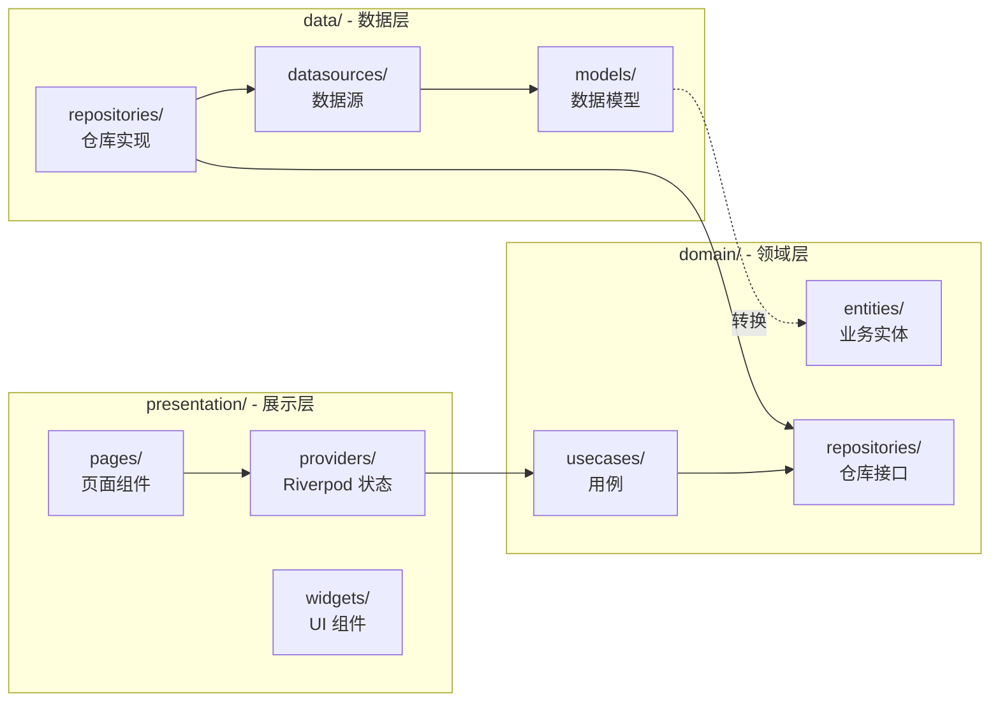

### 共享层结构

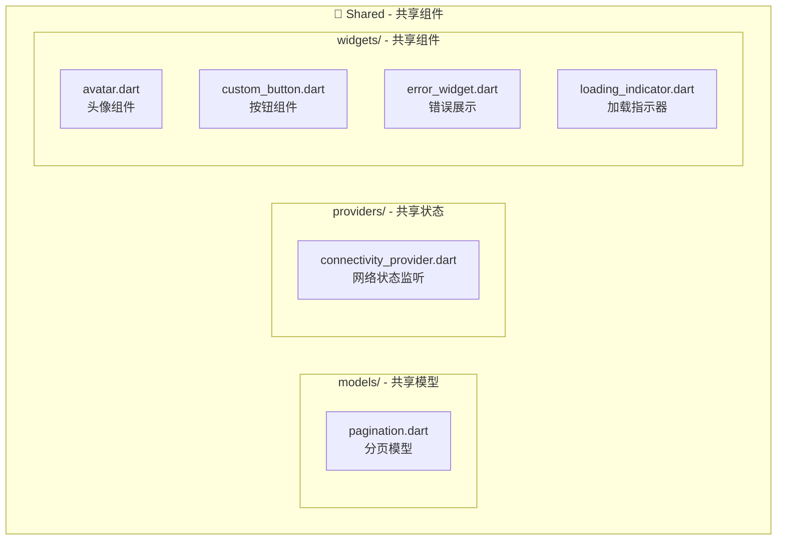


### 数据流向图

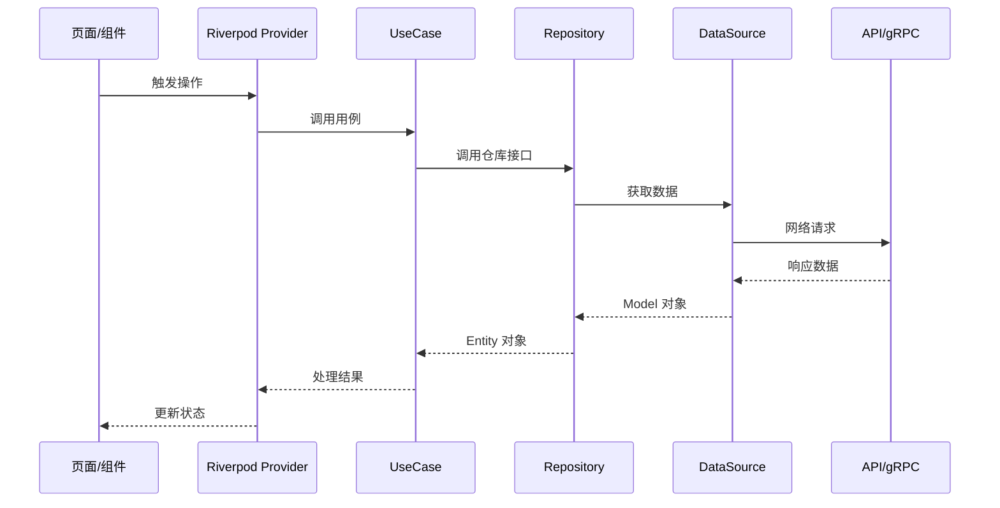

---

## 后端架构

### 大一统数据流程

> 展示客户端请求如何经过网关路由到各个后端服务

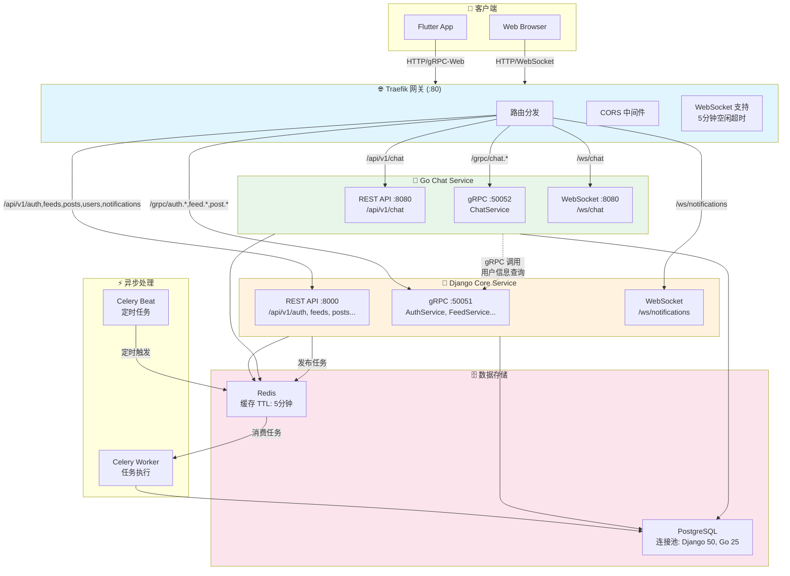


### 请求路由表

| 路径模式 | 目标服务 | 协议 | 说明 |
|----------|----------|------|------|
| `/api/v1/auth/*` | Django :8000 | REST | 认证相关 |
| `/api/v1/feeds/*` | Django :8000 | REST | 动态流 |
| `/api/v1/posts/*` | Django :8000 | REST | 帖子管理 |
| `/api/v1/users/*` | Django :8000 | REST | 用户信息 |
| `/api/v1/notifications/*` | Django :8000 | REST | 通知 |
| `/api/v1/search/*` | Django :8000 | REST | 搜索 |
| `/api/v1/chat/*` | Chat :8080 | REST | 聊天 REST API |
| `/ws/chat/*` | Chat :8080 | WebSocket | 实时聊天 |
| `/ws/notifications/*` | Django :8000 | WebSocket | 实时通知 |
| `/grpc/auth.*` | Django :50051 | gRPC-Web | 认证 gRPC |
| `/grpc/chat.*` | Chat :50052 | gRPC-Web | 聊天 gRPC |

---

### Django 内部数据流程

> Django Core Service 负责用户、帖子、Feed、通知等核心业务

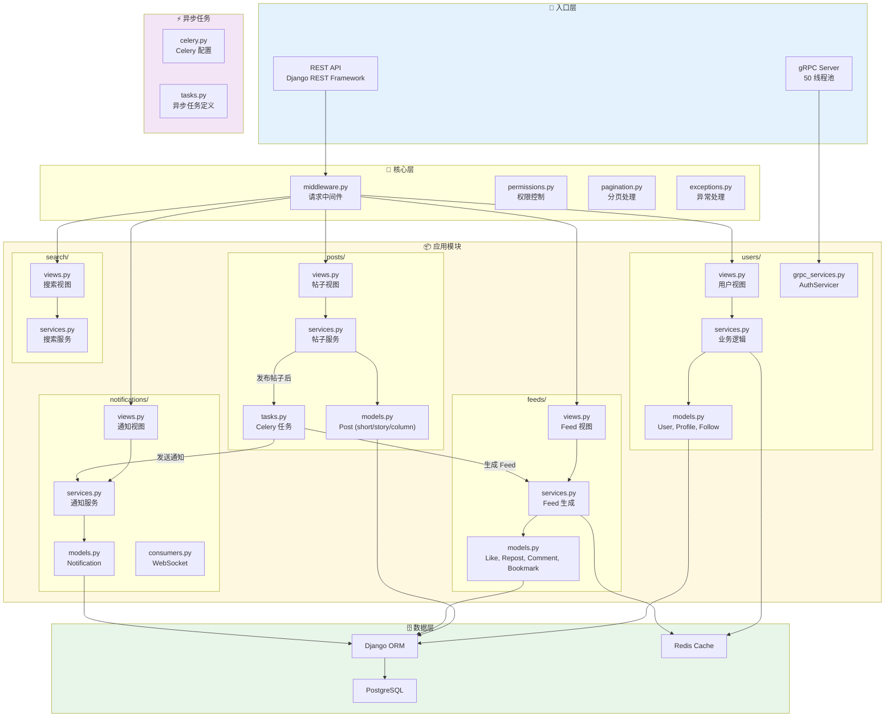


### Django 已实现功能

| 模块 | 功能 | 状态 |
|------|------|------|
| users | 用户注册、登录、JWT 认证 | ✅ |
| users | 用户资料、关注/粉丝 | ✅ |
| users | gRPC AuthService | ✅ |
| posts | 帖子 CRUD (short/story/column) | ✅ |
| posts | Story 24h 自动过期 | ✅ |
| feeds | 点赞、评论、转发、收藏 | ✅ |
| feeds | 关注者 Feed 生成 | ✅ |
| notifications | 通知创建、已读标记 | ✅ |
| notifications | WebSocket 实时推送 | ✅ |
| search | 用户/帖子搜索 | ✅ |

---

### Gin 内部数据流程

> Go Chat Service 负责高性能实时聊天功能

#### 整体架构图

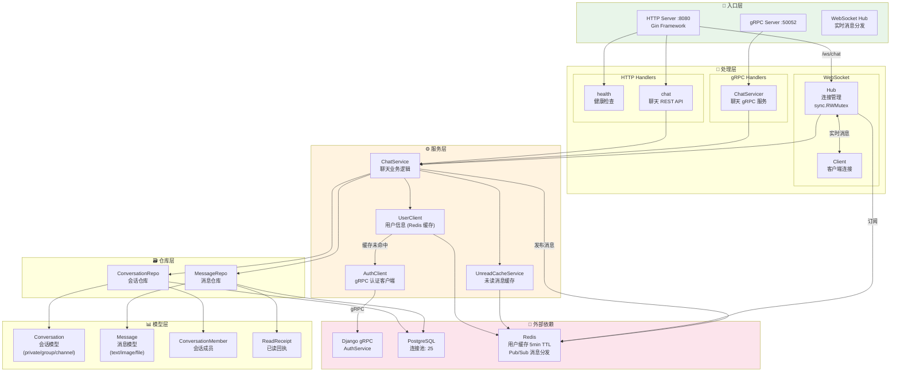

---

#### 目录结构

```
service/chat_gin/
├── cmd/server/
│   └── main.go                 # 应用入口，初始化各组件
├── internal/
│   ├── config/
│   │   └── config.go           # 配置管理（环境变量）
│   ├── handler/
│   │   ├── grpc/
│   │   │   └── chat.go         # gRPC ChatService 实现
│   │   └── ws/
│   │       └── hub.go          # WebSocket Hub + Client
│   ├── middleware/
│   │   └── auth.go             # JWT 认证中间件
│   ├── model/
│   │   ├── conversation.go     # 会话模型
│   │   ├── message.go          # 消息模型
│   │   └── read_receipt.go     # 已读回执模型
│   ├── repository/
│   │   ├── conversation.go     # 会话仓库（GORM）
│   │   ├── message.go          # 消息仓库（GORM）
│   │   └── errors.go           # 仓库层错误定义
│   ├── server/
│   │   ├── http.go             # HTTP 服务器 + 路由配置
│   │   ├── grpc.go             # gRPC 服务器配置
│   │   └── interceptors.go     # gRPC 拦截器
│   └── service/
│       ├── chat.go             # 聊天业务逻辑
│       ├── auth_client.go      # Django gRPC 认证客户端
│       ├── user_client.go      # 用户信息客户端（带缓存）
│       ├── unread_cache.go     # 未读数缓存服务
│       └── errors.go           # 服务层错误定义
├── pkg/
│   ├── cache/
│   │   └── redis.go            # Redis 客户端封装
│   └── database/
│       └── postgres.go         # PostgreSQL 连接池
└── generated/protos/           # Proto 生成的 Go 代码
```

---

#### 分层架构详解

##### 1. 入口层 (Entry)

| 组件 | 端口 | 职责 |
|------|------|------|
| HTTP Server | :8080 | REST API + WebSocket 升级 |
| gRPC Server | :50052 | gRPC 服务（供内部调用） |
| WebSocket Hub | - | 管理所有 WS 连接，消息广播 |

##### 2. 处理层 (Handlers)

```mermaid
flowchart LR
    subgraph HTTP["HTTP Handlers (server/http.go)"]
        direction TB
        H1["GET /health → healthCheck"]
        H2["GET /api/v1/chat/conversations → getConversations"]
        H3["POST /api/v1/chat/conversations → createConversation"]
        H4["GET /api/v1/chat/conversations/:id → getConversation"]
        H5["GET /api/v1/chat/conversations/:id/messages → getMessages"]
        H6["POST /api/v1/chat/conversations/:id/messages → sendMessage"]
        H7["POST /api/v1/chat/conversations/:id/read → markAsRead"]
        H8["POST /api/v1/chat/messages/:id/read → markMessageAsRead"]
        H9["GET /api/v1/chat/unread-counts → getUnreadCounts"]
        H10["POST /api/v1/chat/conversations/:id/members → addMember"]
        H11["DELETE /api/v1/chat/conversations/:id/members/:userId → removeMember"]
        H12["GET /ws/chat → handleWebSocket"]
    end
```

**gRPC Handlers (handler/grpc/chat.go)**

| 方法 | 说明 |
|------|------|
| `GetConversations` | 获取用户会话列表 |
| `GetConversation` | 获取单个会话详情 |
| `CreateConversation` | 创建新会话 |
| `GetMessages` | 获取会话消息列表 |
| `SendMessage` | 发送消息 |
| `StreamMessages` | 实时消息流（服务端流式 RPC） |

**WebSocket Hub (handler/ws/hub.go)**

```go
type Hub struct {
    clients             map[uuid.UUID]*Client           // 用户ID → 客户端
    conversationClients map[uuid.UUID]map[*Client]bool  // 会话ID → 订阅客户端集合
    register            chan *Client                    // 注册通道
    unregister          chan *Client                    // 注销通道
    broadcast           chan *BroadcastMessage          // 广播通道
    userNotify          chan *UserNotification          // 用户通知通道
    chatService         *service.ChatService
    mu                  sync.RWMutex
}
```

##### 3. 中间件层 (Middleware)

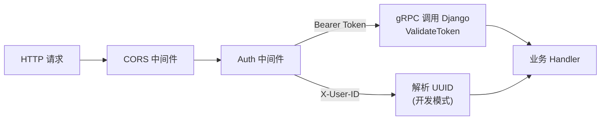

**认证流程 (middleware/auth.go)**

1. 优先从 `Authorization: Bearer <token>` 获取 JWT
2. 通过 gRPC 调用 Django AuthService 验证 token
3. 验证成功后将 `userID` 存入 Gin Context
4. 兼容 `X-User-ID` header（仅开发/测试环境）

##### 4. 服务层 (Services)

```mermaid
flowchart TB
    subgraph ChatService["ChatService (service/chat.go)"]
        direction TB
        CS1["CreateConversation<br/>创建会话"]
        CS2["GetConversation<br/>获取会话详情"]
        CS3["GetUserConversations<br/>获取用户会话列表"]
        CS4["SendMessage<br/>发送消息"]
        CS5["GetMessages<br/>获取消息列表"]
        CS6["MarkConversationAsRead<br/>标记会话已读"]
        CS7["MarkMessageAsRead<br/>标记单条消息已读"]
        CS8["GetUnreadCounts<br/>批量获取未读数"]
        CS9["AddMember / RemoveMember<br/>成员管理"]
    end

    subgraph UserClient["UserClient (service/user_client.go)"]
        direction TB
        UC1["GetUser<br/>获取单个用户信息"]
        UC2["GetUsers<br/>批量获取用户信息"]
        UC3["InvalidateUserCache<br/>使缓存失效"]
    end

    subgraph UnreadCache["UnreadCacheService (service/unread_cache.go)"]
        direction TB
        URC1["GetUnreadCount<br/>获取未读数"]
        URC2["GetUnreadCountsBatch<br/>批量获取未读数"]
        URC3["IncrementUnreadCount<br/>增加未读数"]
        URC4["ResetUnreadCount<br/>重置未读数"]
        URC5["DecrementUnreadCount<br/>减少未读数"]
    end
```

**ChatService 核心方法**

| 方法 | 说明 | 关键逻辑 |
|------|------|----------|
| `CreateConversation` | 创建会话 | 私聊去重、成员验证 |
| `SendMessage` | 发送消息 | 成员检查 → 保存消息 → 更新时间戳 → 增加未读数 → Redis 发布 |
| `GetUserConversations` | 获取会话列表 | 分页查询 → 批量获取未读数 → 填充用户信息 |
| `MarkConversationAsRead` | 标记会话已读 | 批量更新 read_at → 重置未读缓存 → 返回已读回执 |

##### 5. 仓库层 (Repository)

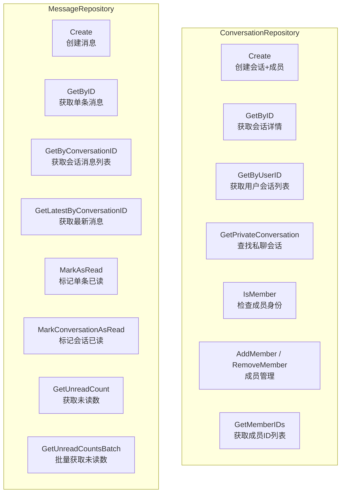

##### 6. 模型层 (Models)

**Conversation 会话模型**

```go
type Conversation struct {
    ID          uuid.UUID           // 主键
    Type        ConversationType    // private | group | channel
    Name        string              // 会话名称（群聊必填）
    CreatorID   uuid.UUID           // 创建者ID
    CreatedAt   time.Time
    UpdatedAt   time.Time
    Members     []ConversationMember // 成员列表（关联查询）
    LastMessage *Message            // 最后一条消息（动态填充）
    UnreadCount int                 // 未读数（动态计算）
}
```

**Message 消息模型**

```go
type Message struct {
    ID             uuid.UUID    // 主键
    ConversationID uuid.UUID    // 所属会话
    SenderID       uuid.UUID    // 发送者
    Content        string       // 消息内容
    MessageType    MessageType  // text | image | file | system
    CreatedAt      time.Time
    ReadAt         *time.Time   // 已读时间（null=未读）
    Metadata       map[string]interface{} // 扩展元数据
}
```

**ConversationMember 会话成员**

```go
type ConversationMember struct {
    ConversationID uuid.UUID
    UserID         uuid.UUID
    Role           string      // owner | admin | member
    JoinedAt       time.Time
    // 以下字段从 UserClient 动态填充
    Username       string
    Email          string
    DisplayName    *string
    AvatarURL      *string
}
```

---

#### 核心数据流程

##### 发送消息流程

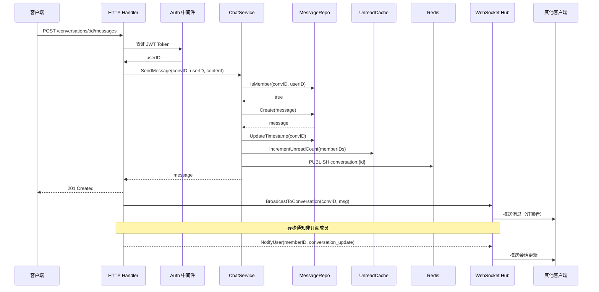

##### 获取会话列表流程

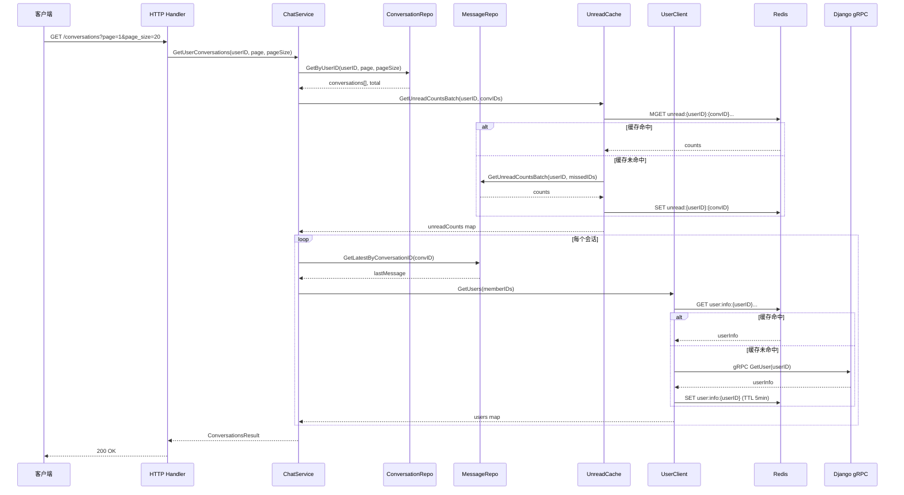

##### 标记已读流程

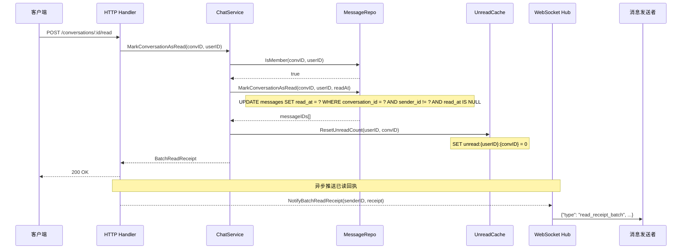

---

#### WebSocket 详细流程

##### 连接与订阅流程

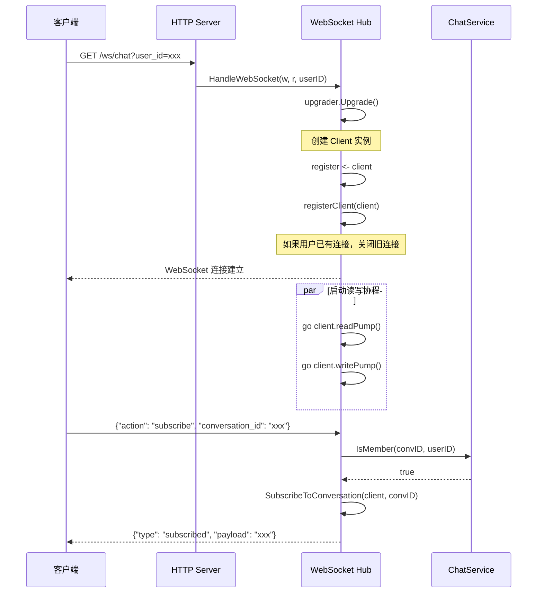

##### 消息广播流程

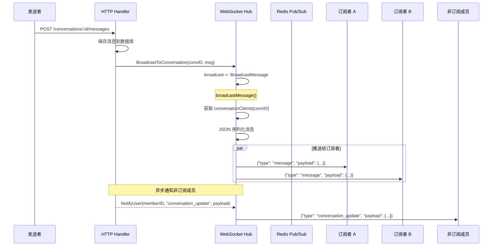

##### WebSocket 消息格式

**客户端 → 服务端**

```json
// 订阅会话
{"action": "subscribe", "conversation_id": "uuid"}

// 取消订阅
{"action": "unsubscribe", "conversation_id": "uuid"}
```

**服务端 → 客户端**

```json
// 新消息（订阅后收到）
{
  "type": "message",
  "payload": {
    "id": "msg-uuid",
    "conversation_id": "conv-uuid",
    "sender_id": "user-uuid",
    "content": "Hello!",
    "message_type": "text",
    "created_at": "2024-12-29T10:00:00Z"
  }
}

// 会话更新通知（所有在线成员）
{
  "type": "conversation_update",
  "payload": {
    "conversation_id": "conv-uuid",
    "last_message": {...},
    "unread_count": 3
  }
}

// 已读回执（单条）
{
  "type": "read_receipt",
  "payload": {
    "message_id": "msg-uuid",
    "conversation_id": "conv-uuid",
    "reader_id": "user-uuid",
    "read_at": "2024-12-29T10:05:00Z"
  }
}

// 已读回执（批量）
{
  "type": "read_receipt_batch",
  "payload": {
    "conversation_id": "conv-uuid",
    "reader_id": "user-uuid",
    "message_ids": ["msg-1", "msg-2", "msg-3"],
    "read_at": "2024-12-29T10:05:00Z"
  }
}

// 订阅确认
{"type": "subscribed", "payload": "conv-uuid"}

// 取消订阅确认
{"type": "unsubscribed", "payload": "conv-uuid"}

// 错误
{
  "type": "error",
  "payload": {
    "action": "subscribe",
    "message": "您不是该会话的成员"
  }
}
```

---

#### 缓存策略

##### 用户信息缓存 (UserClient)

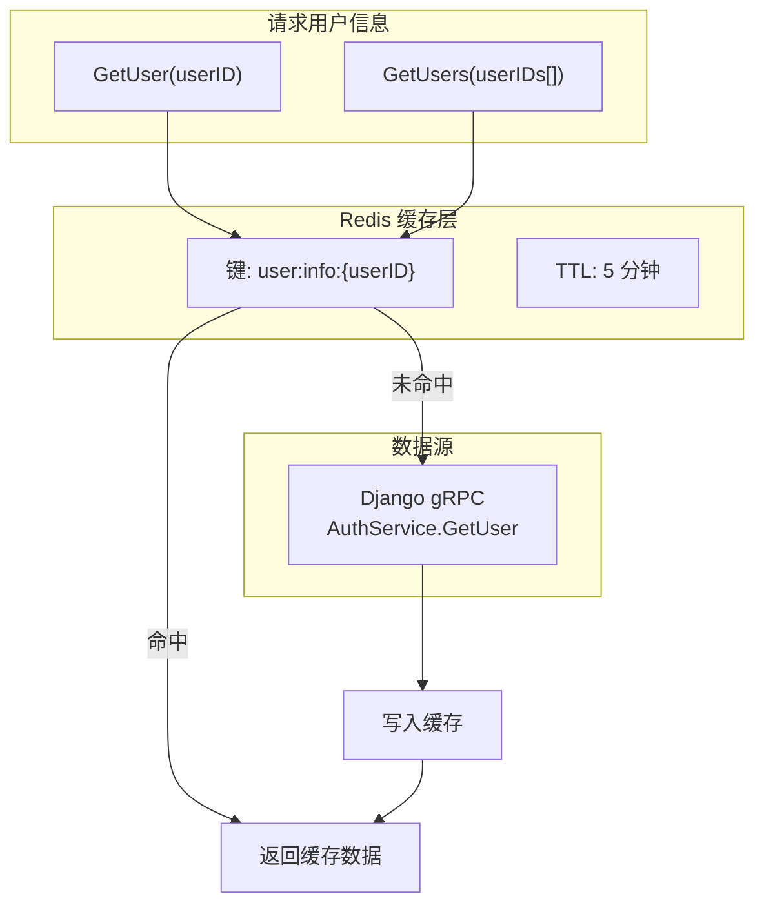

**缓存键格式**: `user:info:{userID}`

**缓存策略**:
- 读取时优先查缓存
- 缓存未命中时调用 Django gRPC
- 写入缓存并设置 5 分钟 TTL
- 支持批量获取，减少 gRPC 调用次数

##### 未读数缓存 (UnreadCacheService)

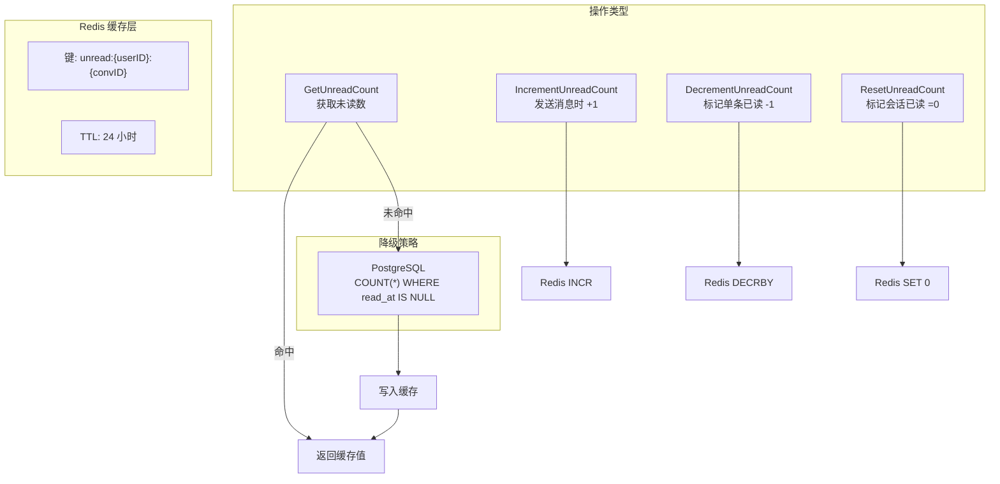

**缓存键格式**: `unread:{userID}:{conversationID}`

**缓存策略**:
- 发送消息时：`INCR` 增加接收者未读数
- 标记单条已读：`DECRBY` 减少未读数
- 标记会话已读：`SET 0` 重置为 0
- 缓存未命中时从数据库查询并回填
- TTL 24 小时，防止缓存与数据库不一致

---

#### HTTP API 路由表

| 方法 | 路径 | 说明 | 认证 |
|------|------|------|------|
| GET | `/health` | 健康检查 | ❌ |
| GET | `/api/v1/chat/hello` | 测试端点 | ✅ |
| GET | `/api/v1/chat/conversations` | 获取会话列表 | ✅ |
| POST | `/api/v1/chat/conversations` | 创建会话 | ✅ |
| GET | `/api/v1/chat/conversations/:id` | 获取会话详情 | ✅ |
| GET | `/api/v1/chat/conversations/:id/messages` | 获取消息列表 | ✅ |
| POST | `/api/v1/chat/conversations/:id/messages` | 发送消息 | ✅ |
| POST | `/api/v1/chat/conversations/:id/read` | 标记会话已读 | ✅ |
| POST | `/api/v1/chat/conversations/:id/read-up-to` | 标记到指定消息已读 | ✅ |
| POST | `/api/v1/chat/messages/:id/read` | 标记单条消息已读 | ✅ |
| GET | `/api/v1/chat/unread-counts` | 批量获取未读数 | ✅ |
| POST | `/api/v1/chat/conversations/:id/members` | 添加成员 | ✅ |
| DELETE | `/api/v1/chat/conversations/:id/members/:userId` | 移除成员 | ✅ |
| GET | `/ws/chat` | WebSocket 连接 | ✅ (query param) |

---

#### gRPC 服务定义

```protobuf
service ChatService {
  // 获取用户会话列表
  rpc GetConversations(GetConversationsRequest) returns (ConversationsResponse);
  
  // 获取单个会话详情
  rpc GetConversation(GetConversationRequest) returns (Conversation);
  
  // 创建新会话
  rpc CreateConversation(CreateConversationRequest) returns (Conversation);
  
  // 获取会话消息列表
  rpc GetMessages(GetMessagesRequest) returns (MessagesResponse);
  
  // 发送消息
  rpc SendMessage(SendMessageRequest) returns (Message);
  
  // 实时消息流（服务端流式 RPC）
  rpc StreamMessages(StreamRequest) returns (stream Message);
}
```


### Gin 已实现功能

| 层级 | 模块 | 功能 | 状态 |
|------|------|------|------|
| **入口层** | server/http | HTTP Server (Gin) + CORS | ✅ |
| | server/grpc | gRPC Server + Keepalive | ✅ |
| | handler/ws | WebSocket Hub 连接管理 | ✅ |
| **处理层** | handler/grpc | ChatService gRPC 实现 | ✅ |
| | handler/ws | 会话订阅/取消订阅 | ✅ |
| | handler/ws | 消息广播 + 用户通知 | ✅ |
| | handler/ws | 已读回执推送 | ✅ |
| **中间件** | middleware/auth | JWT 认证 (gRPC 验证) | ✅ |
| | middleware/auth | X-User-ID 兼容 (开发模式) | ✅ |
| **服务层** | service/chat | 会话 CRUD | ✅ |
| | service/chat | 消息发送/获取 | ✅ |
| | service/chat | 标记已读 (单条/批量/到指定消息) | ✅ |
| | service/chat | 成员管理 (添加/移除) | ✅ |
| | service/user_client | 用户信息 Redis 缓存 (5min TTL) | ✅ |
| | service/unread_cache | 未读数缓存 (24h TTL) | ✅ |
| | service/auth_client | Django gRPC 认证客户端 | ✅ |
| **模型层** | model/conversation | 会话模型 (private/group/channel) | ✅ |
| | model/message | 消息模型 (text/image/file/system) | ✅ |
| | model/read_receipt | 已读回执模型 | ✅ |
| **仓库层** | repository/conversation | 会话仓库 (GORM) | ✅ |
| | repository/message | 消息仓库 (GORM) | ✅ |
| | repository/message | 批量未读数查询 | ✅ |
| **基础设施** | pkg/database | PostgreSQL 连接池 (25 连接) | ✅ |
| | pkg/cache | Redis 客户端 (Pub/Sub) | ✅ |

---

## 新增路由修改流程

> 添加新 API 路由时，需要修改以下文件（按顺序）

```mermaid
flowchart TB
    subgraph Step1["1️⃣ Proto 定义 (如需 gRPC)"]
        Proto["protos/<service>/<service>.proto<br/>添加 message 和 rpc 方法"]
    end

    subgraph Step2["2️⃣ 后端服务"]
        subgraph Django["Django (REST API)"]
            DModels["apps/<module>/models.py"]
            DSerializers["apps/<module>/serializers.py"]
            DViews["apps/<module>/views.py"]
            DUrls["apps/<module>/urls.py"]
            DServices["apps/<module>/services.py"]
            DRootUrls["config/urls.py"]
        end
        
        subgraph Go["Go Chat (如涉及聊天)"]
            GModels["internal/model/*.go"]
            GRepo["internal/repository/*.go"]
            GService["internal/service/*.go"]
            GHandler["internal/handler/*.go"]
            GRouter["internal/server/router.go"]
        end
    end

    subgraph Step3["3️⃣ 网关配置"]
        Routes["infra/gateway/dynamic/routes.yml<br/>Traefik 路由规则"]
    end

    subgraph Step4["4️⃣ 客户端"]
        subgraph FlutterClient["Flutter"]
            FData["lib/features/<module>/data/"]
            FDomain["lib/features/<module>/domain/"]
            FPresentation["lib/features/<module>/presentation/"]
        end
        
        subgraph ReactClient["React"]
            RApi["src/features/<module>/api/"]
            RTypes["src/features/<module>/types/"]
            RHooks["src/features/<module>/hooks/"]
        end
    end

    subgraph Step5["5️⃣ 测试"]
        DTests["service/core_django/apps/<module>/tests/"]
        GTests["service/chat_gin/internal/*_test.go"]
        FTests["client/mobile_flutter/test/features/<module>/"]
    end

    Step1 --> Step2
    Step2 --> Step3
    Step3 --> Step4
    Step4 --> Step5
```


### 新增路由检查清单

| 步骤 | 文件/目录 | 说明 |
|------|----------|------|
| 1 | `protos/` | gRPC 定义 (可选) |
| 2 | `apps/<module>/models.py` | Django 数据模型 |
| 3 | `apps/<module>/serializers.py` | 序列化器 |
| 4 | `apps/<module>/views.py` | 视图/控制器 |
| 5 | `apps/<module>/urls.py` | 模块路由 |
| 6 | `config/urls.py` | 根路由注册 |
| 7 | `routes.yml` | 网关路由 (如需新路径前缀) |
| 8 | `features/<module>/` | 客户端模块 |
| 9 | `tests/` | 单元测试 |

---

## 配置参数汇总

### 数据库连接池

| 服务 | MaxOpenConns | MaxIdleConns | ConnMaxIdleTime |
|------|--------------|--------------|-----------------|
| Django | 50 | - | - |
| Go Chat | 25 | 10 | 5 分钟 |

### 缓存配置

| 缓存项 | TTL | 键格式 | 说明 |
|--------|-----|--------|------|
| 用户信息 | 5 分钟 | `user:info:{userID}` | Go Chat 服务缓存 |
| 未读消息数 | 实时 | `unread:{userID}:{convID}` | 写入时更新 |

### WebSocket 配置

| 参数 | 值 | 说明 |
|------|-----|------|
| dialTimeout | 30s | 连接超时 |
| responseHeaderTimeout | 0s | 禁用响应头超时 (WebSocket 需要) |
| idleConnTimeout | 300s | 5 分钟空闲超时 |

### gRPC 配置

| 服务 | 线程池 | 端口 | 消息大小限制 |
|------|--------|------|-------------|
| Django | 50 workers | 50051 | 4MB |
| Go Chat | - | 50052 | 4MB |

### JWT 配置

| 环境 | Access Token | Refresh Token |
|------|--------------|---------------|
| 开发 | 1 小时 | 7 天 |
| 生产 | 30 分钟 | 1 天 |