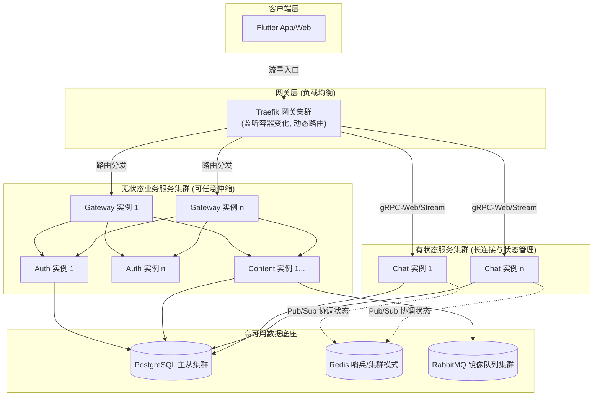
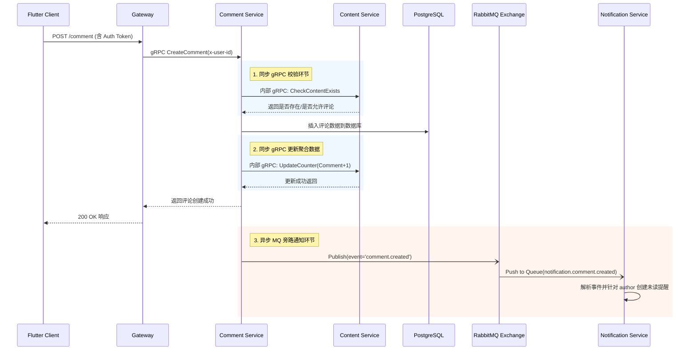
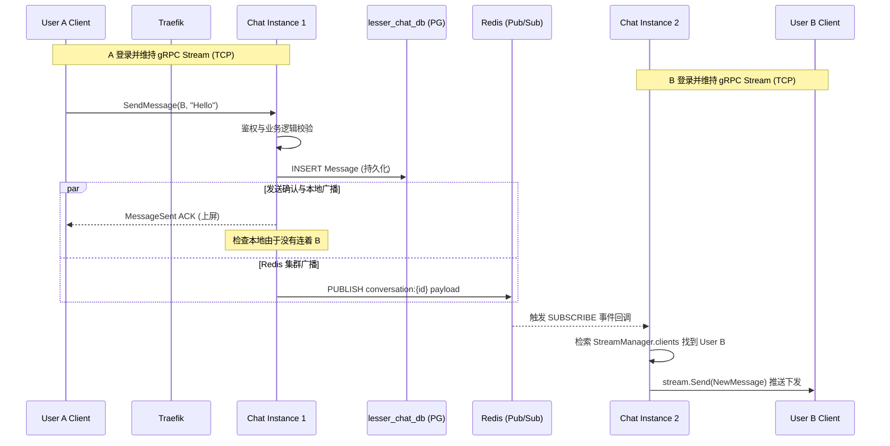
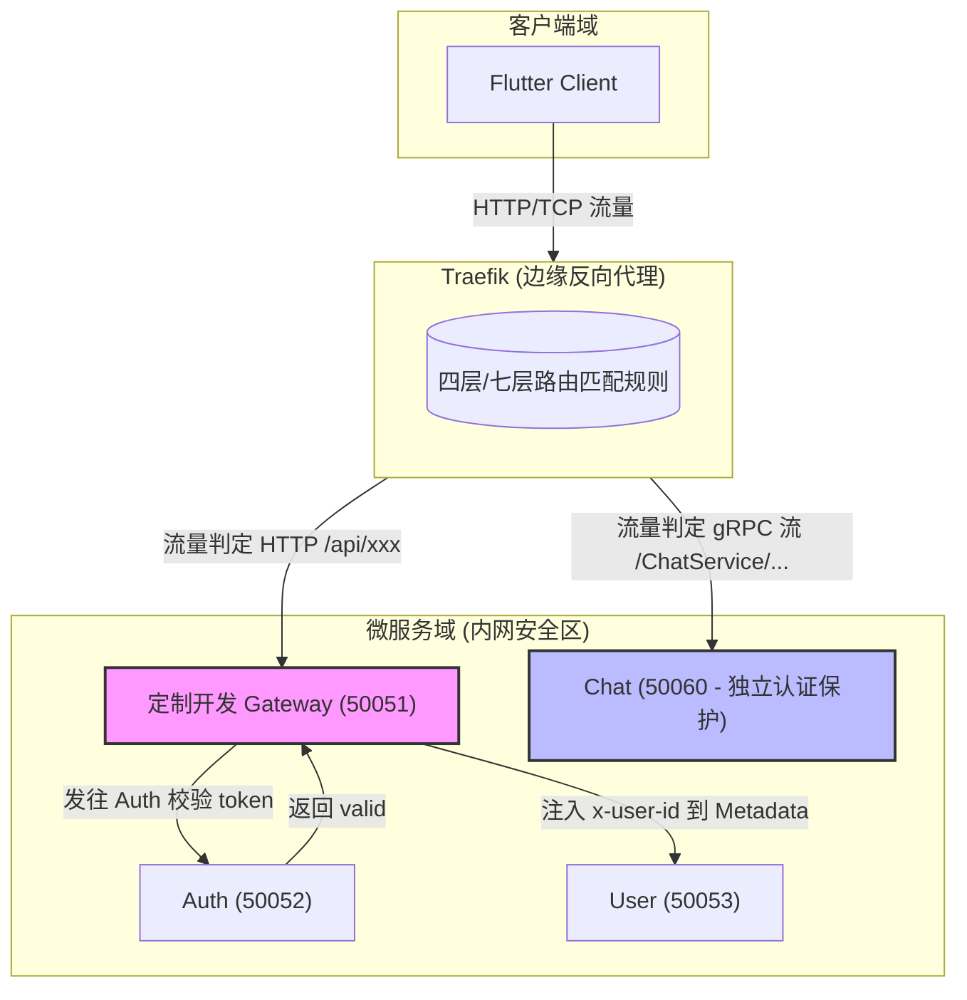

# 架构答疑

> 基于 [架构梳理](./架构梳理.md) 文档的深入解读，结合实际代码（如 `docker-compose.yml`, `stream.go`, `content_client.go` 等）进行详细拆解。

---

## Q1: 如何从单容器扩展到集群？

架构图中每个小方框代表**一个服务的逻辑节点（单实例容器）**。在实际的生产环境中，扩展到一个具体的集群主要依靠以下手段和流程。微服务之间通过 `app-network` 内部网络通信，不暴漏在公网中。

### 扩展手段与机制

1. **容器编排层水平扩展 (Horizontal Scaling)**
   - **Docker Compose**：对于中小型部署，可以在 `docker-compose.prod.yml` 中直接使用 `deploy.replicas: N` 来启动多个同名容器实例。
   - **Kubernetes (K8s)**：通过配置 `Deployment` 的 `replicas`，或者结合 HPA (Horizontal Pod Autoscaler) 根据 CPU/内存/自定义指标自动弹性伸缩 Pod 数量。
2. **边缘网关服务发现与负载均衡 (Traefik)**
   - Traefik 挂载了 `/var/run/docker.sock`，能够实时监听容器的启动与销毁事件（自动服务发现）。
   - 当检测到某个服务（如 `User` 服务）存在多个实例时，Traefik 会自动将外部流量以**轮询 (Round-Robin)** 或其他策略分发到这些实例的 IP 上。
3. **无状态设计 (Stateless) 与有状态服务的解耦**
   - 绝大多数业务服务（Auth、User、Content 等）都是完全无状态的，可以任意增加节点。
   - 状态（如 Session、长连接映射、业务数据）被剥离并下沉到高可用的数据基座中（Redis 主从/哨兵集群、PostgreSQL 主从同步、RabbitMQ 镜像队列）。

### 集群部署拓扑图

---

## Q2: Content 与 Comment 之间的通信机制

这两个服务之间通过 **gRPC (同步 RPC)** 和 **RabbitMQ (异步 MQ 事件)** 协同工作，既保证了业务逻辑的严谨性，又实现了非核心链路的解耦。

### 1. 内部通信机制：内网与服务发现
它们之间的通信完全在**内网 (Docker bridge network `app-network`)** 中进行。
在 `docker-compose` 环境中，服务间通过服务名（如 `content:50054`）进行 DNS 解析和直接的 TCP 连接，公网完全不可见边界内流量。

### 2. 同步链路：gRPC (强一致性与业务前置校验)
当用户发生评论行为时，`Comment` 服务需要**同步知道**该内容是否存在、是否被锁定、以及通知 `Content` 更新评论计数。

- **代码实现**: `Comment` 服务初始化了 `ContentServiceClient` (位于 `comment/internal/remote/content_client.go`)，基于连接池维护到 `Content` 服务的 TCP 长连接。
- **调用流**: `CheckContentExists` 查状态 -> 本地写评论持久化 -> `UpdateCounter` 增加评论计数。

### 3. 异步链路：RabbitMQ (最终一致性与旁路分发)
评论完成后，相关的提醒、搜索索引更新是不需要阻塞用户操作的旁路逻辑。

- **发送端 (Publisher)**: `Comment` 服务在其 `logic` 层完成数据库事务后，异步调用 `messaging.EventPublisher`，向 RabbitMQ 的 `gateway.direct` 交换机发送一条 `comment.created` 的事件消息。
- **接收端 (Consumer)**: `Notification` 服务监听 `notification.comment.created` 队列；`Search` 服务监听同步内容的队列。它们从 MQ 中提取消息，进行红点推送或 ES 索引写入。

### Content 与 Comment 交互时序图

---

## Q3: 两个用户登录 Flutter 之后的 Chat 通信流程

在聊天服务 (`Chat`) 中，核心组件是管理 WebSocket / gRPC 双向流的 `StreamManager` (`stream.go`)。

### 1. 通信承载与长连接落点
- **长连接技术选型**: Flutter 客户端通过 **gRPC-Web / gRPC Bidirectional Streaming** 与后端建立真正的长连接。
- **落点**: 长连接会打到达具体的某一个 `Chat` 容器实例上（比如 Chat-Instance-A）。这是由边缘网关 Traefik 的负载均衡决定的。连接建立后，在 `stream.go` 的 `StreamManager.clients` 字典中，会维持该 `user_id` 与对应 `grpc.ServerStream` 的生命周期映射。

### 2. 跨机器（实例）的消息路由
如果 User A 连在 `Chat-Instance-1`，User B 连在 `Chat-Instance-2`。
- A 通过长连接将发送消息 (`SendMessage`) 的请求发送给 `Chat-Instance-1`。
- `Chat-Instance-1` 会验证权限、将消息持久化至 PostgreSQL 的 `lesser_chat_db`。
- `Chat-Instance-1` 会通过 `Redis` 的 **Pub/Sub 机制**（代码见 `chat_service.go` 的 `s.cache.Publish(ctx, channel, msg)`），将该消息体广播到名为 `conversation:{conv_id}` 的频道中。
- 所有 `Chat` 的实例都在持续监听 Redis 的这些频道。
- `Chat-Instance-2` 从 Redis 收到了该消息，它检查自己本地的 `clients` 字典，发现 User B 就在自己这，于是直接向 User B 的推流通道 (`stream.Send`) 写入并下发该消息。

### 实时通信完整包流转图

---

## Q4: Traefik 网关与具体业务 Gateway 的区别

系统采用了 **“边缘代理 + 业务网关” （Dual-Gateway）** 的双层架构设计。

### 1. Traefik 的定位：边缘代理 (Edge Proxy)
Traefik 是一个纯基础设施层的反向代理，它是进出集群的唯一大门（主要暴露端口 80, 50050）。
**作用**：
- **TLS 终结**：负责处理 HTTPS 证书卸载（在生产环境）。
- **四层/七层路由**：将 `/grpc.ChatService/` 路由到 Chat 容器，将 `/api/v1/` 路由到业务 Gateway。
- **服务发现**：自动感知 Docker 或 K8s 中启动或死掉的容器，并动态调整负载均规则，**不需要修改或重载配置文件**。
- **协议转换**：具备翻译机制，可以将前端的 gRPC-Web HTTP/1.1 请求自动转换为后端的原生 HTTP/2 gRPC 调用。

### 2. Gateway 的定位：业务网关 (Business API Gateway)
位于 `service/gateway/` 下，是用 Go 编写的一个具体微服务。它是所有普通业务请求的第一站总控台。
**作用**：
- **全局身份鉴权 (Auth)**：客户端发来的 Http metadata 中只带 `Authorization: Bearer <jwt-token>`。Gateway 负责拦截这些请求，去调用 `Auth` 服务解密 Token，抽取出内部系统的全局唯一标识 `user_id`，并重新注入到 gRPC 的 Metadata `x-user-id` 中。
- **剥离信任边界**：下游的服务（如 User, Content, Comment）**不再自己去解析和校验 JWT 的合法性**。只要请求来自于 Gateway（携带有特定的内部头），下游就无条件信任 `x-user-id`。这让下游的业务代码变得极度精简纯粹。
- **限流熔断**：可以针对具体的 Endpoint 做精细化的业务级别限流。

### 为什么要分开？为什么要单独写一个 Gateway？

1. **职责分离法则**：
   Traefik 不懂“业务逻辑”（它不知道啥是 JWT 的具体声明、啥是内部加密秘钥）；而业务 Gateway 不应该处理底层的 Socket 均衡策略、SSL证书和连接池维护。让专业的组件干专业的事。
2. **长连接的性能避坑优化**：
   你可以注意到架构图里，`Chat` 和 `Channel` 服务的长连接流量是 **直接由 Traefik 路由给它们** 的，绕开了中间的 Gateway。这是有意为之的。
	  
	**原因所在**：Gateway 中存在诸多的业务拦截器 (Interceptors) ，例如 JWT 校验。让成千上万个双向常连接 (gRPC Bidirectional Stream) 长期穿透一个“鉴权”用的 Gateway，不仅资源浪费，还会放大 Gateway 崩溃对全局实时系统的雪崩效应。**因此**，`Chat` 内部自己做了对应的安检体系并独立承载长连接（代码可见 `getUserIDFromStreamContext`），以减轻业务网关的压力。这使得系统拥有极佳的可扩展性与解耦度。

